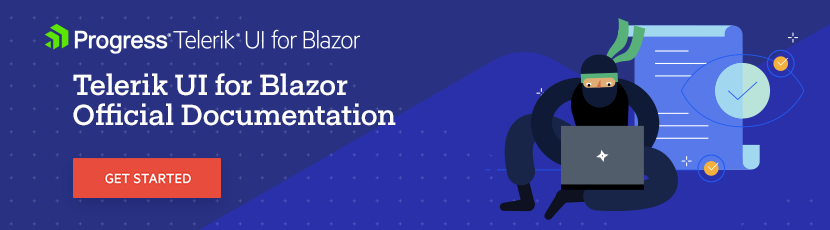

# Telerik® UI for Blazor Components Documentation 

Welcome to the GitHub repo for the [Telerik UI for Blazor components](https://www.telerik.com/blazor-ui?utm_medium=referral&utm_source=github&utm_campaign=blazor-awareness-docs-github) documentation. This repository contains the source content — written in Markdown — that we use to power Telerik® UI for Blazor Documentation at [https://docs.telerik.com/blazor-ui/introduction](https://docs.telerik.com/blazor-ui/introduction?utm_medium=referral&utm_source=github&utm_campaign=blazor-awareness-docs-github).

If you've arrived here wanting to search and peruse our docs, you'd be better served heading over to the officially published [UI for Blazor components documentation](https://docs.telerik.com/blazor-ui/introduction?utm_medium=referral&utm_source=github&utm_campaign=blazor-awareness-docs-github) where our content is prettified and searchable.

## Contribution

**Pull Requests are welcome!** If you see mistakes or missing info, fix it in a Pull Request (you may need to fork the repo for something larger than a typo you can fix online), **or [open an Issue](https://github.com/telerik/blazor-docs/issues/new)**. This will help everyone have better documentation.

## Offline PDF Version

You can download a PDF with this documentation from [your telerik.com account](https://www.telerik.com/account). Go to the **Downloads** section, navigate to **UI for Blazor**, choose the version you want from the dropdown, and get the **PDF** file under the **Documentation** section.

## Running Locally

You can generate a static web site from the Telerik® UI for Blazor documentation and browse it locally.

1. Clone the repository `git clone git@github.com:telerik/blazor-docs.git`
2. Go to the [https://github.com/telerik/docs-seed](https://github.com/telerik/docs-seed) repo and follow the instructions from its own readme file

If you want to keep the local documentation alive after closing the prompt, you can add the `_site` folder that was generated to a server of your choice. Make sure that it is under a path like `serverName/blazor-ui`. You can find sample instructions in the following page, and they are applicable for IIS, even though they are written for the UI for ASP.NET AJAX docs where we have two nests folders instead of one: [https://github.com/telerik/ajax-docs/wiki/Deploying-Documentation-on-IIS](https://github.com/telerik/ajax-docs/wiki/Deploying-Documentation-on-IIS).

## Useful Links

* Browse all [UI for Blazor component demos live](https://demos.telerik.com/blazor-ui)
* Browse [the Telerik UI for Blazor documentation](https://docs.telerik.com/blazor-ui/introduction?utm_medium=referral&utm_source=github&utm_campaign=blazor-awareness-docs-github)
* Follow this link to [report bugs and add feature requests](https://feedback.telerik.com/blazor?utm_medium=referral&utm_source=github&utm_campaign=blazor-awareness-docs-github)
* Browse or contribute to [localization texts](https://github.com/telerik/blazor-ui-messages) used in the samples
* Create, run, share and test Blazor code snippets directly in the browser in our [Blazor REPL code runner](https://blazorrepl.telerik.com/?utm_medium=referral&utm_source=github&utm_campaign=blazor-awareness-docs-github)

## License

The Telerik® UI for Blazor Documentation is licensed under the Apache 2.0 license. See the [`LICENSE` file](LICENSE) for the full terms. This license applies to the markdown (`.md`) files in this site ONLY and does not convey, override, or modify any existing licenses covering the runtime source and components of Telerik® UI for Blazor. For more information, see the [Telerik® UI for Blazor license agreement](https://www.telerik.com/purchase/license-agreement/blazor-ui).

If you don't have a license for Telerik® UI for Blazor, [start a free trial](https://www.telerik.com/download-trial-file/v2-b/ui-for-blazor?utm_medium=referral&utm_source=github&utm_campaign=blazor-awareness-docs-github) and then follow the [First Steps article](https://docs.telerik.com/blazor-ui/introduction?utm_medium=referral&utm_source=github&utm_campaign=blazor-awareness-docs-github#getting-started) for the appropriate Blazor application type.
