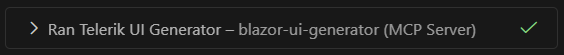

# Getting Started with the Agentic UI Generator

The Agentic UI Generator is an intelligent, prompt-driven AI development assistant designed to accelerate the creation and styling of modern web applications. Built around Telerik and Kendo UI, the Agent enables developers to move from idea to quality UI with speed, precision, and confidence.

This article describes how to install, configure, and use the Telerik UI for Blazor Agentic UI Generator in Visual Studio and Visual Studio Code.

>warning **Кnown Issue: Hanging tool calls in Visual Studio**, see [Troubleshooting](slug:ai-troubleshooting#troubleshooting).

## Quick Start

The next video guides you through the steps needed for setting up and using the Telerik UI for Blazor Agentic UI Generator.

<iframe width="560" height="315" src="https://youtu.be/0UC79VbbyQI?si=2DCbYHTykuO7X6qe" title="Getting started with Blazor Agentic UI Generator" frameborder="0" allow="accelerometer; autoplay; clipboard-write; encrypted-media; gyroscope; picture-in-picture; web-share" allowfullscreen></iframe>

> If you have already completed the [Installation Guide]() and configured your license key, skip directly to **step 3** to start using the Agentic UI Generator.

Follow these steps to set up the Agentic UI Generator:

1. Create an `.mcp.json` file in your solution (if you are using Visual Studio), or an `mcp.json` file in your workspace (if you are using Visual Studio Code) with the following configuration:
   ````JSON.skip-repl
   {
     "servers": {
       "telerik-blazor-mcp": {
         "type": "stdio",
         "command": "dnx",
         "args": ["Telerik.Blazor.MCP", "--yes"],
         // set any of the arguments in the 'env' configuration below, if you haven't set up your license file globally 
         //"env": {
         //  "TELERIK_LICENSE_PATH": "THE_PATH_TO_YOUR_LICENSE_FILE",
         //  // or
         //  "TELERIK_LICENSE": "YOUR_LICENSE_KEY"
         //}
       }
      }
     }
   ````

   The server name `telerik-blazor-mcp` can be customized as desired. The name helps distinguish the MCP server in your configuration and does not affect how you invoke the generator tool in your prompt.

   > For IDE-specific setup instructions and advanced configuration options, see [MCP Server Configuration](slug:ai-installation#mcp-clients-configuration).

1. Ensure you have a [supported license]() and set up your Telerik license key globally on your machine or in the `.mcp.json` configuration. The server automatically recognizes your license and activates [the appropriate tools]().

     > Refer to the [Telerik License Key Setup](slug:installation-license-key#manual-installation) section for detailed instructions.

1. Open the AI chat interface of your IDE and start your prompt with `Telerik` to make it more likely for the Agentic UI Generator to get called. If you are using VS Code, then you can start your prompt with the `#telerik_ui_generator` handle to invoke the main generator tool:
    ````TEXT.skip-repl
    #telerik_ui_generator Create a dashboard page with a grid showing sales data and a chart visualizing monthly trends.
    ````

   > Step-by-step usage instructions are available in [Using the Agentic UI Generator](#using-the-agentic-ui-generator).

## Using the Agentic UI Generator

Once installed, start a new chat session in your IDE to begin interacting with the Agentic UI Generator via natural language prompts. The Agentic UI Generator can be used in two primary modes: basic usage through [the main tool](#call-the-agentic-ui-generator), or advanced usage by [calling specific MCP tools directly](#target-the-tools-advanced).

### Call the Agentic UI Generator

1. Open the AI chat interface in your IDE&mdash;Start a new chat session to begin interacting with the Agentic UI Generator.
1. In Visual Studio Code, you can start your prompt with the `#telerik_ui_generator` handle&mdash;this invokes the main MCP tool that uses an agentic flow to analyze and process your request.
    > Using the `#telerik_ui_generator` handle ensures the Agentic UI Generator is called. Alternatively, you can use natural language without the handle. Make sure to mention the "telerik" keyword in your natural language prompt, so that the AI model can automatically recognize when to call the generator. The generator analyzes your prompt and creates the appropriate Blazor components, markup, and styling.
1. Inspect the output and verify that the `telerik-blazor-mcp` MCP server (or the one with your custom server name) is called. Look for a similar statement in the output:

    

1. If prompted, grant the MCP server permission to run for this session, workspace, or always.

### Target the Tools (Advanced)

For more granular control, you can call individual tools that make up the Agentic UI Generator:

| Tool | Handle | Purpose |
|------------|-------------|-------------|
| UI Generator Orchestrator Tool | `telerik_ui_generator` | Main generator for building full UI flows. Coordinates all other tools to deliver complete solutions. |
| Layout Tool | `telerik_layout_assistant` | Applies suitable CSS utility classes from the [Progress Design System](https://www.telerik.com/design-system/docs/) for styling and positioning elements. Use this tool when you need help with spacing, typography, colors, layout structure, or transforms. |
| Component Tool | `telerik_component_assistant` | Answers questions and generates code related to Telerik UI for Blazor components. Use this tool when you need to implement or configure specific UI for Blazor components like Grid, Charts, Forms, etc. |
| Style Tool | `telerik_style_assistant` | Generates custom styles and theme configurations for your application. Use this tool when you need to apply brand-specific colors, create custom themes, or modify the overall visual design of your UI. |
| Icon Tool | `telerik_icon_assistant` | Searches and retrieves icons from the [Progress Design System Iconography](https://www.telerik.com/design-system/docs/foundation/iconography/icon-list/) by name, category, or keywords. Use this tool when you need to find and add specific icons for your UI components or design elements. |
| Validator Tool | n/a | Not designed to be invoked manually. It is called automatically by the UI Generator Orchestrator and ensures the generated code follows Telerik UI for Blazor best practices and standards. |
| Accessibility Tool | `telerik_accessibility_assistant` | Provides WCAG 2.2 Level AA guidance and component-specific accessibility implementation details. Use this tool to ensure your UI meets compliance standards, implements correct ARIA roles, and retrieves accessibility API references for Telerik UI for Blazor components. |

You can call these tools directly when you need specific functionality, allowing for more precise control over the generation process.

> Tagging specific tools in Visual Studio currently is not available. To increase the probability that a tool will be called, either explicitly mention the tool in your prompt, or specify that in your Copilot instructions. 

## See Also

* [Agentic UI Generator Prompt Library](slug:agentic-ui-generator-prompt-library)
* [Telerik Design System](https://www.telerik.com/design-system/docs/)
