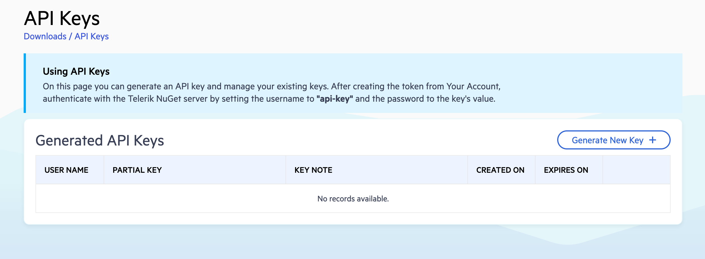
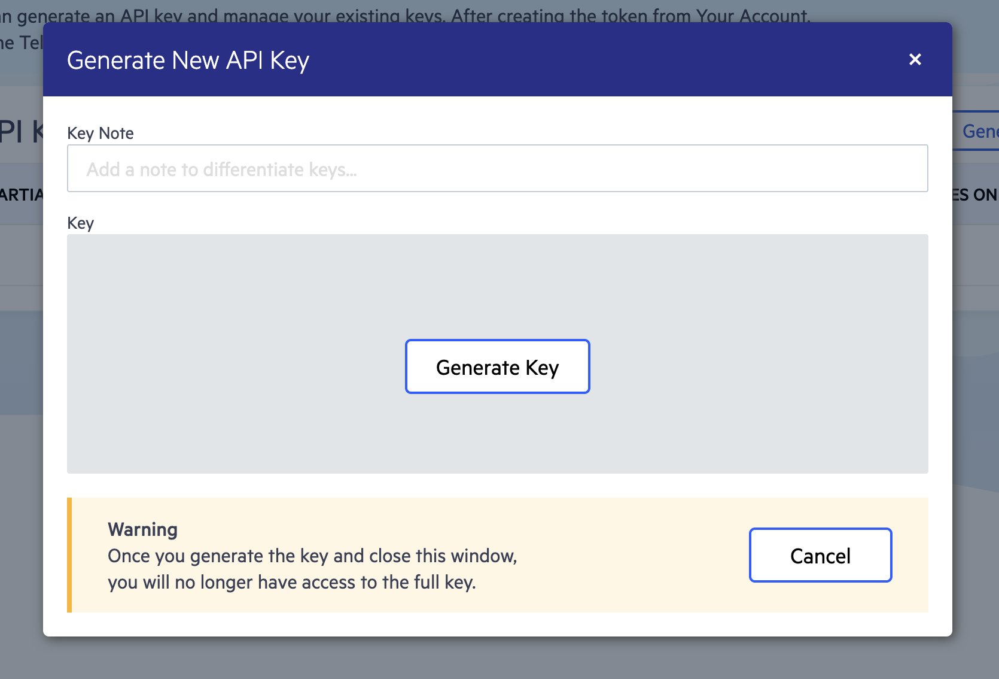

# Getting Started with the Agentic UI Generator

This article describes how to install, configure, and use the Telerik UI for Blazor Agentic UI Generator in Visual Studio and Visual Studio Code.

## Quick Start

Follow these steps to set up the Agentic UI Generator:

1. Ensure you have a supported license. You need a DevCraft Complete or Ultimate Subscription to access the Agentic UI Generator. If you have a different license type, you can start a [30-day AI Tools trial](https://www.telerik.com/mcp-servers-blazor/thank-you).

    > For more information about access requirements based on the license type, see [Usage Limits](slug:agentic-ui-generator-overview#usage-limits).
1. To add the MCP server to your IDE, create an `.mcp.json` file in your solution (if you are using Visual Studio), or an `mcp.json` file in your workspace (if you are using Visual Studio Code) with the following configuration:
   ````JSON.skip-repl
   {
     "servers": {
       "blazor-ui-generator": {
         "type": "http",
         "url": "https://uiagent.mcp.telerik.com/mcp/blazor",
         "headers": {
           "x-api-key": "YOUR API KEY"
         }
       }
      }
     }
   ````
   The server name `blazor-ui-generator` can be customized as desired. The name helps distinguish the MCP server in your configuration and does not affect how you invoke the generator tool in your prompt.

   > For more details on how to configure the MCP server, refer to the instructions for your specific IDE below:
   > * [Visual Studio](#visual-studio)
   > * [Visual Studio Code](#visual-studio-code)

1. Log in to your [Telerik account](https://www.telerik.com/account/) and generate an API key from the [API Keys page](https://www.telerik.com/account/downloads/api-keys). Replace `YOUR API KEY` in the `mcp.json` file with the generated key.

    > Refer to the [Obtaining the API Key](#obtaining-the-api-key) section below for detailed instructions.
1. Open the AI chat interface of your IDE and start your prompt with the `#telerik_ui_generator` handle to invoke the main generator tool:
    ````TEXT.skip-repl
    #telerik_ui_generator Create a dashboard page with a grid showing sales data and a chart visualizing monthly trends.
    ````

   > Step-by-step usage instructions are available in [Using the Agentic UI Generator](#using-the-agentic-ui-generator).

## Installation

Use the documentation of your AI-powered MCP client to add the Agentic UI Generator to a specific workspace or globally. Below you can find installation tips and examples for some popular MCP clients, and instructions for obtaining your API key.

### Visual Studio

You can use the Agentic UI Generator in Visual Studio on an application level, and you can also enable global automatic discovery of the tool.

#### Application Configuration

To enable the Agentic UI Generator in your application, in Visual Studio, add a `.mcp.json` file to the solution folder.

>caption .mcp.json

````JSON.skip-repl
{
  "servers": {
    "blazor-ui-generator": {
      "type": "http",
      "url": "https://uiagent.mcp.telerik.com/mcp/blazor",
      "headers": {
        "x-api-key": "YOUR API KEY"
      }
    }
  }
}
````

> Replace `YOUR API KEY` with the API key you generate.

The server name `blazor-ui-generator` can be changed to a custom value based on your preferences.

#### Global Configuration

To enable global automatic discovery of the Agentic UI Generator in Visual Studio, add the above `.mcp.json` file to your user directory (`%USERPROFILE%`), for example, `C:\Users\____\.mcp.json`.

> Once the MCP server configuration is added, make sure that the `blazor-ui-generator` tool is [enabled (checked) in the Copilot Chat window's tool selection dropdown](https://learn.microsoft.com/en-us/visualstudio/ide/mcp-servers?view=vs-2022#configuration-example-with-github-mcp-server). This dropdown opens when clicking the wrench icon 🔧 at the bottom of the Copilot Window. The Telerik Agentic UI Generator may get disabled when starting a new chat, changing threads, or relaunching Visual Studio. This is a known issue with MCP servers in general.

### Visual Studio Code

For more information about using MCP servers in Visual Studio Code, refer to [Use MCP servers in VS Code](https://code.visualstudio.com/docs/copilot/chat/mcp-servers).

Make sure that [`chat.mcp.enabled`](vscode://settings/chat.mcp.enabled) is enabled in the VS Code settings.

#### Workspace Configuration

To enable the Agentic UI Generator in a specific [workspace](https://code.visualstudio.com/docs/copilot/chat/mcp-servers#_add-an-mcp-server-to-your-workspace), Blazor app, or [globally](https://code.visualstudio.com/docs/copilot/chat/mcp-servers#_add-an-mcp-server-to-your-user-configuration), add a `.vscode` folder with an `mcp.json` file at the root of the workspace, app, or your user folder, respectively. 

>caption mcp.json

````JSON.skip-repl
{
  "servers": {
    "blazor-ui-generator": {
      "type": "http",
      "url": "https://uiagent.mcp.telerik.com/mcp/blazor",
      "headers": {
        "x-api-key": "YOUR API KEY"
      }
    }
  }
}
````

> Replace `YOUR API KEY` with the API key you generate.

The server name `blazor-ui-generator` can be changed to a custom value based on your preferences.

#### Global Configuration

To use the Agentic UI Generator in all workspaces and apps, make sure that [`chat.mcp.discovery.enabled`](vscode://settings/chat.mcp.discovery.enabled) is enabled in [`settings.json`](https://code.visualstudio.com/docs/configure/settings#_settings-json-file).

>caption VS Code settings.json

````JSON.skip-repl
{
  // ...
  "chat.mcp.discovery.enabled": true,
}
````

After adding the configuration, restart your IDE to load the Agentic UI Generator.

### Obtaining the API Key

The following steps provide detailed instructions for obtaining your [Telerik API key](https://www.telerik.com/account/downloads/api-keys), which you need to add as a `headers` parameter in the `mcp.json` file:

1. Log in to your [Telerik account](https://www.telerik.com/account/).
2. Navigate to **License Keys > API Keys**, or go directly to the [API Keys page](https://www.telerik.com/account/downloads/api-keys).

    

3. Click **Generate New Key** and provide a name of your choice, or use an existing API key if you already have one.

    

4. Copy the generated API key for use in the MCP configuration.


## Using the Agentic UI Generator

Once installed, start a new chat session in your IDE to begin interacting with the Agentic UI Generator via natural language prompts. The Agentic UI Generator can be used in two primary modes: basic usage through [the main tool](#call-the-agentic-ui-generator), or advanced usage by [calling specific MCP tools directly](#target-the-tools-advanced).

### Call the Agentic UI Generator

1. Open the AI chat interface in your IDE&mdash;Start a new chat session to begin interacting with the Agentic UI Generator.
1. In Visual Studio Code, you can start your prompt with the `#telerik_ui_generator` handle&mdash;this invokes the main MCP tool that uses an agentic flow to analyze and process your request.
    > Using the `#telerik_ui_generator` handle ensures the Agentic UI Generator is called. Alternatively, you can use natural language without the handle. Make sure to mention the "telerik" keyword in your natural language prompt, so that the AI model can automatically recognize when to call the generator. The generator analyzes your prompt and creates the appropriate Blazor components, markup, and styling.
1. Inspect the output and verify that the `blazor-ui-generator` MCP server  (or the one with your custom server name) is called. Look for a similar statement in the output:

    

1. If prompted, grant the MCP server permission to run for this session, workspace, or always.

### Target the Tools (Advanced)

For more granular control, you can call individual tools that make up the Agentic UI Generator:

| Tool Handle | Description |
|------------|-------------|
| `telerik_ui_generator` | Main generator for building full UI flows. Coordinates all other tools to deliver complete solutions. |
| `telerik_layout_assistant` | Applies suitable CSS utility classes from the Progress Design System for styling and positioning elements. Use this tool when you need help with spacing, typography, colors, layout structure, or transforms. |
| `telerik_component_assistant` | Answers questions and generates code related to Telerik UI for Blazor components. Use this tool when you need to implement or configure specific UI for Blazor components like Grid, Charts, Forms, etc. |
| `telerik_style_assistant` | Generates custom styles and theme configurations for your application. Use this tool when you need to apply brand-specific colors, create custom themes, or modify the overall visual design of your UI. |
| `telerik_icon_assistant` | Searches and retrieves icons from the Progress Design System iconography by name, category, or keywords. Use this tool when you need to find and add specific icons for your UI components or design elements. |

You can call these tools directly when you need specific functionality, allowing for more precise control over the generation process.

> Tagging specific tools in Visual Studio currently is not available. To increase the probability that a tool will be called, either explicitly mention the tool in your prompt, or specify that in your Copilot instructions. 

## See Also

* [Agentic UI Generator Overview](slug:agentic-ui-generator-overview)
* [Agentic UI Generator Prompt Library](slug:agentic-ui-generator-prompt-library)
* [Telerik Design System](https://www.telerik.com/design-system/docs/)
