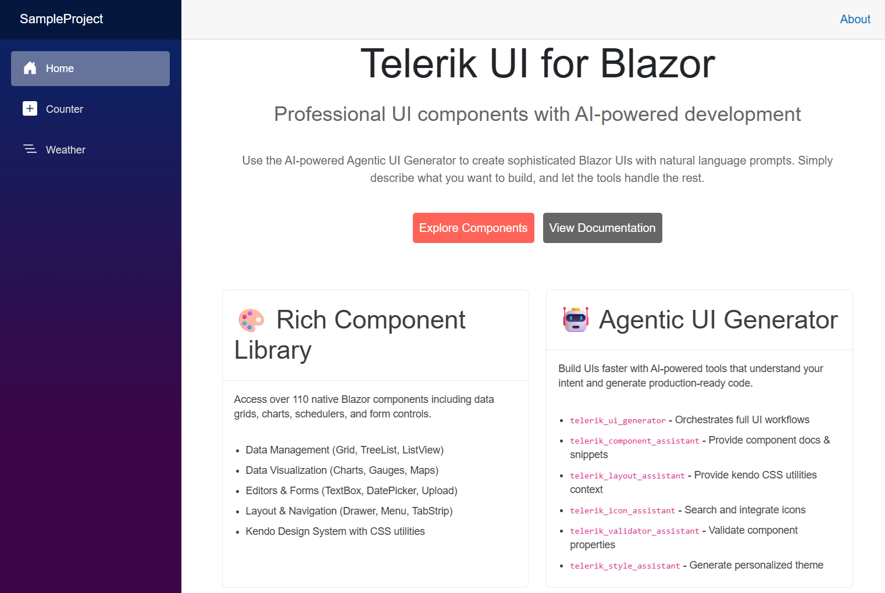

# Getting Started with the Agentic UI Generator

The Agentic UI Generator is an intelligent development tool delivered through the [Telerik Blazor MCP Server](https://www.nuget.org/packages/Telerik.Blazor.MCP) that enables UI generation from natural language prompts. It includes a comprehensive orchestrator that coordinates six specialized assistants working together to deliver complete, beautiful, on-brand, and enterprise-ready UIs.

This article describes a streamlined approach to setting up the Agentic UI Generator using the Kendo CLI, which automates license configuration, MCP server setup, and project scaffolding through a single guided command in your IDE.

## Prerequisites

To use the Telerik Blazor MCP server, you need:

* A [compatible MCP client (IDE, code editor, or app)](https://modelcontextprotocol.io/clients) that supports MCP server integrations.
* [.NET 8 or newer](https://dotnet.microsoft.com/en-us/download).
* Enabled HTTP/2 protocol support on the client device and any firewalls and proxies that may manage the network requests.
* A [Telerik user account](https://www.telerik.com/account/).
* An [active Telerik license](slug:ai-overview#license-requirements) that provides access to the Telerik Blazor MCP server.

## Getting Started with the Telerik CLI

Instead of manually creating configuration files, you can use the [Telerik CLI](https://www.nuget.org/packages/Telerik.CLI) and the built-in Getting Started Assistant to handle the entire setup automatically—whether you are starting a new project or adding Telerik UI for Blazor to an existing one.

Follow these steps:

1. Install the Telerik CLI globally by executing the following command in any standard command-line interface (CLI) or terminal on your operating system:
   ````SH.skip-repl
   dotnet tool install -g Telerik.CLI
   ````

1. Set up the Telerik NuGet feed so that the CLI and your IDE can restore Telerik packages:
   ````SH.skip-repl
   telerik nuget setup
   ````

1. Activate (update) your Telerik license:
   ````SH.skip-repl
   telerik license get-key
   ````
   The command downloads and stores the Telerik license key for the authenticated account.
  
   * Requires an active session [Telerik login](https://www.telerik.com/account/) first.
   * Stores the key file in the [Default Product License Key Location](slug:installation-license-key#manual-installation).

   > To obtain a license key or start a trial, visit the [Telerik License Key Setup](slug:installation-license-key#basics) page.
   
1. Generate the Telerik MCP configuration:
   ````SH.skip-repl
   telerik mcp all
   ````

1. Open your IDE (Visual Studio Code or another supported AI-enabled IDE). In the AI chat interface, invoke the Getting Started Assistant with the `#telerik_getting_started_assistant` handle and describe what you want to build:
   ````TEXT.skip-repl
   #telerik_getting_started_assistant create a new blazor web app
   ````

   The assistant analyzes your request and sets up everything needed to get you running with Telerik UI for Blazor—no manual file editing is required. When it is done, it outputs the URL on which the created app can be run and a summary of the completed tasks.

   >caption The application created by the Getting Started Assistant running in the browser

   

1. After the Getting Started Assistant completes its task, you can start prompting in your IDE's chat interface:
    - `#telerik_ui_generator` for full, orchestrated UI generation
    - `#telerik_component_assistant`, `#telerik_layout_assistant`, `#telerik_style_assistant`, `#telerik_icon_assistant`, or `#telerik_accessibility_assistant` for targeted workflows
   
   > For more details, see the [Using the Agentic UI Generator](slug:agentic-ui-generator-fundamentals#using-the-agentic-ui-generator) article.

## Getting Started Tool Parameters

The Getting Started tool accepts the following parameters to tailor the setup to your needs:

| Parameter | Type | Description |
|-----------|------|-------------|
| `createNewProject` | `bool` | Set to `true` to scaffold a new project, or `false` to install Telerik UI for Blazor into an existing project. |
| `projectName` | `string` | The name of the new project. Applies only when `createNewProject` is `true`. |
| `projectType` | `wasm` \| `webapp` | The type of Blazor application to create. Use `webapp` for a Blazor Web App (server-side rendering with optional interactivity) or `wasm` for a Blazor WebAssembly standalone app. |
| `theme` | `string` | The Telerik theme to apply. If not specified, the Default theme is used. |

When creating a new project, the tool uses the standard .NET Blazor Web App template and adds the configuration, package references, and theme assets required by Telerik UI for Blazor.

## See Also

* [Agentic UI Generator Fundamentals](slug:agentic-ui-generator-fundamentals)
* [Agentic UI Generator Getting Started](slug:agentic-ui-generator-getting-started)
* [Agentic UI Generator Prompt Library](slug:agentic-ui-generator-prompt-library)
* [Telerik Design System](https://www.telerik.com/design-system/docs/)
