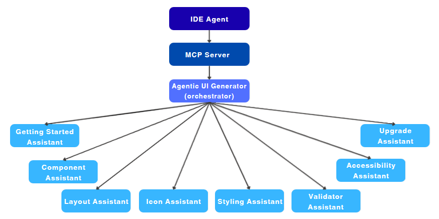
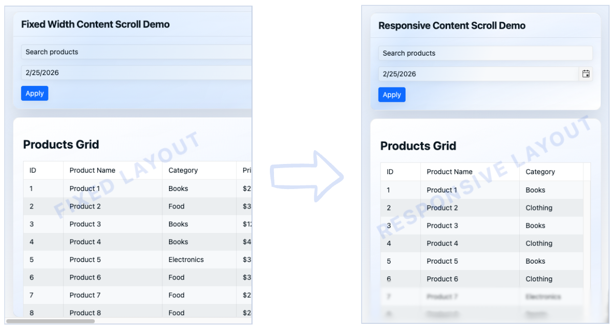
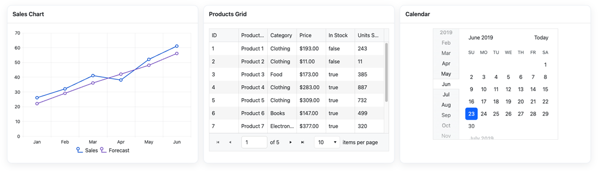
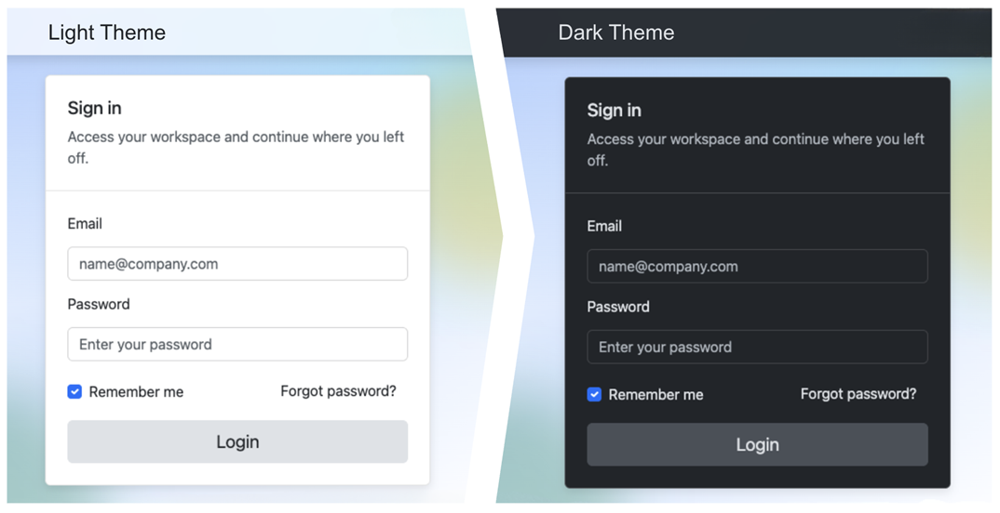
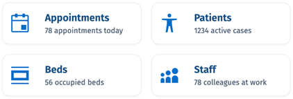

# Telerik UI for Blazor AI Tools Overview

The Telerik UI for Blazor AI Tools are delivered through a single [Model Context Protocol (MCP) server](https://modelcontextprotocol.io/docs/getting-started/intro) that connects your AI client to UI-generation capabilities and knowledge specific to Telerik UI for Blazor.

Use the MCP server to generate complete pages, configure components correctly, align with the Progress Design System, and reduce repetitive setup work. This overview helps you choose between the full Agentic UI Generator flow and the specialized assistants for setup, layout, component configuration, styling, icons, accessibility review, and validation.

## Before You Start

This overview assumes that you have:

* An AI client that supports MCP servers.
* Either an existing Telerik UI for Blazor project or a new project that you want to scaffold during setup.
* Access to an active Telerik subscription or a trial when you want to use the AI tools end to end.

Use this page to decide which AI tool fits your task. For installation steps, client-specific setup, and troubleshooting, continue with [Agentic UI Generator Getting Started](slug:agentic-ui-generator-getting-started).

If your client can connect to MCP servers but uses a different prompt UX, the same assistant roles still apply even when the exact interaction flow looks different.

## Supported AI Clients and .NET IDEs

The Telerik Blazor MCP Server is designed for AI clients that support MCP server integrations. The client provides the chat experience and sends requests to the Telerik tools; the Agentic UI Generator and specialized assistants provide Telerik UI for Blazor context.

The documentation includes setup guidance for the following AI clients:

| AI client | Compatibility status | Notes |
|---|---|---|
| GitHub Copilot | Documented for MCP-compatible hosts | Use the MCP configuration and enable the Telerik tools in the host's tool selection when required. |
| Cursor | Documented | Add the Telerik MCP server to the workspace or user configuration as described in the setup article. |
| Claude Code | Expected when MCP server support is available | Follow the client's current MCP configuration guidance. The client vendor controls its configuration and feature availability. |
| Windsurf | Expected when MCP server support is available | Follow the client's current MCP configuration guidance. The client vendor controls its configuration and feature availability. |

You can use the Telerik Blazor MCP Server from common .NET development environments, including:

* **Visual Studio**
* **Visual Studio Code**
* **JetBrains Rider**

The exact configuration steps depend on the IDE and AI client combination. For current setup examples, see [Agentic UI Generator Getting Started](slug:agentic-ui-generator-getting-started). Compatibility outside the documented examples depends on the client's MCP implementation and should be verified in the target environment.

## What Are the Telerik UI for Blazor AI Tools

The Telerik Blazor MCP Server is a local MCP server that is distributed through the [Telerik.Blazor.MCP](https://www.nuget.org/packages/Telerik.Blazor.MCP) NuGet package.

The Telerik Blazor MCP server uses an orchestration-first model, centered on the Agentic UI Generator tool. It contains a core set of specialized assistants. Click the cards below for more details on each assistant:

<Row>
    <Column count={[24,12,8]}>
        <Component className="tile card-icon" href="#how-the-agentic-flow-works">
            <ComponentTitle>UI Generator (Orchestrator)</ComponentTitle>
        </Component>
    </Column>
    <Column count={[24,12,8]}>
        <Component className="tile card-icon" href="#getting-started-assistant">
            <ComponentTitle>Getting Started Assistant</ComponentTitle>
        </Component>
    </Column>
    <Column count={[24,12,8]}>
        <Component className="tile card-icon" href="#component-assistant">
            <ComponentTitle>Component Assistant</ComponentTitle>
        </Component>
    </Column>
    <Column count={[24,12,8]}>
        <Component className="tile card-icon" href="#icon-assistant">
            <ComponentTitle>Icon Assistant</ComponentTitle>
        </Component>
    </Column>
    <Column count={[24,12,8]}>
        <Component className="tile card-icon" href="#layout-assistant">
        <ComponentTitle>Layout Assistant</ComponentTitle>
        </Component>
    </Column>
    <Column count={[24,12,8]}>
        <Component className="tile card-icon" href="#styling-assistant">
        <ComponentTitle>Styling Assistant</ComponentTitle>
                </Component>
    </Column>
    <Column count={[24,12,8]}>
      <Component className="tile card-icon" href="#accessibility-assistant">
        <ComponentTitle>Accessibility Assistant</ComponentTitle>
        </Component>
    </Column>
    <Column count={[24,12,8]}>
      <Component className="tile card-icon" href="#validator-assistant">
        <ComponentTitle>Validator Assistant</ComponentTitle>
        </Component>
    </Column>
</Row>

The Agentic UI Generator orchestrates all assistants so you can build pages and components, apply styling and theming, and stay aligned with the design system in one seamless process. You can use the full end-to-end flow when you need complete page generation, or call a specific assistant directly when you need a focused change.

## How the Agentic Flow Works

The Agentic UI Generator takes one prompt and manages the flow for you. It decides which assistants to use and combines their output into a single result. Choose this path when you want to generate a full page quickly, keep several design and implementation decisions coordinated, or move from prompt to first draft without manually switching tools.

## Which Path to Choose

Use the following scenarios to decide whether you need orchestration or a single assistant:

| Scenario | Best choice | Why |
|---|---|---|
| Generate a dashboard or landing page from one prompt | `#telerik_ui_generator` | The orchestrator can coordinate layout, components, styling, icons, accessibility, and validation in one pass. |
| Set up a new project and connect the MCP server | Getting Started Assistant | It focuses on project scaffolding, MCP configuration, Telerik UI for Blazor setup, and license activation. |
| Refine page hierarchy, spacing, and responsive breakpoints | Layout Assistant | It is optimized for section structure and responsive presentation decisions. |
| Configure a Grid, form, or other Telerik UI for Blazor component | Component Assistant | It helps with component selection, API usage, and feature configuration such as filtering, grouping, or export. |
| Apply brand tokens, theme variables, or high-contrast adjustments | Styling Assistant | It focuses on reusable styling decisions instead of component behavior. |
| Review keyboard flow, ARIA usage, and semantic markup before release | Accessibility Assistant | It is the right tool for WCAG-oriented review and corrective guidance. |

## What You Get Back

The result depends on the assistant that you call and the prompt that you provide. Typical outputs include:

* Proposed page structure and section hierarchy for a new screen.
* Telerik UI for Blazor component recommendations and configuration guidance.
* Generated or revised markup, styling guidance, and theme-token suggestions.
* Accessibility corrections for keyboard flow, ARIA usage, semantic markup, and contrast issues.
* Validation feedback that helps you review whether the generated result follows Telerik UI for Blazor best practices.

Treat the generated result as an accelerated first draft. Review data binding, business rules, service integration, and project-specific architecture before you ship the implementation.

## Prompt Examples

The following examples show when to choose the orchestrator or a targeted assistant:

| Goal | Best choice | Example prompt | Expected result |
|---|---|---|---|
| Create a complete analytics dashboard page | `#telerik_ui_generator` | `Create a Blazor analytics dashboard with KPI cards, a revenue chart, a filter form, and a pageable Grid for recent orders.` | A coordinated first draft that can include layout, Telerik UI for Blazor component choices, styling direction, and validation feedback. |
| Configure a Grid for richer behavior | Component Assistant | `Configure a Telerik UI for Blazor Grid with filtering, grouping, export, and virtual scrolling for an orders dataset.` | Focused guidance for Grid features, relevant configuration choices, and API-oriented implementation direction. |
| Refine layout without changing component behavior | Layout Assistant | `Rework this page into a two-column tablet layout and a single-column mobile layout while preserving the existing components.` | Revised section hierarchy, spacing, and responsive layout guidance. |

Use targeted assistants when the scope is narrow. Use the orchestrator when one request spans layout, components, styling, accessibility, and validation.

## How a Real Workflow Looks

The following examples show what an end-to-end interaction can look like in practice.

### Orchestrated Workflow Example

**Scenario:** You have a Blazor line-of-business app and need a new sales dashboard page.

**Prompt:** `Create a sales dashboard page with KPI cards, a revenue trend chart, a filter form, and a Telerik UI for Blazor Grid that shows recent orders with paging and filtering.`

**What the orchestrator typically coordinates:**

* Page structure and section order.
* Telerik UI for Blazor component selection for the cards, chart, form, and Grid.
* Styling direction that keeps the page aligned with the design system.
* Validation feedback for generated structure and Telerik usage patterns.

**What you still review manually:**

* Real data binding and service calls.
* Domain-specific filtering rules and business calculations.
* Security, authorization, and application-specific error handling.

### Targeted Workflow Example

**Scenario:** The page already exists, but the Grid configuration is incomplete.

**Prompt:** `Update this Telerik UI for Blazor Grid to support grouping, export, and virtual scrolling for large order datasets.`

**What the Component Assistant is best at:**

* Narrow component-level guidance instead of full-page regeneration.
* Feature-oriented configuration suggestions for the Grid API.
* Safer iteration when you want to refine one part of the page without changing layout or styling.

**What it does not replace:**

* Your application data model and transport layer decisions.
* Performance testing with your real dataset size and hosting constraints.

## Example Workflows

The following workflows show where the tools add Telerik-specific value:

1. First-time setup and first generated page:
    1. Start with the Getting Started Assistant to scaffold the project, connect the MCP server, and activate licensing.
    2. Prompt `#telerik_ui_generator` to build the first page.
    3. Let the orchestrator route layout, component, styling, and validation work automatically.
2. Existing application, new dashboard feature:
    1. Ask the Layout Assistant to propose the section structure for the dashboard.
    2. Use the Component Assistant to configure the Grid, charts, forms, or navigation elements.
    3. Bring in the Styling Assistant to apply tokens and theme refinements.
3. Final review before handoff:
    1. Run the Accessibility Assistant to catch keyboard, ARIA, and contrast issues.
    2. Use the Validator Assistant through the orchestrator to confirm Telerik UI for Blazor best practices.
    3. Return to a targeted assistant only when one part of the page needs refinement.

### Getting Started Assistant

Starting from a blank machine or a clean proof-of-concept is the best fit for the Getting Started Assistant. It guides the first-run experience: project scaffolding, MCP configuration, Telerik UI for Blazor setup, and license activation.

Best for: first-run setup, clean environment validation, and early proof-of-concept work.

It reduces setup friction, but it does not replace feature-specific documentation after the environment is ready.

### Layout Assistant

Layout work becomes easier once you know the content and component mix, but need help shaping the page around them. The Layout Assistant focuses on section order, spacing, and responsive behavior so the UI stays clear across desktop, tablet, and mobile.

Best for: dashboard structure, responsive adaptation, and visual hierarchy cleanup.

Typical outcomes include a clearer dashboard hierarchy, better spacing between sections, and responsive layouts that do not collapse awkwardly on smaller screens.

### Component Assistant

Component work is where the product-specific guidance is most visible. The Component Assistant helps you choose the right Telerik UI for Blazor component and configure it with real API patterns.

Best for: component selection, Telerik API usage, and feature configuration for controls such as the Grid and form inputs.

It is a strong fit for Grid features such as sorting, paging, filtering, grouping, export, and virtualization, as well as validated forms and safe sample-data prototypes.

### Styling Assistant

Styling decisions pay off early when you want more than a one-off visual tweak. The Styling Assistant helps define reusable tokens and CSS variables for scalable theming.

Best for: theme tokens, reusable CSS variables, and consistent visual refinement across multiple pages.

Bring it in for brand color systems, dark mode or high-contrast variants, and reusable styling rules that can scale as new pages are added.

### Icon Assistant

Icons are a small surface, but inconsistency shows up quickly in navigation and actions. The Icon Assistant helps you choose icons that match user intent and UI context.

Best for: action icons, navigation cues, and status indicators that need visual consistency.

It is especially useful for toolbars, navigation menus, cards, and status indicators where visual meaning must stay consistent across the app.

### Accessibility Assistant

Accessibility review is most effective before the page structure is locked down. The Accessibility Assistant applies WCAG 2.2 Level AA guidance during implementation and helps with ARIA usage, keyboard navigation, semantic markup, and color contrast validation for text and UI controls.

Best for: interactive templates, keyboard review, semantic corrections, and accessibility checks before release.

It is most valuable for interactive templates, complex component flows, and final semantic checks before release.

### Validator Assistant

The Validator Assistant is not a manual entry point. The orchestrator calls it automatically to check whether generated output follows Telerik UI for Blazor best practices and standards.

It helps confirm component usage, generated structure, and implementation direction, but it does not replace manual review of business logic, data access, or application-specific requirements.

### When to Use Orchestrated vs Targeted Mode

Use `#telerik_ui_generator` when one request spans layout, components, styling, accessibility, and validation. Switch to a dedicated assistant when the page already exists and you want to refine a single area without rerunning the full orchestration flow. For details, see [Target the Assistants (Advanced)](slug:agentic-ui-generator-prompt-library#assistant-specific-prompts).

## Limitations and Unsupported Scenarios

Keep the following boundaries in mind:

* This overview does not replace the detailed setup, troubleshooting, or API-focused articles linked from Getting Started and the Prompt Library.
* The AI tools can generate and refine UI, but application-specific business logic, backend integrations, and data contracts still require manual review and implementation decisions.
* The Validator Assistant is called through the orchestrator rather than used as a separate manual workflow.
* The output quality depends on the prompt quality, the available project context, and the capabilities of the client that connects to the MCP server.
* Existing-project results are only as complete as the context that the client can send. Missing component markup, incomplete data-model context, or partial file visibility can reduce output accuracy.
* Generated output can accelerate page composition and component setup, but it does not automatically verify production readiness, application architecture, or environment-specific deployment constraints.
* Some prompts need iterative refinement, especially when the request depends on custom data models, nonstandard design constraints, or project-specific architecture.
* License state, local tooling, and AI client capabilities can change the exact setup path for the same overall workflow.

## AI Plugin

The Agentic UI Generator also comes with an AI `telerik-blazor-plugin` that brings the same capabilities directly into your agent without any manual MCP configuration. Instead of tools, the plugin delivers the functionality as skills: purpose-built instructions that your agent picks up automatically from context or that you can call explicitly with a slash command. It is a convenient way to get started and an alternative to setting up the MCP Server through the Telerik CLI.

To explore the available skills and usage examples, see [Prompt Library](slug:agentic-ui-generator-prompt-library#skills-and-assistant-prompts).

## Start Building in Minutes

Go from zero setup to your first generated UI quickly with the smart Getting Started assistant. Start with [Agentic UI Generator Getting Started](slug:agentic-ui-generator-getting-started) for a simple, guided flow through Telerik CLI installation, MCP setup, license activation, and your first prompt.

Explore the [Agentic UI Generator Prompt Library](slug:agentic-ui-generator-prompt-library) for ready-to-use prompts covering common UI scenarios.

## License Requirements

The Telerik UI for Blazor MCP server and its tools are offered as a single experience through the **Agentic UI Generator** (`#telerik_ui_generator`) in [all active Telerik subscription licenses](https://www.telerik.com/purchase.aspx?filter=web).

<table>
<colgroup>
<col style="width: 40%">
<col style="width: 30%">
</colgroup>
<thead>
<tr>
<th>License Type</th>
<th>Agentic UI Generator</th>
</tr>
</thead>
<tbody>
<tr>
<td><strong>Subscription License</strong>
</td>
<td><svg xmlns="http://www.w3.org/2000/svg" width="24" height="24" viewBox="0 0 24 24"><path d="M20.285 2l-11.285 11.567-5.286-5.011-3.714 3.716 9 8.728 15-15.285z" stroke="white" stroke-width="2"/></svg></td>
</tr><tr>
<td><strong>Trial License</strong></td>
<td><svg xmlns="http://www.w3.org/2000/svg" width="24" height="24" viewBox="0 0 24 24"><path d="M20.285 2l-11.285 11.567-5.286-5.011-3.714 3.716 9 8.728 15-15.285z" stroke="white" stroke-width="2"/></svg></td>
</tr>
<tr>
<td><strong>Perpetual License</strong></td>
<td>No*</td>
</tr>

</tbody>
</table>

<em>
*  All AI tools are available with a <a href="https://www.telerik.com/mcp-servers-blazor/thank-you">30-day AI Tools trial</a> or <a href="https://www.telerik.com/try/ui-for-blazor">a Telerik UI for Blazor trial</a>.
</em>  

## Privacy

The Telerik MCP server operates under the following conditions:

* The MCP server does not have access to your workspace and application code. Note that when using the Telerik MCP server (or any other MCP server), the LLM generates parameters for the MCP server request, which may include parts of your application code.
* The MCP server does not use your prompts to train Telerik AI models.
* The MCP server does not generate the actual responses and has no access to these responses. The MCP server only provides a better context that helps your selected model (for example, GPT, Gemini, Claude) produce better responses.
* The MCP server does not associate your prompts with your Telerik user account. Your prompts and generated context are anonymized and stored for statistical and troubleshooting purposes.

## Next Steps

* [Agentic UI Generator Getting Started](slug:agentic-ui-generator-getting-started)
* [Agentic UI Generator Prompt Library](slug:agentic-ui-generator-prompt-library)

## See Also

* [MCP Clients](https://modelcontextprotocol.io/clients)
* [Changelog](slug:ai-changelog)

