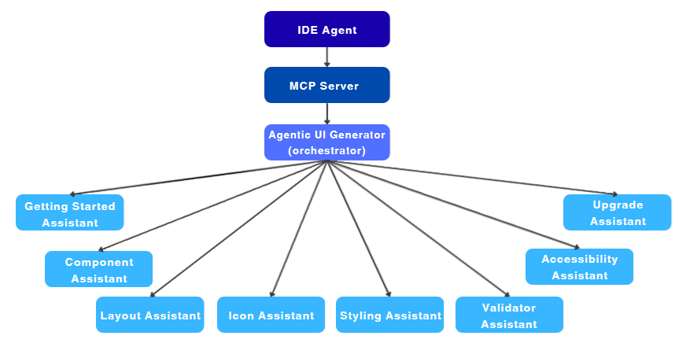
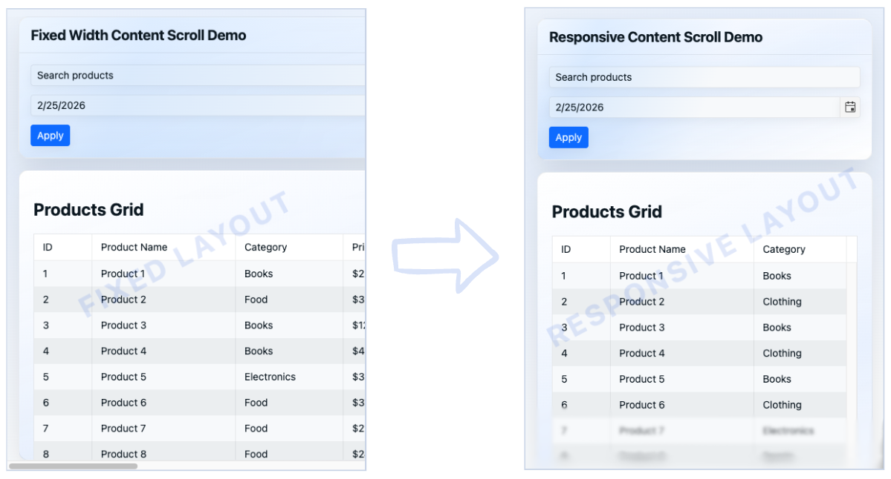
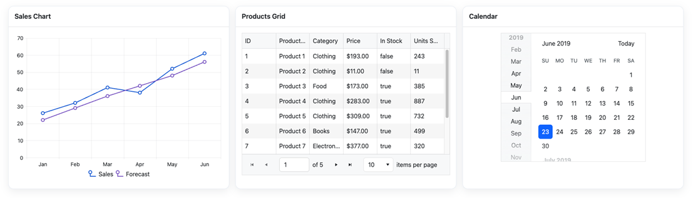
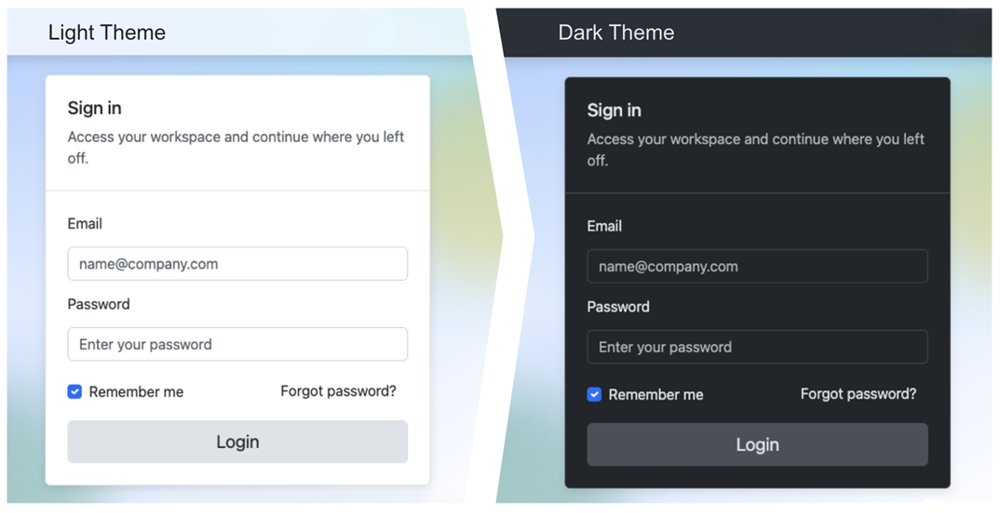
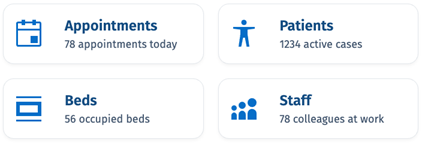

# Telerik UI for Blazor AI Tools Overview

Telerik delivers the Telerik UI for Blazor AI Tools through a single [Model Context Protocol (MCP) server](https://modelcontextprotocol.io/docs/getting-started/intro) that connects your AI client to UI-generation capabilities and knowledge specific to Telerik UI for Blazor.

From idea to implementation, you can use the MCP server to generate complete pages, configure components correctly, align with the Progress Design System, and reduce repetitive setup work.

## What Are the Telerik UI for Blazor AI Tools

You can install the local Telerik Blazor MCP Server through the [Telerik.Blazor.MCP](https://www.nuget.org/packages/Telerik.Blazor.MCP) NuGet package.

The Telerik Blazor MCP server uses an orchestration-first model, centered on the Agentic UI Generator tool. It contains a core set of specialized assistants. Click the cards below for more details on each assistant:

<Row>
    <Column count={[24,12,8]}>
        <Component className="tile card-icon" href="#how-the-agentic-flow-works">
            <ComponentTitle>UI Generator (Orchestrator)</ComponentTitle>
        </Component>
    </Column>
    <Column count={[24,12,8]}>
        <Component className="tile card-icon" href="#getting-started-assistant">
            <ComponentTitle>Getting Started Assistant</ComponentTitle>
        </Component>
    </Column>
    <Column count={[24,12,8]}>
        <Component className="tile card-icon" href="#component-assistant">
            <ComponentTitle>Component Assistant</ComponentTitle>
        </Component>
    </Column>
    <Column count={[24,12,8]}>
        <Component className="tile card-icon" href="#icon-assistant">
            <ComponentTitle>Icon Assistant</ComponentTitle>
        </Component>
    </Column>
    <Column count={[24,12,8]}>
        <Component className="tile card-icon" href="#layout-assistant">
        <ComponentTitle>Layout Assistant</ComponentTitle>
        </Component>
    </Column>
    <Column count={[24,12,8]}>
        <Component className="tile card-icon" href="#styling-assistant">
        <ComponentTitle>Styling Assistant</ComponentTitle>
    </Column>
    <Column count={[24,12,8]}>
      <Component className="tile card-icon" href="#accessibility-assistant">
        <ComponentTitle>Accessibility Assistant</ComponentTitle>
        </Component>
    </Column>
    <Column count={[24,12,8]}>
      <Component className="tile card-icon" href="#validator-assistant">
        <ComponentTitle>Validator Assistant</ComponentTitle>
        </Component>
    </Column>
    <Column count={[24,12,8]}>
      <Component className="tile card-icon" href="#upgrade-assistant">
        <ComponentTitle>Upgrade Assistant</ComponentTitle>
        </Component>
    </Column>
</Row>

The Agentic UI Generator orchestrates all assistants so you can build pages and components, apply styling and theming, and stay aligned with the design system in one workflow. You can use the full end-to-end flow when you need complete page generation, or call a specific assistant directly when you need a focused change.

## Before You Start

Before you use the AI Tools, make sure that you have the following:

* A local [Telerik Blazor MCP Server](https://www.nuget.org/packages/Telerik.Blazor.MCP) that connects your AI client to Telerik UI for Blazor.
* An active Telerik subscription or trial license. See [License Requirements](#license-requirements).
* A project or development environment where you can apply and review the generated output.

The [Agentic UI Generator Getting Started](slug:agentic-ui-generator-getting-started) article covers the setup flow. This overview does not replace detailed setup, manual configuration, or troubleshooting guidance. Use the [Prompt Library](slug:agentic-ui-generator-prompt-library) for assistant-specific prompts and examples.

## How the Agentic Flow Works

The Agentic UI Generator takes one prompt and manages the flow for you. It decides which assistants to use and combines their output into a single result. Use it when you want to generate a full page quickly, or call a specific assistant when you need a focused update to the layout, components, styling, theme, or icons in your project.

### Getting Started Assistant

Use the Getting Started Assistant when you want a guided onboarding flow for first-time setup. Call it to scaffold a Blazor project, configure the Telerik MCP server, set up Telerik UI for Blazor in the project, and complete license activation with minimal manual steps.

It is useful when setting up a new environment, validating your initial MCP integration, or preparing a clean proof of concept quickly.

### Layout Assistant

Start with the Layout Assistant when a page needs a clearer structure or responsive behavior. It helps with section order and spacing so the UI stays clear across desktop, tablet, and mobile.

Typical tasks include adding a new dashboard section, cleaning up visual hierarchy, and converting desktop-first screens into responsive layouts.

### Component Assistant

For Telerik UI for Blazor component configuration, turn to the Component Assistant. It helps you pick the right component and wire it correctly with real API patterns.

Common tasks include enabling Grid features (sorting, paging, filtering, grouping), building validated forms, setting up virtual scrolling or export, and using sample data for safe prototyping.

### Styling Assistant

To keep visuals consistent across the app, use the Styling Assistant to define reusable tokens and CSS variables for scalable theming.

Typical tasks include applying brand colors, adding dark mode or high-contrast variants, and keeping styling behavior consistent as new pages are added.

### Icon Assistant

For navigation, status indicators, and action buttons, the Icon Assistant chooses icons that match the user action and UI context.

It is useful for toolbars, navigation menus, cards, and any new section where icon consistency matters.

### Accessibility Assistant

Before release, use the Accessibility Assistant to apply WCAG 2.2 Level AA guidance during implementation. It helps with ARIA usage, keyboard navigation, semantic markup, and color contrast validation for text and UI controls.
It is especially useful for interactive templates, complex component flows, and final semantic checks before release.

### Validator Assistant

Do not invoke the Validator Assistant manually. The UI Generator Orchestrator calls it automatically to ensure the generated code follows documented Telerik UI for Blazor practices and standards.

### Upgrade Assistant

Use the Upgrade Assistant to migrate existing Blazor applications to the latest version of Telerik UI for Blazor. It automates detection and resolution of [breaking API changes](slug:versions-with-breaking-changes), NuGet version bumps, and CDN reference updates.

For best results, use the Upgrade Assistant with the highest-tier model available in your AI client. More capable models reason more accurately over complex migration scenarios and produce more reliable file edits.

### When to Use Orchestrated vs Targeted Mode

Choose the orchestration-first flow when you can describe a complete page or component outcome in one prompt. Use `#telerik_ui_generator` to let the Agentic UI Generator select assistants and combine their output.

Choose targeted mode when you need a focused change to an existing project. Call a specialized assistant directly for layout, component configuration, styling, theme, or icon updates. For details, see [Target the Assistants (Advanced)](slug:agentic-ui-generator-prompt-library#assistant-specific-prompts).

## Example Workflows

Use these scenarios to choose a starting point:

* Generate a complete page from one prompt: Use the Agentic UI Generator.
* Configure Grid sorting, paging, filtering, grouping, virtual scrolling, or export: Use the Component Assistant.
* Convert a desktop-first page into a responsive layout: Use the Layout Assistant.
* Apply brand colors, dark mode, or high-contrast variants: Use the Styling Assistant.
* Check ARIA usage, keyboard navigation, semantic markup, and color contrast: Use the Accessibility Assistant.

## AI Plugin

The Agentic UI Generator also comes with an AI `telerik-blazor-plugin` that brings these capabilities directly into your agent. Instead of tools, the plugin delivers the functionality as skills: purpose-built instructions that your agent picks up automatically from context or that you can call explicitly with a slash command.

To explore the available skills and usage examples, see [Prompt Library](slug:agentic-ui-generator-prompt-library#skills-and-assistant-prompts).

## Start Building in Minutes

Go from zero setup to your first generated UI quickly with the smart Getting Started assistant. Start with [Agentic UI Generator Getting Started](slug:agentic-ui-generator-getting-started) for a simple, guided flow through Telerik CLI installation, MCP setup, license activation, and your first prompt.

Explore the [Agentic UI Generator Prompt Library](slug:agentic-ui-generator-prompt-library) for ready-to-use prompts covering common UI scenarios.

## License Requirements

Telerik offers the Telerik UI for Blazor MCP server and its tools as a single experience through the **Agentic UI Generator** (`#telerik_ui_generator`) in [all active Telerik subscription licenses](https://www.telerik.com/purchase.aspx?filter=web).

<table>
<colgroup>
<col style="width: 40%">
<col style="width: 30%">
</colgroup>
<thead>
<tr>
<th>License Type</th>
<th>Agentic UI Generator</th>
</tr>
</thead>
<tbody>
<tr>
<td><strong>Subscription License</strong>
</td>
<td><svg xmlns="http://www.w3.org/2000/svg" width="24" height="24" viewBox="0 0 24 24" role="img" aria-label="Available"><path d="M20.285 2l-11.285 11.567-5.286-5.011-3.714 3.716 9 8.728 15-15.285z" stroke="white" stroke-width="2"/></svg></td>
</tr><tr>
<td><strong>Trial License</strong></td>
<td><svg xmlns="http://www.w3.org/2000/svg" width="24" height="24" viewBox="0 0 24 24" role="img" aria-label="Available"><path d="M20.285 2l-11.285 11.567-5.286-5.011-3.714 3.716 9 8.728 15-15.285z" stroke="white" stroke-width="2"/></svg></td>
</tr>
<tr>
<td><strong>Perpetual License</strong></td>
<td>No*</td>
</tr>

</tbody>
</table>

<em>
*  All AI tools are available with a <a href="https://www.telerik.com/mcp-servers-blazor/thank-you">30-day AI Tools trial</a> or <a href="https://www.telerik.com/try/ui-for-blazor">a Telerik UI for Blazor trial</a>.
</em>  

## Privacy

The Telerik MCP server operates under the following conditions:

* The MCP server does not have access to your workspace and application code. Note that when using the Telerik MCP server (or any other MCP server), the LLM generates parameters for the MCP server request, which may include parts of your application code.
* The MCP server does not use your prompts to train Telerik AI models.
* The MCP server does not generate the actual responses and has no access to these responses. The MCP server only provides a better context that helps your selected model (for example, GPT, Gemini, Claude) produce better responses.
* The MCP server does not associate your prompts with your Telerik user account. Your prompts and generated context are anonymized and stored for statistical and troubleshooting purposes.

## Next Steps

* [Agentic UI Generator Getting Started](slug:agentic-ui-generator-getting-started)
* [Agentic UI Generator Prompt Library](slug:agentic-ui-generator-prompt-library)

## See Also

* [MCP Clients](https://modelcontextprotocol.io/clients)
* [Changelog](slug:ai-changelog)

