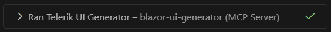

# Agentic UI Generator Fundamentals

The Agentic UI Generator is an intelligent development tool delivered through the [Telerik Blazor MCP Server](https://www.nuget.org/packages/Telerik.Blazor.MCP) that enables UI generation from natural language prompts. It includes a comprehensive orchestrator that coordinates six specialized assistants working together to deliver complete, beautiful, on-brand, and enterprise-ready UIs.

This article describes how to use the Agentic UI Generator, target its specialized assistants, and understand usage limits and privacy considerations.

## Using the Agentic UI Generator

Once installed, start a new chat session in your IDE to begin interacting with the Agentic UI Generator via natural language prompts. The Agentic UI Generator can be used in two primary modes: basic usage through [the Agentic UI Generator orchestrator](#call-the-agentic-ui-generator), or advanced usage by [calling specific MCP assistants directly](#target-the-assistants-advanced).

### Call the Agentic UI Generator

1. Open the AI chat interface in your IDE&mdash;Start a new chat session to begin interacting with the Agentic UI Generator.
1. In Visual Studio Code, you can start your prompt with the `#telerik_ui_generator` handle&mdash;this invokes the main MCP tool that uses an agentic flow to analyze and process your request.
    > Using the `#telerik_ui_generator` handle ensures the Agentic UI Generator is called. Alternatively, you can use natural language without the handle. Make sure to mention the "telerik" keyword in your natural language prompt, so that the AI model can automatically recognize when to call the generator. The generator analyzes your prompt and creates the appropriate Blazor components, markup, and styling.
1. Inspect the output and verify that the `telerik-blazor-mcp` MCP server (or the one with your custom server name) is called. Look for a similar statement in the output:

    

1. If prompted, grant the MCP server permission to run for this session, workspace, or always.

### Target the Assistants (Advanced)

For more precise control over the generation process, you can invoke the specialized assistants individually using their dedicated handles. Each assistant focuses on a specific aspect of UI development:

| Assistant | Handle | Purpose |
|------------|-------------|-------------|
| Layout Assistant | `telerik_layout_assistant` | Applies suitable CSS utility classes from the [Progress Design System](https://www.telerik.com/design-system/docs/) for styling and positioning elements. Use this assistant when you need help with spacing, typography, colors, layout structure, or transforms. |
| Component Assistant | `telerik_component_assistant` | Answers questions and generates code related to Telerik UI for Blazor components. Use this assistant when you need to implement or configure specific UI for Blazor components like Grid, Charts, Forms, etc. |
| Style Assistant | `telerik_style_assistant` | Generates custom styles and theme configurations for your application. Use this assistant when you need to apply brand-specific colors, create custom themes, or modify the overall visual design of your UI. |
| Icon Assistant | `telerik_icon_assistant` | Searches and retrieves icons from the [Progress Design System Iconography](https://www.telerik.com/design-system/docs/foundation/iconography/icon-list/) by name, category, or keywords. Use this assistant when you need to find and add specific icons for your UI components or design elements. |
| Accessibility Assistant | `telerik_accessibility_assistant` | Provides WCAG 2.2 Level AA guidance and component-specific accessibility implementation details. Use this assistant to ensure your UI meets compliance standards, implements correct ARIA roles, and retrieves accessibility API references for Telerik UI for Blazor components. |
| Validator Assistant | n/a | Not designed to be invoked manually. It is called automatically by the UI Generator Orchestrator and ensures the generated code follows Telerik UI for Blazor best practices and standards. |

For examples of how to use each specialized assistant, see the [Assistant-Specific Prompts](slug:agentic-ui-generator-prompt-library#assistant-specific-prompts) section in the Prompt Library article.

> Using assistant handles to target specific tools in Visual Studio currently is not available. To increase the probability that a tool will be called, either explicitly mention the tool in your prompt, or specify that in your Copilot instructions.

## Agentic UI Generator in Telerik REPL for Blazor

Telerik REPL for Blazor now includes a Preview integration with the Agentic UI Generator. Through this integration, developers can generate complete UI pages, layouts, and UI for Blazor components directly in the browser and evaluate them in real time&mdash;making it easy to experiment with different configurations without setting up a local project. For more details, see [Agentic UI Generator Integration in Blazor REPL](slug:blazor-repl-integration#agentic-ui-generator-integration-with-blazor-repl-preview).

## Usage Limits

* [Subscription licenses](#license-requirements) grant a virtually unlimited number of requests. Fair use policy applies.
* Perpetual licenses do not grant access to the Telerik AI tools.
* [AI tools trials](https://www.telerik.com/mcp-servers-blazor/thank-you) :
    * Grant a virtually unlimited number of requests for a 30-day evaluation. Fair use policy applies.
    * Do not grant additional requests when reactivating the same trial for a new release.
* Requests count toward your account's usage quota.
* One prompt may trigger multiple requests depending on complexity.

## Privacy

The Telerik MCP server operates under the following conditions:

* The MCP server does not have access to your workspace and application code. Note that when using the Telerik MCP server (or any other MCP server), the LLM generates parameters for the MCP server request, which may include parts of your application code.
* The MCP server does not use your prompts to train Telerik AI models.
* The MCP server does not generate the actual responses and has no access to these responses. The MCP server only provides a better context that helps your selected model (for example, GPT, Gemini, Claude) provide better responses.
* The MCP server does not associate your prompts to your Telerik user account. Your prompts and generated context are anonymized and stored for statistical and troubleshooting purposes.
* The MCP server stores metrics about how often and how much you use it in order to ensure compliance with the [allowed number of requests that correspond to your current license](#usage-limits).

### Best Practices

To get the best results from the Agentic UI Generator:

* Start with a focused prompt, then iterate by adding requirements step by step.
* Be explicit about layout, behavior, data structure, and acceptance criteria.
* Reference existing components, styling, or patterns to match (for example the [Progress Design System](https://www.telerik.com/design-system/docs/)).
* Attach relevant files so the generator can align with your current project structure.
* Use `#telerik_ui_generator` when you want coordinated output across layout, components, styling, icons, and accessibility.
* Specify responsive behavior for desktop, tablet, and mobile.
* Keep your Blazor project structure and naming conventions consistent.
* Review, test, and validate generated code before using it in production.
* While the Agentic UI Generator performs close to parity with Copilot when paired with powerful models like **Claude Sonnet 4.5**, **GPT-5.2**, or **Gemini 3 Pro**, it also excels with smaller models such as **Haiku** and **GPT 5.1 mini**.

## .NET 8 and 9 Local Tool Installation

For .NET 8 and 9 projects, you can install the MCP server as a local tool without global installation:

````bash.skip-repl
dotnet tool install Telerik.Blazor.MCP
````

MCP configuration for VS Code `.vscode/mcp.json` using local tools:

````JSON.skip-repl
{
  "servers": {
    "telerik-blazor-mcp": {
      "type": "stdio",
      "command": "dotnet",
      "args": ["tool", "run", "telerik-blazor-mcp"],
      // set any of the arguments in the 'env' configuration below, if you haven't set up your license file globally 
      //"env": {
      //  "TELERIK_LICENSE_PATH": "THE_PATH_TO_YOUR_LICENSE_FILE",
      //  // or
      //  "TELERIK_LICENSE": "YOUR_LICENSE_KEY"
      //}
    }
  },
  "inputs": []
}
````

> The `command` argument value must be `dotnet` when you configure the MCP server for .NET 8 or 9.

## See Also

* [Agentic UI Generator Getting Started](slug:agentic-ui-generator-getting-started)
* [Agentic UI Generator Smart Getting Started](slug:agentic-ui-generator-smart-getting-started)
* [Agentic UI Generator Prompt Library](slug:agentic-ui-generator-prompt-library)
* [Telerik Design System](https://www.telerik.com/design-system/docs/)
