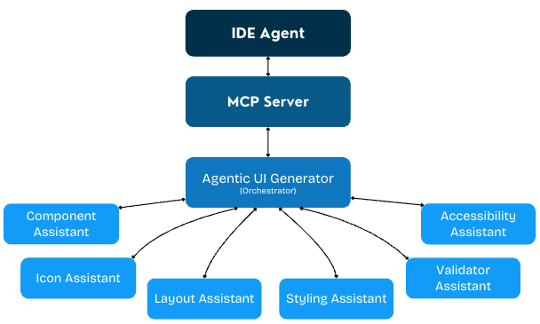
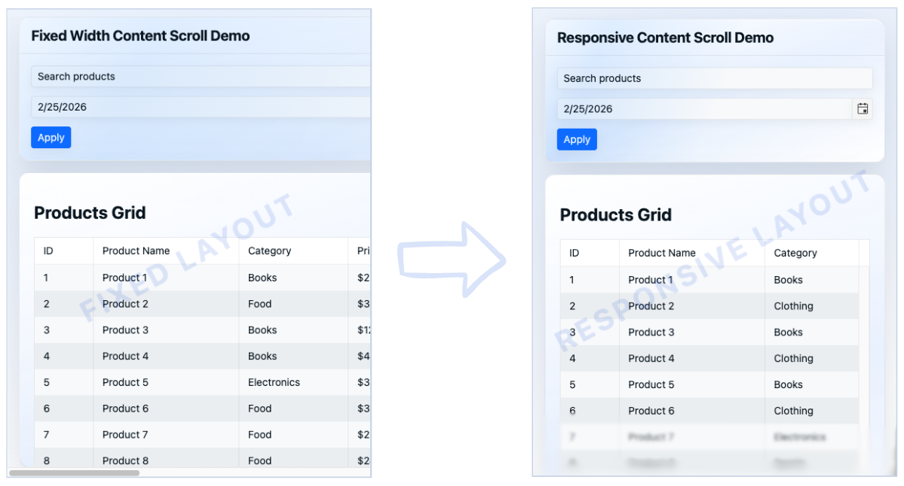
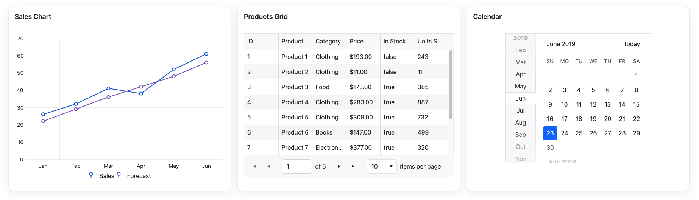

# Telerik UI for Blazor AI Tools Overview

The Telerik UI for Blazor AI Tools are delivered through a single [Model Context Protocol (MCP) server](https://modelcontextprotocol.io/docs/getting-started/intro) that connects your AI client to UI-generation capabilities and knowledge specific to Telerik UI for Blazor.

From idea to implementation, you can use the MCP server to generate complete pages, configure components correctly, align with the Progress Design System, and reduce repetitive setup work.

## What Are the Telerik UI for Blazor AI Tools

The Telerik Blazor MCP Server is a local MCP server that is distributed through the [Telerik.Blazor.MCP](https://www.nuget.org/packages/Telerik.Blazor.MCP) NuGet package.

The Telerik Blazor MCP server uses an orchestration-first model, centered on the Agentic UI Generator tool. It contains a core set of specialized assistants:

<Row>
    <Column count={[24,12,8]}>
        <Component className="tile card-icon" href="#how-the-agentic-flow-works">
            <ComponentTitle>UI Generator (Orchestrator)</ComponentTitle>
        </Component>
     </Column>
    <Column count={[24,12,8]}>
        <Component className="tile card-icon" href="#component-assistant">
            <ComponentTitle>Component Assistant</ComponentTitle>
        </Component>
    </Column>
    <Column count={[24,12,8]}>
        <Component className="tile card-icon" href="#icon-assistant">
            <ComponentTitle>Icon Assistant</ComponentTitle>
        </Component>
    </Column>
    <Column count={[24,12,6]}>
        <Component className="tile card-icon" href="#layout-assistant">
        <ComponentTitle>Layout Assistant</ComponentTitle>
        </Component>
    </Column>
    <Column count={[24,12,6]}>
        <Component className="tile card-icon" href="#styling-assistant">
        <ComponentTitle>Styling Assistant</ComponentTitle>
    </Column>
    <Column count={[24,12,6]}>
      <Component className="tile card-icon" href="#accessibility-assistant">
        <ComponentTitle>Accessibility Assistant</ComponentTitle>
        </Component>
    </Column>
    <Column count={[24,12,6]}>
      <Component className="tile card-icon" href="#validator-assistant">
        <ComponentTitle>Validator Assistant</ComponentTitle>
        </Component>
    </Column>
</Row>

The Agentic UI Generator orchestrates all assistants so you can build pages and components, apply styling and theming, and stay aligned with the design system in one seamless process. You can use the full end-to-end flow when you need complete page generation, or call a specific assistant directly when you need a focused change.

 

## How the Agentic Flow Works

The Agentic UI Generator takes one prompt and manages the flow for you. It decides which assistants to use and combines their output into a single result. Use it when you want to generate a full page quickly, or call a specific assistant when you need a focused update to the layout, components, styling, theme, or icons in your project.


### Layout Assistant

Use the Layout Assistant to set up or refine the page structure. It helps with section order, spacing, and responsive behavior so the UI stays clear across desktop, tablet, and mobile.

Typical tasks include adding a new dashboard section, cleaning up visual hierarchy, and converting desktop-first screens into responsive layouts.



### Component Assistant

Use the Component Assistant when you need help implementing or configuring Telerik UI for Blazor components. It helps you pick the right component and wire it correctly with real API patterns.

Common tasks include enabling Grid features (sorting, paging, filtering, grouping), building validated forms, setting up virtual scrolling or export, and using sample data for safe prototyping.



### Styling Assistant

Use the Styling Assistant when you want consistent visuals across the app. It helps define reusable tokens and CSS variables for scalable theming.

Typical tasks include applying brand colors, adding dark mode or high-contrast variants, and keeping styling behavior consistent as new pages are added.


### Icon Assistant

Use the Icon Assistant to choose icons that match user actions and UI context. It helps keep navigation, status indicators, and action buttons visually consistent.

It is useful for toolbars, navigation menus, cards, and any new section where icon consistency matters.


### Accessibility Assistant

Use the Accessibility Assistant to apply WCAG 2.2 Level AA guidance during implementation, not after it. It helps with ARIA usage, keyboard navigation, and semantic markup.
It is especially useful for interactive templates, complex component flows, and final semantic checks before release.


### Validator Assistant

Not designed to be invoked manually. It is called automatically by the UI Generator Orchestrator and ensures the generated code follows Telerik UI for Blazor best practices and standards.

### When to Use Orchestrated vs Targeted Mode

Use `#telerik_ui_generator` for a complete orchestration-first workflow from a single prompt. When you need finer control or want to adjust just one aspect (such as layout, theme, or a component), you can call a specialized assistant directly by its dedicated handle. For details, see [Target the Assistants (Advanced)](slug:agentic-ui-generator-getting-started#target-the-assistants-advanced).

## Start Building in Minutes

To get started with the Telerik Blazor MCP server, complete the following steps:

1. [Configure the MCP server](slug:ai-installation#mcp-server-configuration)
1. _(Optional)_ [Set up your Telerik license key](slug:ai-installation#license-key-setup) if not already configured globally
1. Start prompting in your IDE's chat interface:
    - `#telerik_ui_generator` for full, orchestrated UI generation
    - `#telerik_component_assistant`, `#telerik_layout_assistant`, `#telerik_style_assistant`, `#telerik_icon_assistant`, or `#telerik_accessibility_assistant` for targeted workflows

For detailed setup instructions, see the [Installation](slug:ai-installation) article. For guided usage, continue with [Agentic UI Generator Getting Started](slug:agentic-ui-generator-getting-started).

### Example Prompts and Expected Results

The following examples show how natural-language prompts can map to practical, editable output in your project.

```prompt Sales Dashboard
#telerik_ui_generator Build a sales operations dashboard with a pageable and sortable Grid, a monthly revenue Chart, and a KPI summary row.`
```
```Razor
```

**Expected result:** A page scaffold with responsive sections, configured Telerik UI for Blazor Grid and Chart, both wired to sample data, and KPI cards arranged for desktop and mobile.

```prompt Dark Theme
#telerik_ui_generator Apply a dark theme and define reusable CSS variables for brand, surface, and semantic colors.`
```
```Razor
```

**Expected result:** A token-driven theme setup with color variables and a dark-mode-ready styling baseline that you can refine for your brand.

```prompt Sign-in Form
#telerik_ui_generator Create a sign-in page with validation, accessible labels, keyboard-friendly form flow, and clear action buttons.`
```
```Razor
```

**Expected result:** A clean authentication layout with Telerik UI for Blazor form inputs, validation patterns, accessible markup, and consistent button/icon treatment.

You can start with these as-is, then iterate by asking for focused updates to layout, component behavior, theme tokens, icons, or accessibility details.

## License Requirements

The Telerik UI for Blazor MCP server and its tools are offered as a single experience through the **Agentic UI Generator** (`#telerik_ui_generator`) in [all active Telerik subscription models](https://www.telerik.com/purchase.aspx?filter=web).

<table>
<thead>
<tr>
<th width="40%">License Type</th>
<th width="30%">Agentic UI Generator</th>
</tr>
</thead>
<tbody>
<tr>
<td><strong>Subscription License</strong>
</td>
<td><svg xmlns="http://www.w3.org/2000/svg" width="24" height="24" viewBox="0 0 24 24"><path d="M20.285 2l-11.285 11.567-5.286-5.011-3.714 3.716 9 8.728 15-15.285z" stroke="white" stroke-width="2"/></svg></td>
</tr><tr>
<td><strong>Trial License</strong></td>
<td><svg xmlns="http://www.w3.org/2000/svg" width="24" height="24" viewBox="0 0 24 24"><path d="M20.285 2l-11.285 11.567-5.286-5.011-3.714 3.716 9 8.728 15-15.285z" stroke="white" stroke-width="2"/></svg></td>
</tr>
<tr>
<td><strong>Perpetual License</strong></td>
<td>No*</td>
</tr>

</tbody>
</table>

<p style="font-size: 18px; font-style: italic; color: #666; margin-top: 12px; line-height: 1.5;">
<em>
*  All AI tools are available with a <a href="https://www.telerik.com/mcp-servers-blazor/thank-you">30-day AI Tools trial</a> or <a href="https://www.telerik.com/try/ui-for-blazor">a Telerik UI for Blazor trial</a>.
</em> <br/>

</p>

## Next Steps

* [Installing the Telerik MCP server](slug:ai-installation)
* [Agentic UI Generator Getting Started](slug:agentic-ui-generator-getting-started)
* [Agentic UI Generator Prompt Library](slug:agentic-ui-generator-prompt-library)

## See Also

* [MCP Clients](https://modelcontextprotocol.io/clients)
* [Changelog](slug:ai-changelog)


<style>
div .card-icon {
    padding: 10px 0;
}

.d-print-none button:nth-child(2) {
  display: none !important;
}
</style>
