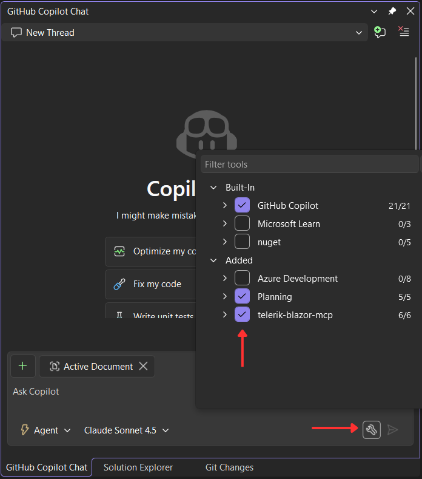

# Troubleshooting

This article provides solutions to common issues you may encounter when working with the Telerik UI for Blazor AI Tools.

>warning **Кnown Issue: Hanging tool calls in Visual Studio**
>
> When using Telerik AI tools in Visual Studio, GitHub Copilot may:
> * **hang** during tool invocation;
> * show UI for a successful tool response, but actually **fail silently**;
> * continue generation without waiting for **parallel tool calls**.
>
> In these cases, the response may be generated but not provided to the Copilot Agent UI.
>
> This is a known issue in Visual Studio Copilot, not related to Telerik MCP servers or AI tools, and does not reproduce in VS Code.
>
> For more details, see the related Visual Studio Developer Community issue:  
https://developercommunity.visualstudio.com/t/Copilot-stopped-working-after-latest-upd/10936456
>
> Microsoft has acknowledged the issue and marked it as **Fixed - Pending Release**. A future Visual Studio update is expected to resolve it.

## AI Coding Assistant Stopped Working

Starting in January 2026, we restructured the Telerik UI for Blazor AI Tools to better serve different user needs. Both the AI Coding Assistant and the Agentic UI Generator are now delivered through a single Telerik MCP server. The AI Coding Assistant is a streamlined version of the Agentic UI Generator, providing access to Component, Icon and Validator tools with a component-focused orchestrator.

License requirements have changed as follows:

* **DevCraft Complete Subscription or DevCraft Ultimate Subscription**&mdash;Provides full access to the Agentic UI Generator, including the Component, Layout, Styling, Icon, and Validator tools with comprehensive orchestration capabilities.
* **DevCraft UI Subscription, Telerik UI for Blazor Subscription**&mdash;Provide access to the AI Coding Assistant with Component, Icon, and Validator tools.
* **Perpetual licenses**&mdash;Do not grant access to any of the AI tools. You must have an active Subscription or trial license to use the Telerik MCP server.

For detailed information about license requirements and tool capabilities, see [License Requirements](slug:ai-overview#license-requirements).

## I Started a Trial License but Cannot Activate the MCP Server

When you activate a trial license, you must download and install the updated license key to enable access to the AI Tools. To resolve this issue:

1. Follow the steps in the [License Key Updates](slug:installation-license-key#license-key-updates) section.
1. Restart your IDE to ensure the changes take effect.

The MCP server validates your license during initialization. Without a properly activated license key, the server cannot authenticate your access to the AI Tools.

## The MCP Server Tools Are Not Recognized by Visual Studio

If the Telerik MCP server tools are not available or recognized by GitHub Copilot in Visual Studio, you may need to manually enable them:

1. Click on the *Select Tools* button on the bottom right part of the Copilot chat window.
1. In the popup that opens, check the **telerik-blazor-mcp** from the list to enable it.

## See Also

* [Telerik UI for Blazor AI Tools Overview]()
* [Telerik MCP Server Installation]()
* [Licensing]()
