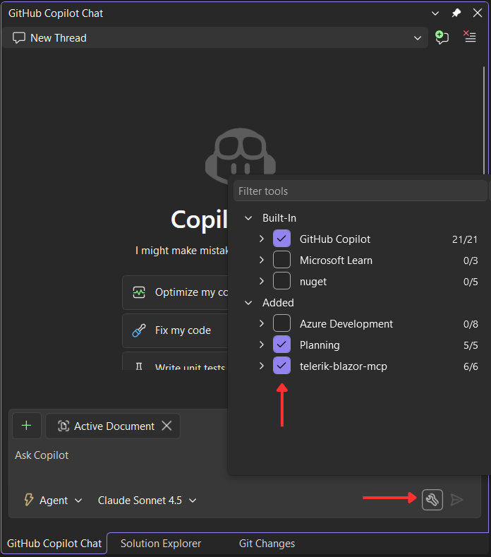

# Troubleshooting

This article provides solutions to common issues you may encounter when working with the Telerik UI for Blazor AI Tools.

## No Access to the AI Coding Assistant

Starting in February 2026, we restructured the Telerik UI for Blazor AI Tools to better serve different user needs by deprecating the AI Coding Assistant. The Telerik Blazor MCP server now provides a single workflow centered around the Agentic UI Generator tool and its specialized MCP assistants.

As part of this restructuring, license requirements have also changed.:

* **All active Telerik Subscription models**&mdash;Provide access to the Agentic UI Generator.
* **Trial licenses**&mdash;Provide access to the Agentic UI Generator during the active trial period.
* **Perpetual licenses**&mdash;Do not grant access to the AI tools. You must have an active Subscription or a trial license to use the Telerik Blazor MCP server.

@[template](/_contentTemplates/common/general-info.md#license-names)

For detailed information about license requirements and tool capabilities, see [License Requirements](slug:ai-overview#license-requirements).

## I Started a Trial License but Cannot Activate the MCP Server

When you activate a trial license, you must download and install the updated license key to enable access to the AI Tools. To resolve this issue:

1. Follow the steps in the [License Key Updates](slug:installation-license-key#license-key-updates) section.
1. Restart your IDE to ensure the changes take effect.

The MCP server validates your license during initialization. Without a properly activated license key, the server cannot authenticate your access to the AI Tools.

## MCP Assistants Not Recognized by Visual Studio

If the Telerik MCP server assistants are not available or recognized by GitHub Copilot in Visual Studio, you may need to manually enable them:

1. Click on the *Select Tools* button on the bottom right part of the Copilot chat window.
1. In the popup that opens, check **telerik-blazor-mcp** from the list to enable it.

## Hanging Tool Calls in Visual Studio

When using Telerik AI tools in Visual Studio, GitHub Copilot may:
* **Hang** during tool invocation.
* Show UI for a successful tool response, but actually **fail silently**.
* Continue generation without waiting for **parallel tool calls**.

This is a [known issue](https://developercommunity.visualstudio.com/t/Copilot-stopped-working-after-latest-upd/10936456) in older Visual Studio versions that has been fixed in Visual Studio 2026 Insiders 18.3.0 (11426.168).

## See Also

* [Telerik UI for Blazor AI Tools Overview](slug:ai-overview)
* [Telerik MCP Server Installation](slug:ai-installation)
* [Licensing](slug:installation-license-key)
