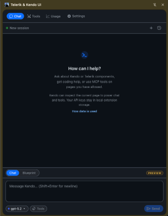

# Telerik & Kendo UI WebMCP Browser Extension

>note The Telerik & Kendo UI WebMCP browser extension is currently in **preview**. Features and behavior may change before the final release.

The Telerik & Kendo UI WebMCP browser extension provides a chat interface for interacting with AI models. It connects to all [WebMCP tools](slug:web-mcp-overview) registered on the current page and allows AI models to discover and invoke those tools through natural language conversation.

<!-- TODO: replace with actual download link -->
[Download the Telerik WebMCP Browser Extension](https://example.com/placeholder-extension-download)

## Extension Tabs

@[template](/_contentTemplates/common/parameters-table-styles.md#table-layout)

The browser extension toolbar contains four tabs:

| Tab | Description |
|---|---|
| **Chat** | The main conversation interface. Send prompts and the AI model invokes WebMCP tools on the page. |
| **Tools** | Inspect all `WebMCP` tools registered on the current page. View tool names, descriptions, and parameters. |
| **Usage** | Track AI usage metrics - input tokens, output tokens, and total consumption across conversations. |
| **Settings** | Configure API credentials, prompting behavior, and page access. See [Settings](#settings). |

## Settings

The Settings tab is organized into three sections: [API Credentials](#api-credentials), [Prompting](#prompting), and [Page Access](#page-access).

### API Credentials

Register an AI model provider that the extension uses to process conversations and invoke tools. The following providers are supported:

* **OpenAI** - provide your OpenAI API key and select a model.
* **Google Gemini** - provide your Gemini API key.
* **Anthropic** - provide your Anthropic API key.
* **Azure OpenAI** - provide your Azure OpenAI endpoint, deployment name, and API key.

### Prompting

Set custom system instructions that are sent with every conversation. Use this to define rules specific to your application and use case.

For example, you can instruct the model to always filter the Grid before exporting, or to navigate the Scheduler to today's date before creating an event.

### Page Access

The browser extension only inspects pages and invokes tools on matching allowed origins. All other origins are denied by default. Add multiple allowed origins on separate lines.

The accepted formats are:

* Full origin with scheme - `https://example.com`
* Bare hostnames - `example.com`
* Host with port - `localhost:3000`
* Wildcard subdomains - `*.example.com`

## See Also

* [WebMCP Supported Components](slug:web-mcp-supported-components)
