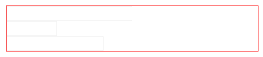
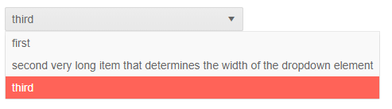
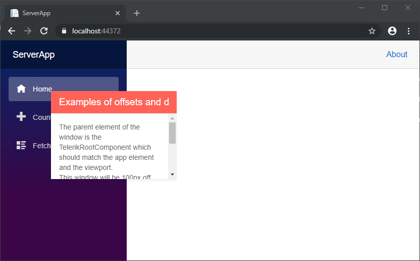

# Dimensions

This article explains how dimensional properties like `Width` and `Height`, `Top` and `Left` work in the Telerik UI for Blazor suite to set size and position.

Properties that denote **dimensions and positions are** simple **string properties** that are not parsed by our code. You can provide **valid CSS values** to them. For example, `100px` or `50%` are valid options. This provides you with flexibility without limiting options. At the time of writing there is no `Unit` type in the underlying framework.

The string you provide is usually rendered within an inline `style` attribute, so you must make sure to provide a valid value that will not break other options. You do not need to include a semicolon (`;`).

For elements with **special positioning** (`Top` and `Left` properties), keep in mind that if the parent elements have special CSS positioning, it will affect the position of the component. If you experience issues, inspect the rendered HTML to see what elements are present and what their CSS rules are.

When setting **percentage values** (such as `100%` or `50%`), keep in mind the following - according to the web standards, elements which have their height set in percentage require that the height of their parent is also explicitly set. This requirement applies recursively until either an element with a pixel height or the html element is reached. Elements that are 100% high should not have margins, paddings, borders, or sibling elements.

## Examples

The examples here showcase different units and examples of using them to set dimensions and positions. The results you get may vary from the screenshots here because of different CSS rules in your project and different browser/screen sizes. Review the explanations in the code for more details on what to expect.

>caption Setting sizes in different dimensions (percent, pixel, vw in this sample)

````CSHTML
<div style="width: 500px; border: 1px solid red;">
    <TelerikTextBox Width="50%" />
    <br />
    <TelerikTextBox Width="100px" />
    <br />
    <TelerikTextBox Width="10vw" />
</div>
````




>caption Using auto width to have an element adjust to its contents

````CSHTML
<TelerikDropDownList Data="@MyList" @bind-Value="MyItem" PopupWidth="auto" PopupHeight="auto">
</TelerikDropDownList>

@code {
    protected List<string> MyList = new List<string>() 
    {
        "first",
        "second very long item that determines the width of the dropdown element",
        "third"
        //if you have many items, avoid PopupHeight="auto" because it will go off the screen
    };

    protected string MyItem { get; set; } = "third";
}
````




>caption Position is controlled by the parent element with special positioning

````CSHTML
<TelerikWindow Visible="true" Top="100px" Left="100px" Width="30vw" Height="40vh">
    <WindowContent>
        The parent element of the window is the TelerikRootComponent which should match the app element and the viewport.
        <br />
        This window will be 100px off the top left corner of the viewport in a blank app without special CSS rules. You can also use other units, such as percent.
        <br />
        Also, the size of this window will depend on the viewport size - resize your browser to see the effects.
    </WindowContent>
    <WindowTitle>Examples of offsets and dimensions</WindowTitle>
</TelerikWindow>
````




