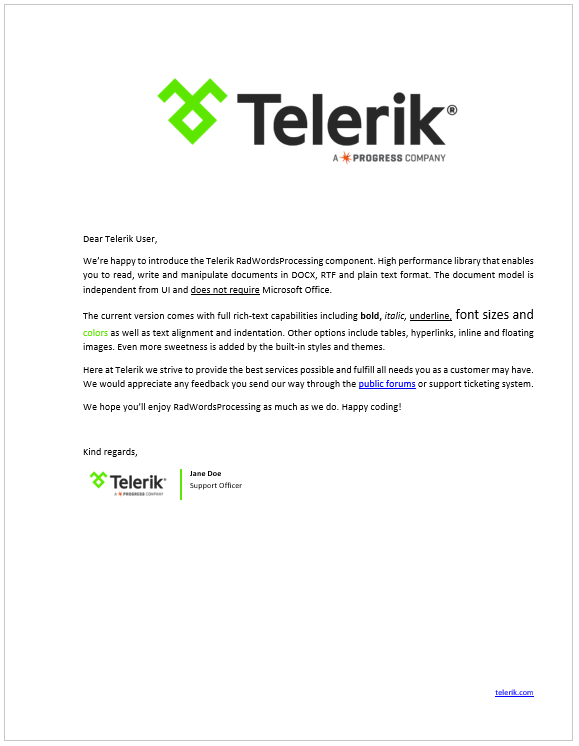

# Telerik Word Processing

>note **RadWordsProcessing** is part of the **Telerik Document Processing** libraries. The full documentation for this component is available at [https://docs.telerik.com/devtools/document-processing/libraries/radwordsprocessing](https://docs.telerik.com/devtools/document-processing/libraries/radwordsprocessing/overview).
      

**RadWordsProcessing** is a processing library that allows to create, modify and export documents to a variety of formats. Through the API, you can access each element in the document and modify, remove it or add a new one. The generated content you can save as a stream, as a file, or send it to the client browser.

   

## Model

The model of **RadWordsProcessing** includes:
            
* [**Sections**](https://docs.telerik.com/devtools/document-processing/libraries/radwordsprocessing/model/section): You can customize the sections using the properties exposed by the corresponding class. The library provides support for customizing the headers, footers, and watermarks for a section as well.

* [**Paragraphs**](https://docs.telerik.com/devtools/document-processing/libraries/radwordsprocessing/model/paragraph): The properties and methods related to paragraphs enable you to change its collection of inlines and appearance.

* [**Tables**](https://docs.telerik.com/devtools/document-processing/libraries/radwordsprocessing/model/table): An API for inserting, editing and removing tables. You can also change their rows, cells, appearance, and content.

* **Inlines**:
	* [Runs](https://docs.telerik.com/devtools/document-processing/libraries/radwordsprocessing/model/run)
	* Images: Including [inline](https://docs.telerik.com/devtools/document-processing/libraries/radwordsprocessing/model/imageinline) and [floating images](https://docs.telerik.com/devtools/document-processing/libraries/radwordsprocessing/model/floatingimage).
	* [Fields](https://docs.telerik.com/devtools/document-processing/libraries/radwordsprocessing/concepts/fields/fields): Merge fields, Document Variables and custom code fields, enabling you to insert any fields using its code representation.
	* [Breaks](https://docs.telerik.com/devtools/document-processing/libraries/radwordsprocessing/model/break): Support for different types of breaks, so you can achieve the desired layout.
	* [Bookmarks](https://docs.telerik.com/devtools/document-processing/libraries/radwordsprocessing/model/bookmark): Inserting, modifying and removing bookmarks.
	* [Hyperlinks](https://docs.telerik.com/devtools/document-processing/libraries/radwordsprocessing/concepts/hyperlinks): You can work with hyperlinks pointing to a website or to a bookmark inside the document.
	* [Tab stops](https://docs.telerik.com/devtools/document-processing/libraries/radwordsprocessing/concepts/tabstop): Working with a tab stops collection for each paragraph.

* [**Styles**](https://docs.telerik.com/devtools/document-processing/libraries/radwordsprocessing/concepts/styles)
	* The document model includes a repository of Style objects which contain sets of character, paragraph or table style properties.
	* The API allows you create custom styles and use them throughout the document.
	* [List styles](https://docs.telerik.com/devtools/document-processing/libraries/radwordsprocessing/concepts/lists).

## Features:

* [**Mail Merge**](https://docs.telerik.com/devtools/document-processing/libraries/radwordsprocessing/editing/mail-merge): Provides ability to produce personalized documents from a template holding fixed content merged with variable data from a data source (database or any other collection of data items).

* [**Merge documents**](https://docs.telerik.com/devtools/document-processing/libraries/radwordsprocessing/editing/insert-documents): Insert a document into another one at the desired position, controlling the way the styles of both are merged.

* [**Import of document elements**](https://docs.telerik.com/devtools/document-processing/libraries/radwordsprocessing/editing/import-document-element): Import a document element from one document into another.

* [**Clone**](https://docs.telerik.com/devtools/document-processing/libraries/radwordsprocessing/editing/clone-and-merge) documents and document elements.

* [**Replace**](https://docs.telerik.com/devtools/document-processing/libraries/radwordsprocessing/editing/find-and-replace): RadWordsProcessing gives you the ability to search for a string in a RadFlowDocument instance and replace all matches. The library also allows you to replace the styling of the matches alone. 

* [**RadFlowDocumentEditor**](https://docs.telerik.com/devtools/document-processing/libraries/radwordsprocessing/editing/radflowdocumenteditor): It is intended to simplify the process of creating and modifying a document and achieve the same results as you would using the style properties and child collections of the document elements with less amount of code.

* Formatting:

	In addition to the styles, RadWordsProcessing provides support for different types of formatting so you can format any of the document elements:
	* **Character formatting**: Font size, font color, font name, bold, italic, underline, etc.
	* **Paragraph formatting**: Line spacing, alignment, indentation, spacing before and after, etc.
	* **Table formatting**: Enables you to change the alignment, borders, shading, spacing and padding, and more.
	* **Modifying the section properties** to adjust the page size, orientation, margins, headers, and footers, etc.

## Supported formats:

The library comes with support for the following document formats:

* [**DOCX**](https://docs.telerik.com/devtools/document-processing/libraries/radwordsprocessing/formats-and-conversion/docx/docxformatprovider)

* [**RTF**](https://docs.telerik.com/devtools/document-processing/libraries/radwordsprocessing/formats-and-conversion/rtf/rtfformatprovider)

* [**HTML**](https://docs.telerik.com/devtools/document-processing/libraries/radwordsprocessing/formats-and-conversion/html/htmlformatprovider)

* [**PDF**](https://docs.telerik.com/devtools/document-processing/libraries/radwordsprocessing/formats-and-conversion/pdf/pdfformatprovider) (export only)

* [**Plain text**](https://docs.telerik.com/devtools/document-processing/libraries/radwordsprocessing/formats-and-conversion/plain-text/txt-txtformatprovider)

You can import and export documents of these formats as well as convert the format of the document.
 
