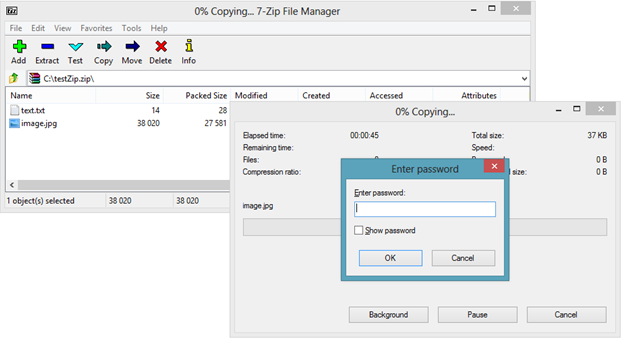

# Telerik Zip Library

>note **RadZipLibrary** is part of the **Telerik Document Processing** libraries. The full documentation for this component is available at [https://docs.telerik.com/devtools/document-processing/libraries/radziplibrary](https://docs.telerik.com/devtools/document-processing/libraries/radziplibrary/overview).

Have you ever wondered how to increase the responsiveness of your applications by compressing the data that you send over the internet? With the new __Zip Library__ you can compress data like images, docx or pdf files and send them over the wire. Thus, you will achieve fast and secure transactions. 

This is a list with short descriptions of the top-of-the-line features of Telerik's __Zip Library__ control:
        

* **Easy to use API**: The library exposes flexible and easy API to provide you with full control over the compressed data. The [extension methods](https://docs.telerik.com/devtools/document-processing/libraries/radziplibrary/features/zip-extensions) allow you to implement the most common scenarios in a single line of code, like creating zip file from folder or extracting it.

* **Load or create ZIP files**: You can load data from existing ZIP files, create new ones and edit ZIPs that can be used by other applications. You can also create ZIP files in memory or add data to ZIP file from stream.

* [**Compress a stream**](https://docs.telerik.com/devtools/document-processing/libraries/radziplibrary/features/compress-stream): **RadZipLibrary** can significantly facilitate your efforts in compressing a stream, for example to send it over the internet.

* **Support for large files**: The **Zip Library** works seamlessly with large files (over 4GB).
            
* **Support for [encryption](https://docs.telerik.com/devtools/document-processing/libraries/radziplibrary/features/protect-ziparchive)**: You can protect your ZIP file with password for more security.
            

            