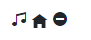
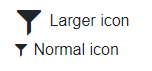
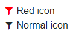
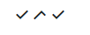

# Built-in Icons

The UI for Blazor suite comes with a set of font icons that you can use in various places like in the Button component, or as a standalone component.

In this article:

* [Standalone Icon Component](#standalone-icon-component)
* [Icon Parameters - Order of Precedence](#icon-parameters---order-of-precedence)
* [Icon in Telerik Component](#icon-in-telerik-component)
* [Icon Adjustments](#icon-adjustments)
	* [Size](#size)
	* [Color](#color)
	* [Kendo Icons](#kendo-icons)
* [Icons List](#icons-list)
	


## Standalone Icon Component

Telerik UI for Blazor comes with the `TelerikIcon` component that you can use to render icons. It works with the following image types:

* **Telerik font icon** - You can find the rendered icons and their names in the [Icons List](#icons-list) section below. Use those names as plain strings.

* **Third party font-icon** - the `IconClass` parameter lets you set a CSS class that provides the required font name, font size and content for the `::before` pseudoelement.

* **Raster image** - the `ImageUrl` is a string points to the image - it can be a path relative to the `wwwroot` folder, or an absolute URL.

* **Raster image sprite** - the `SpriteClass` parameter lets you provide the classes from your site's stylesheet that produce the desired appearance and background positions for your sprites.

>caption Render a standalone icon through the TelerikIcon component

````CSHTML
<TelerikIcon Icon="audio" /> @* will render the audio note icon *@

<TelerikIcon IconClass="oi oi-home" /> @* home icon from OpenIconic, assuming you have loaded the font on the page, you can use your own CSS classes and font icon fonts *@

<TelerikIcon ImageUrl="https://docs.telerik.com/blazor-ui/images/snowboarding.png" /> @* an image by URL, renders an actual  tag *@
````

>caption The result from the snippet above



## Icon Parameters - Order of Precedence

The priority order of the Icon properties, if more than one is defined, is:

1. `ImageUrl`
2. `Icon`
3. `IconClass`
4. `SpriteClass`

This order applies to other components that expose the same parameters, such as the TelerikButton or the grid command buttons.

## Icon in Telerik Component

Some Telerik components expose icon features out-of-the box. These parameters match the `TelerikIcon` component described above.

>caption How to use a built-in font icon class on a component's Icon property

````CSHTML
<TelerikButton Icon="filter">I show the Filter icon</TelerikButton>
````

>caption The result from the code snippet above


## Icon Adjustments

This section shows a few examples of adjusting the font icons:

* [Size](#size)
* [Color](#color)
* [Kendo Icons](#kendo-icons)

### Size

You can change the `font-size` of the icon element in your own CSS rules to change the size of the icons.

Our font icons are designed on a 16px grid base. To achieve a pixel-perfect icon display, scale up by maintaining the 16-unit measure (32, 48, 64, and so on).

>caption Enlarging icons with CSS



````CSHTML
@*The first icon is made larger through CSS, the second has the default size*@

<style>
    .large-icons .k-icon {
        font-size: 32px;
    }
</style>

<div class="large-icons">
    <TelerikIcon Icon="filter"></TelerikIcon> Larger icon
</div>
<TelerikIcon Icon="filter"></TelerikIcon> Normal icon
````

### Color

You can change the `color` CSS rule of the icon element to change its color from the default black.

>caption Change icon color



````CSHTML
@*The first icon is made red through CSS, the second has the default color*@

<style>
    .colored-icons .k-icon {
        color: red;
    }
</style>

<div class="colored-icons">
    <TelerikIcon Icon="filter"></TelerikIcon> Red icon
</div>
<TelerikIcon Icon="filter"></TelerikIcon> Normal icon
````


### Kendo Icons

The Telerik UI for Blazor suite shares the same [themes]() with several other component suites made by Progress (such as Kendo UI and UI for ASP.NET Core). This means that the same font icons are available across all these suites and come as features in our stylesheets, and so you can use the icons directly with the rules and HTML rendering that they are designed for without a helper component such as the `<TelerikIcon>`.

Using such direct HTML may make it easier for you to customize and style icons that you use in your own layouts - it lets you add additional CSS classes directly to their rendering without cascading through a parent element.

To use the icons directly, review the [Kendo UI Web Font Icons Library](https://docs.telerik.com/kendo-ui/styles-and-layout/icons-web) article. It shows all the information you need. The `<TelerikIcon>` component and other built-in icons in UI for Blazor simply drop the `k-i-` prefix to make it easier for you.

>caption Use Kendo font icons directly



````CSHTML
@*Direct usage of the Kendo UI font icon*@
<span class="k-icon k-i-check"></span>

@*Direct usage of the Kendo icons so you can add more classes directly to them*@
<span class="k-icon k-i-check k-flip-h k-flip-v"></span> 

@* The same icon can be rendered through the Blazor component but styling needs a parent to cascade through *@
<TelerikIcon Icon="check"></TelerikIcon>
````


## Icons List

This section lists the avaialble font icons that come with the Telerik UI for Blazor themes. 

Each icon is accompanied by its name that you can use in the Telerik Blazor components where a Telerik `Icon` parameter is available.


<div id="iconListContainer">

    <script src="scripts/scoped-plugin.js"></script>
    
    <style scoped>
    </style>
    
    <style scoped>
        ul.WebComponentsIcons > li:before {
            content: none !important;
        }
    
        ul.WebComponentsIcons > li {
            line-height: 15px;
            list-style-type: none;
            line-height: 15px;
        }
        
        ul.WebComponentsIcons .k-icon {
            display: block;
            clear: both;
            margin: 0 auto 10px;
            color: #656565;
            font-size: 32px;
        }
    </style>
        
    <ul id="IconsList" class="WebComponentsIcons">
        <li>Please wait, the list of icons is loading and rendering...</li>
    </ul>
    
    <p id="iconsLoadFail" style="display:none;">The Icon list failed to load. You can see the available icons in the <a href="https://docs.telerik.com/kendo-ui/styles-and-layout/icons-web#list-of-font-icons">Kendo UI Font Icons</a> article. To use them with UI for Blazor, remove the <code>k-i-</code> prefix. If you are seeing this, <a href="https://github.com/telerik/blazor-docs/issues/new">open an issue</a> to let us know the icon list is broken.</p>

</div>

<script>
    function scopeLatestTheme() {
        var latestThemeUrl = "https://unpkg.com/@progress/kendo-theme-default@latest/dist/all.css";

        $.ajax({
            url: latestThemeUrl,
            dataType: "text/css",
            success: function (data, extStatus, jqXHR) {
                console.log("fetching the themes changed, the icons list needs to be fixed, please open an issue if you see this");
                showFallbackInfo();
            },
            error: function (data, extStatus, jqXHR) {
                if (extStatus == "parsererror") { // we expect parsing the styles to fail
                    document.querySelector("#iconListContainer style").innerHTML = data.responseText;
                }
            },
        });
    }

    function renderIconsList() {
        scopeLatestTheme();

        var iconsListJson = "https://raw.githubusercontent.com/telerik/kendo-icons/develop/src/icons/icons-list.json?token=ABL26UZCFI62VK2U3EVSJZLAEALVM";
       
        $.getJSON(iconsListJson, function (data) {

            var iconsList = data.list;
            var iconsToRender = [];
            
            $.each(iconsList, function (index, iconName) {
                if (iconName != null) {
                    iconsToRender.push(`<li><span class="k-icon k-i-${iconName}"></span>${iconName}</li>`)
                }
            });

            $("#IconsList").html(iconsToRender.join(""));
        })
        .fail(showFallbackInfo);
    }
    
    function showFallbackInfo(){
        document.querySelector("#iconListContainer #iconsLoadFail").style.display = "";
        document.querySelector("#iconListContainer #IconsList").style.display = "none";
    }

    window.addEventListener("load", function () {
        setTimeout(function () {
            try {
                renderIconsList();
            } catch (e) {
                showFallbackInfo();
            }
        }, 1500); 
    });
</script>


## See Also

  * [Blazor Live Demos](https://demos.telerik.com/blazor-ui/)
  * [Kendo UI Web Font Icons Library](https://docs.telerik.com/kendo-ui/styles-and-layout/icons-web)
