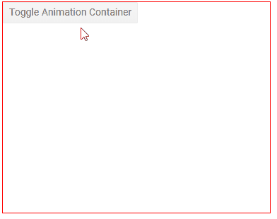

# Animation Container

The UI for Blazor suite provides the Animation Container component that you can use to create messages and popups such as [notifications](https://demos.telerik.com/blazor-ui/animationcontainer/notification) or expandable containers, even [tooltips](https://demos.telerik.com/blazor-ui/animationcontainer/tooltip). It lets you define its animation, size and position, and arbitrary content.

To use the animation container, add the `TelerikAnimationContainer` tag.

>caption How to use the Animation Container

````CSHTML
@* Click the button to toggle the visibility of the customized popup *@

<div style="position:relative; border: 1px solid red; height: 300px;">
    <TelerikButton OnClick="@ToggleContainer">Toggle Animation Container</TelerikButton>

    <TelerikAnimationContainer @ref="myPopupRef" Top="50px" Left="50px" Width="250px" Height="150px" AnimationType="AnimationType.ZoomOut" Class="k-popup">
        <p>
            The "k-popup" class adds some background and borders which you can define through your own styles instead.
        </p>
        <p>
            My parent element has <code>position: relative</code> to control my <code>Top</code> and <code>Left</code> offset.
        </p>
    </TelerikAnimationContainer>
</div>

@code {
    Telerik.Blazor.Components.TelerikAnimationContainer myPopupRef;

    async Task ToggleContainer()
    {
        await myPopupRef.ToggleAsync();
    }
}
````

>caption The result from the code snippet above



>note The component renderes in its place of declaration and has `position: absolute`. Parent elements in the DOM with special positioning can affect its position and the calculation of the `Top` and `Left` offsets.

The animation container exposes the following properties and methods:

* `Show()`, `Hide()` and `Toggle()`; `ShowAsync()`, `HideAsync()` and `ToggleAsync()` - to control whether the container is shown.
    * To show an animation container immediately when the page loads, use the `OnAfterRenderAsync` event.
* `Width` and `Height` - to control its [size](). The `Height` cannot be in percentage values, it is recommended to use pixels for it.
* `Top` and `Left` - to control its offset from its parent with special positioning (`relative`, `absolute`, `fixed`).
* `AnimationType` and `AnimationDuration` to control the way it is shown and hidden. The animation duration is in milliseconds (defaults to `300`), and the type is of the `Telerik.Blazor.AnimationType` enum with the following options:
	* SlideUp,
	* SlideIn,
	* SlideDown,
	* SlideRight,
	* SlideLeft,
	* PushUp,
	* PushDown,
	* PushLeft,
	* PushRight,
	* Fade,
	* ZoomIn,
	* ZoomOut
* `ShowDelay` and `HideDelay` - defines the delay between showing/hiding the component and the respective animation start. Both values are in milliseconds and default to `20`.
* `Class` - a CSS class rendered on the container DOM element.

>caption Explore the animation options

````CSHTML
@*Choose a new animation from the dropdown and toggle the container*@

<div style="position:relative;">

    <select @bind="AnimType">
        @foreach (var possibleAnimation in Enum.GetValues(typeof(AnimationType)))
        {
            <option value="@possibleAnimation">@possibleAnimation</option>
        }
    </select>

    <TelerikButton OnClick="@ShowContainer">Show Animation Container</TelerikButton>

    <TelerikAnimationContainer @ref="myPopup" Top="40px" Width="200px" Height="200px" AnimationType="@AnimType" Class="my-popup">
        My content goes here.<br />
        <TelerikButton OnClick="@HideContainer">Hide Animation Container</TelerikButton>
    </TelerikAnimationContainer>
</div>

@code {
    TelerikAnimationContainer myPopup;
    AnimationType AnimType { get; set; } = AnimationType.Fade;

    async Task ShowContainer()
    {
        await myPopup.ShowAsync();
    }

    async Task HideContainer()
    {
        await myPopup.HideAsync();
    }
}

<style>
    .my-popup {
        border: 2px solid red;
        background: #ccc;
    }
</style>
````

## See Also

  * [Live Demos: Animation Container](https://demos.telerik.com/blazor-ui/animationcontainer/index)
  * [API Reference](https://docs.telerik.com/blazor-ui/api/Telerik.Blazor.Components.TelerikAnimationContainer)
