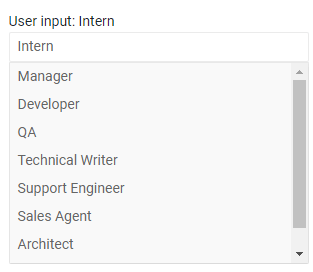

# AutoComplete Overview

The AutoComplete component is a textbox that offers the users hints as they type. These suggestions can be [filtered]() as the user types. The user can write their own value or click a suggestion from the dropdown to select it and populate the input. You can control the list of suggestions through [data binding](), various appearance settings like [dimensions]() and [templates]().

To use a Telerik AutoComplete for Blazor

1. add the `TelerikAutoComplete` tag
1. populate its `Data` property with the collection of items you want in the dropdown
1. (optional) enable features like [filtering]() and clear button

>caption AutoComplete two-way value binding, main features and simple [data binding](data-bind)

````CSHTML
@* Main features and simple data binding for the suggestions and the Value *@

User input: @TheValue
<br />
<TelerikAutoComplete Data="@Suggestions" @bind-Value="@TheValue"
    Placeholder="Enter your role (can be free text)" ClearButton="true" />

@code{
    string TheValue { get; set; }

    List<string> Suggestions { get; set; } = new List<string> {
        "Manager", "Developer", "QA", "Technical Writer", "Support Engineer", "Sales Agent", "Architect", "Designer"
    };
}
````

>caption The result from the code snippet above, as the user types a custom value



>caption Component namespace and reference

The AutoComplete is a generic component and its type is determined by the type of the model you use as its data source. You can find examples in the [Data Bind - Considerations](#considerations) article.

>caption The AutoComplete provides the following features:

* `Class` - the CSS class that will be rendered on the main wrapping element of the combobox.
* `ClearButton` - whether the user will have the option to clear the selected value with a button on the input. When it is clicked, the `Value` will be updated to `string.Empty`.
* `Data` - allows you to provide the data source. Required.
* `Enabled` - whether the component is enabled.
* `Filterable` - whether [filtering]() is enabled for the end user (suggestions will get narrowed down as they type).
* `MinLength` - how many characters the text has to be before the suggestions list appears. Cannot be `0`. Often works together with [filtering]().
* `Placeholder` - the text the user sees as a hint when there is no text in the input.
* `PopupHeight` - the height of the expanded dropdown list element.
* `PopupWidth` - the width of the expanded dropdown list element.
* `TItem` - the type of the model to which the component is bound. Required if you can't provide `Data` or `Value`. Determines the type of the reference object.
* `TextField` - the name of the field from the model that will be shown as hints to the user. Defaults to `Text`. Not required when binding to a simple list of strings.
* `Value` and `bind-Value`- get/set the value of the component, can be used for binding. Use the `@bind-Value` syntax for two-way binding, for example, to a variable of your own. The `Value` must be a `string`.
* `Width` - the width of the main element.
* Templates - they allow you to control the rendering of items in the component. See the [Templates]() article for more details.
* Validation - see the [Input Validation]() article for more details.


## See Also

  * [Data Binding]()
  * [Live Demo: AutoComplete](https://demos.telerik.com/blazor-ui/autocomplete/overview)
  * [Live Demo: AutoComplete Validation](https://demos.telerik.com/blazor-ui/AutoComplete/validation)

