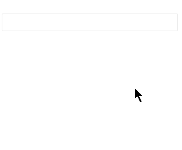

# AutoComplete Virtualization

The AutoComplete @[template](/_contentTemplates/common/dropdowns-virtualization.md#value-proposition)

#### In This Article

* [Basics](#basics)
* [Local Data Example](#local-data-example)
* [Remote Data Example](#remote-data-example)

>caption Display, scroll and filter over 10k records in the AutoComplete without delays and performance issues.

## Basics

@[template](/_contentTemplates/common/dropdowns-virtualization.md#basics-core)

@[template](/_contentTemplates/common/dropdowns-virtualization.md#remote-data-specifics)

### Limitations

@[template](/_contentTemplates/common/dropdowns-virtualization.md#limitations)

## Local Data Example

<demo metaUrl="client/autocomplete/virtualization/local/" height="350"></demo>

## Remote Data Example

@[template](/_contentTemplates/common/dropdowns-virtualization.md#remote-data-sample-intro)

Run this and see how you can display, scroll and filter over 10k records in the AutoComplete without delays and performance issues from a remote endpoint. There is artificial delay in these operations for the sake of the demonstration.

<demo metaUrl="client/autocomplete/virtualization/remote/" height="400"></demo>

## See Also

* [Live Demo: AutoComplete Virtualization](https://demos.telerik.com/blazor-ui/autocomplete/virtualization)
