# Appearance Settings

You can control the appearance of the button by setting the following attributes:

* [FillMode](#fillmode)
* [Rounded](#rounded)
* [Shape](#shape)
* [Size](#size)
* [ThemeColor](#themecolor)

You can use all of them together to achieve the desired appearance. This article will explain their effect one by one.

## FillMode

The `FillMode` controls how the TelerikButton is filled. You can set it to a member of the `Telerik.Blazor.ThemeConstants.Button.FillMode` class:

| Class members | Result |
|------------|--------|
|`Solid` <br /> default value|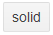|
|`Flat`|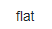|
|`Outline`|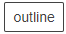|
|`Link`|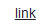|

>caption The built-in Fill modes

````CSHTML
@* These are all built-in fill modes *@

@{ 
    var fields = typeof(Telerik.Blazor.ThemeConstants.Button.FillMode)
        .GetFields(System.Reflection.BindingFlags.Public | System.Reflection.BindingFlags.Static
        | System.Reflection.BindingFlags.FlattenHierarchy)
        .Where(field => field.IsLiteral && !field.IsInitOnly).ToList();

    foreach (var field in fields)
    {
        string fillmode = field.GetValue(null).ToString();

        <div style="float:left; margin: 20px;">
            <TelerikButton FillMode="@fillmode">@fillmode</TelerikButton>
        </div>
    }
}
````

## Rounded

The `Rounded` paramter applies the `border-radiums` CSS rule to the button to achieve curving of the edges. You can set it to a member of the `Telerik.Blazor.ThemeConstants.Button.Rounded` class:

| Class members | Result |
|------------|--------|
|`Small` |add screenshot here|
|`Medium`|add screenshot here|
|`Large`|add screenshot here|
|`Full`|add screenshot here|

>caption The built-in values of the Rounded attribute

````CSHTML
@* The built-in rounded edges of the button.  *@

@{
    var fields = typeof(Telerik.Blazor.ThemeConstants.Button.Rounded)
        .GetFields(System.Reflection.BindingFlags.Public | System.Reflection.BindingFlags.Static
        | System.Reflection.BindingFlags.FlattenHierarchy)
        .Where(field => field.IsLiteral && !field.IsInitOnly).ToList();

    foreach (var field in fields)
    {
        string rounded = field.GetValue(null).ToString();

        <div style="float:left; margin: 20px;">
            <TelerikButton Rounded="@rounded">@rounded</TelerikButton>
        </div>
    }
}
````

## Shape

The `Shape` attribute defines the geometric shape of the button. You can set it to a member of the `Telerik.Blazor.ThemeConstants.Button.Shape` class:

| Class members | Result |
|---------------|--------|
| `Rectangle`   ||
| `Square`   |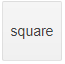|
| `Circle`   |To create a circular button you should set the `Shape` attribute to **Square**, and the `Rounded` attribute to **Full**|


>note The width and height of the geometric shapes depend on the amount of text in the button, and the size of the font.

>caption The built-in button shapes

````CSHTML
@{
    var fields = typeof(Telerik.Blazor.ThemeConstants.Button.Shape)
        .GetFields(System.Reflection.BindingFlags.Public | System.Reflection.BindingFlags.Static
        | System.Reflection.BindingFlags.FlattenHierarchy)
        .Where(field => field.IsLiteral && !field.IsInitOnly).ToList();

    foreach (var field in fields)
    {
        string shape = field.GetValue(null).ToString();

        <div style="float:left; margin: 20px;">
            <TelerikButton Shape="@shape">@shape</TelerikButton>
        </div>
    }
}
````

## Size

You can increase or decrease the size of the button by setting the `Size` parameter to a member of the `Telerik.Blazor.ThemeConstants.Button.Size` class:

| Class members | Result |
|---------------|--------|
| `Small`   |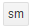|
| `Medium`   |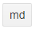|
| `Large`   |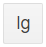|

>caption The built-in button sizes

````CSHTML
@{
    var fields = typeof(Telerik.Blazor.ThemeConstants.Button.Size)
        .GetFields(System.Reflection.BindingFlags.Public | System.Reflection.BindingFlags.Static
        | System.Reflection.BindingFlags.FlattenHierarchy)
        .Where(field => field.IsLiteral && !field.IsInitOnly).ToList();

    foreach (var field in fields)
    {
        string size = field.GetValue(null).ToString();

        <div style="float:left; margin: 20px;">
            <TelerikButton Size="@size">@size</TelerikButton>
        </div>
    }
}
````

## ThemeColor

The color of the button is controlled through the `ThemeColor` parameter. You can set it to a member of the `Telerik.Blazor.ThemeConstants.Button.ThemeColor` class:

| Class members | Result |
|------------|--------|
|`Base` <br /> default value |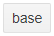|
|`Primary`|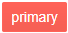|
|`Secondary`||
|`Tertiary`||
|`Info`||
|`Success`||
|`Warning`|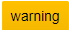|
|`Error`|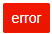|
|`Dark`|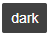|
|`Light`|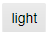|
|`Inverse`||

