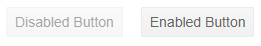

# Disabled Button

Sometimes specific buttons in an application must be temporarily disabled. To control the enabled state of the component, use the `Enabled` Boolean attribute.

The following example demonstrates how to enable and disable the Button.

To render a disabled button, set its `Enabled` attribute to `false`.

>caption Disabled Telerik Button

````CSHTML
<TelerikButton Enabled="false">Disabled Button</TelerikButton>
````

>caption Comparison between disabled and enabled button

