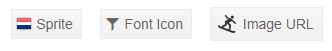

# Button Icons

You can put an image, sprite or a font icon in the button to illustrate its purpose for your end users. To apply them, use the following properties:

* for a font icon, use the `Icon` attribute to set the font icon class.
* for an image, use the `ImageUrl` attribute to provide the URL
* for a sprite, set the `SpriteClass` attribute to `k-icon MySpriteClass` where `MySpriteClass` defines the CSS rules for the sprite.

You can see how to use the built-in icons in the [Font Icons]() article.

For a custom font icon, define the font and glyph in your `Icon` CSS class.

The following example shows how to use an image from a URL, a sprite image, and the built-in font icons.

>caption How to use icons in Telerik Button

````CSHTML
<TelerikButton SpriteClass="k-icon netherlandsFlag">Sprite</TelerikButton>
<TelerikButton Icon="@IconName.Filter">Font Icon</TelerikButton>
<TelerikButton ImageUrl="https://demos.telerik.com/kendo-ui/content/shared/icons/sports/snowboarding.png">Image URL</TelerikButton>

<style>
    /* the sprite for the first button is defined through a CSS rule matchin its Class */
    .netherlandsFlag {
        background-image: url("https://demos.telerik.com/kendo-ui/content/shared/styles/flags.png");
        background-position: 0 -64px;
    }
</style>
````

>caption The result from the code snippet above



>tip You can use relative paths to your images in the `wwwroot` folder. The example above uses absolute paths to make it easy for you to see the results without preparing images.

>tip If you don't add text to the button, the button will center the icon on all sides.

>note Images used as icons should generally be small enough to fit in a line of text - the button is an inline element and is not designed for large images. If you want to use big icon buttons, consider one of the following options:
>
> * defining a `Class` on the button that provides `height` and `width`. The width and height can be set in `px` sufficient to accommodate the icon or to `auto`,
> * or attaching an `@onclick` handler to an icon/`span`/`img` element instead of using a button,
> * or adding your own HTML inside the button, something like: `<TelerikButton>some text</TelerikButton>`


## See Also

  * [Button Overview]()
