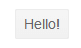
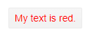
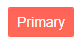

# Button Overview

This article provides information about the Button component and its core features.

The Button component provides styling according to the [chosen theme](), click event and icons. You can also disable the button through a property.

## Basic Button

To add a Telerik Button to your Blazor app, use the `<TelerikButton>` tag:

>caption Basic Telerik Button tag

````CSHTML
@using Telerik.Blazor.Components.Button

<TelerikButton>Hello!</TelerikButton>
````

>caption The result from the code snippet above



>caption Component namespace and reference

````CSHTML
@using Telerik.Blazor.Components.Button

<TelerikButton ref="@theButton">Hello!</TelerikButton>

@functions{
	Telerik.Blazor.Components.Button.TelerikButton theButton;
}
````

## Click Handler

To attach a click handler, use the `OnClick` attribute and define the method in the `functions` section. 

>caption Click handler for a Telerik Button

````CSHTML
@using Telerik.Blazor.Components.Button

<TelerikButton OnClick="@myHandler">Click me!</TelerikButton>

@someVariable

@functions {
	MarkupString someVariable;

	void myHandler()
	{
		someVariable = new MarkupString(DateTime.Now.ToString());
	}
}
````

## Styling

You can style the button through its `Class` attribute to define your own CSS rules that apply to the HTML rendering.

>caption Set CSS class to the button and change its appearance

````CSHTML
@using Telerik.Blazor.Components.Button

<TelerikButton Class="RedText">My text is red.</TelerikButton>

<style>
	.RedText,
	.RedText:hover {
		color: red;
	}
</style>
````

>caption The result from the code snippet above



You can also make the button use a strong color to attact attention, called Primary button styling. To do that, set its `Primary` property to true.

>caption Button with the Primary color scheme from the current theme

````CSHTML
@using Telerik.Blazor.Components.Button

<TelerikButton Primary="true">Primary</TelerikButton>
````

>caption The result from the code snippet above, with the Default theme



## Icons

You can put an image, sprite or a font icon in the button to illustrate its purpose for your end users. To apply them, use the following properties:

* for a font icon, use the `Icon` attribute to set the font icon class.
* for an image, use the `ImageUrl` attribute to provide the URL
* for a sprite, set the `SpriteClass` attribute to `k-icon MySpriteClass` where `MySpriteClass` defines the CSS rules for the sprite.

You can see how to use the built-in icons in the [Font Icons]() article.

For a custom font icon, define the font and glyph in your `Icon` CSS class.

The following example shows how to use an image from a URL, a sprite image, and the built-in font icons.

>caption How to use icons in Telerik Button

````CSHTML
@using Telerik.Blazor.Components.Button
@using Telerik.Blazor

<TelerikButton SpriteClass="k-icon netherlandsFlag">Sprite</TelerikButton>
<TelerikButton Icon="@IconName.Filter">Font Icon</TelerikButton>
<TelerikButton ImageUrl="https://demos.telerik.com/kendo-ui/content/shared/icons/sports/snowboarding.png">Image URL</TelerikButton>

<style>
    /* the sprite for the first button is defined through a CSS rule matchin its Class */
    .netherlandsFlag {
        background-image: url("https://demos.telerik.com/kendo-ui/content/shared/styles/flags.png");
        background-position: 0 -64px;
    }
</style>
````

>caption The result from the code snippet above


>tip You can use relative paths to your images in the `wwwroot` folder. The example above uses absolute paths to make it easy for you to see the results without preparing images.

## Disabled State

To disable a button, set its `Enabled` attribute to `false`.

>caption Disabled Telerik Button

````CSHTML
@using Telerik.Blazor.Components.Button

<TelerikButton Enabled="false">Disabled Button</TelerikButton>
````

>caption Comparison between disabled and enabled button


## Button Type

The button renders a `<button type="submit">` element by default, as this is the default behavior of a button.

You can control the `type` attribute through the `ButtonType` property of the component which can accept the following values:

* `Submit` - Renders a `type="submit"` attribute. Can submit the form and trigger validation. The default value.
* `Button` - Renders a `type="button"` attribute. Does not invoke form validation and submission.
* `Reset` - Renders a `type="reset"` attribute. Can reset the current form.

````CSHTML
@using Telerik.Blazor.Components.Button
@using Telerik.Blazor

<TelerikButton>Implicit SUBMIT</TelerikButton>
<TelerikButton ButtonType="@ButtonType.Submit">Explicit SUBMIT</TelerikButton>
<TelerikButton ButtonType="@ButtonType.Button">BUTTON</TelerikButton>
<TelerikButton ButtonType="@ButtonType.Reset">RESET</TelerikButton>
````

## See Also

  * [Live Demo: Button](https://demos.telerik.com/blazor-ui/button/index)
   
  