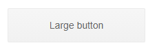

# Button Overview

This article introduces the <a href="https://www.telerik.com/blazor-ui/buttons" target="_blank">Blazor Button component</a>, shows how to start using it, and lists its core features.

Buttons convey user actions and can display text, images and HTML.

The Blazor Button provides a variety of styling options through the [built-in themes]() and the [button type](). It supports [font icons and images]() and fires click [events]().

## Creating Blazor Button

1. Use the `<TelerikButton>` tag to add the component to your razor page.

1. Add an `OnClick` event handler to show the current date and time.

>caption Basic Blazor Button with OnClick event handler

````CSHTML
@result
<br />
<TelerikButton OnClick="@OnClickHandler">Hello!</TelerikButton>

@code {
    string result;

    async Task OnClickHandler()
    {
        result = DateTime.Now.ToString();
    }
}
````


## Icons

To visually communicate the purpose of a button, you can add an image, sprite, or font icon. You can choose between a wide range of built-in font icons or use your custom font icons. [Read more about the Blazor Button icons...]()

## Type

To control the submit behavior of the Blazor Button, use the `Type` attribute. Select from the following button types: `Submit`, `Reset`, and `Button`. [Read more about the Blazor Button Type...]()

## Events

The Blazor Button fires events that you can handle and respond to user actions. [Read more about the Blazor Button events...]().

## Disabled State

To prevent user interaction with a Button, disable it. [Read more about the disabled Blazor Button...]().

## Styling

To customize the style and the appearance of the Blazor Button, you can use the [built-in themes](). Additionally, set the `Class` attribute and implement custom CSS rules. [Read more about the Blazor Button styling...]()

## Button Reference

Add a reference to the Button instance to use its methods (for example - `FocusAsync()`).

>caption Component namespace and reference

````CSHTML
<TelerikButton @ref="theButton">Hello!</TelerikButton>

@code{
    Telerik.Blazor.Components.TelerikButton theButton { get; set; }

    protected override async Task OnAfterRenderAsync(bool firstRender)
    {
        await theButton.FocusAsync();

        await base.OnAfterRenderAsync(firstRender);
    }
}
````

## Next Steps

* [Styling the Blazor Button]()

* [Using Button Icons]()

>caption The result from the code snippet above



## See Also

  * [Live Demo: Button](https://demos.telerik.com/blazor-ui/button/index)
  * [Events]()
  * [Type]()
  * [API Reference](https://docs.telerik.com/blazor-ui/api/Telerik.Blazor.Components.TelerikButton)
  
