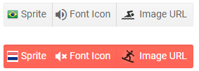

# ButtonGroup Icons

You can put an image, sprite or a font icon in the buttons within a ButtonGroup to illustrate its purpose for your end users. To apply them, use the following properties:

* for a [Telerik font icon](), use the `Icon` attribute to set the font icon class.

* for a raster image, use the `ImageUrl` attribute to provide the URL to the icon (relative or absolute).

* for a custom font icon class, set the `IconClass` parameter of the component to the desired CSS class list which provides the required rules (like font name and glyph symbol). Make sure to also reference the desired font in your app and to use its own recommendations.

* for a sprite, set the `SpriteClass` attribute to `k-icon MySpriteClass` where `MySpriteClass` defines the CSS rules for the sprite.


The following example shows how to use an image from a URL, a sprite image, and the built-in font icons.

>caption How to use icons in the Telerik ButtonGroup Button

````CSHTML
@* This sample shows how you can use conditional logic to show different icons in the different states.
It also shows how to use telerik icons, raster icons and sprite images*@

<TelerikButtonGroup SelectionMode="@ButtonGroupSelectionMode.Multiple">
    <ButtonGroupToggleButton SpriteClass="@( FlagSelected ? "flag netherlands" : "flag brazil")" @bind-Selected="@FlagSelected">Sprite</ButtonGroupToggleButton>

    <ButtonGroupToggleButton Icon="@( FontSelected ? IconName.VolumeOff : IconName.VolumeUp )" @bind-Selected="@FontSelected">Font Icon</ButtonGroupToggleButton>

    <ButtonGroupToggleButton ImageUrl="@RasterIconUrl" @bind-Selected="@RasterSelected">Image URL</ButtonGroupToggleButton>
</TelerikButtonGroup>

<style>
    /* the sprite for the first button is defined through a CSS rule matchin its Class */
    .flag {
        background-image: url("https://docs.telerik.com/blazor-ui/images/flags.png");
    }

        .flag.netherlands {
            background-position: 0 -64px;
            background-color: white;
        }

        .flag.brazil {
            background-position: 0 0;
        }
</style>

@code{
    bool FlagSelected { get; set; }
    bool FontSelected { get; set; }
    bool RasterSelected { get; set; }
    string RasterIconUrl => RasterSelected ? "https://docs.telerik.com/blazor-ui/images/snowboarding.png" : "https://docs.telerik.com/blazor-ui/images/swimming.png";
}
````

>caption The result from the code snippet above



>tip You can use relative paths to your images in the `wwwroot` folder. The example above uses absolute paths to make it easy for you to see the results without preparing images.

>tip If you don't add text to the button, the button will center the icon on all sides.

>note Images used as icons should generally be small enough to fit in a line of text - the button is an inline element and is not designed for large images. If you want to use big icon buttons, consider one of the following options:
>
> * defining a `Class` on the button that provides `height` and `width`. The width and height can be set in `px` sufficient to accommodate the icon or to `auto`,
> * or attaching an `@onclick` handler to an icon/`span`/`img` element instead of using a button,
> * or adding your own HTML inside the button, something like: `<TelerikButton>some text</TelerikButton>`


## See Also

  * [ButtonGroup Overview]()
