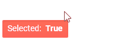
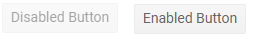
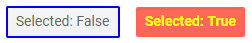

# ButtonGroup Overview

This article provides information about the ToggleButton component and its core features.

The ToggleButton component provides two-state styling according to the [chosen theme](), [events]() and [icons]().

In this article:

* [Basic Button](#basic-button)
* [Disabled State](#disabled-state)
* [Styling](#styling)


## Basic Button

To add a Telerik ToggleButton to your Blazor app, use the `<TelerikToggleButton>` tag. You may also want to add conditional logic for its content, icon or class based on its `Selected` field.

>caption Basic Telerik ToggleButton

````CSHTML
@result
<br />

<TelerikToggleButton @bind-Selected="@IsSelected" OnClick="@ToggleButtonClickHandler">
    Selected: &nbsp; <strong>@IsSelected</strong>
</TelerikToggleButton>

@code {
    bool IsSelected { get; set; } = true;

    string result { get; set; }

    async Task ToggleButtonClickHandler()
    {
        string currState = IsSelected ? "ON" : "OFF";
        result = $"The user clicked the {currState} state.";
    }
}
````

>caption The result from the code snippet above




## Disabled State

To disable a button, set its `Enabled` attribute to `false`.

>caption Disabled Telerik ToggleButton

````CSHTML
<TelerikToggleButton Enabled="false">Disabled Button</TelerikToggleButton>
````

>caption Comparison between disabled and enabled button



## Styling

You can style the button through its `Class` attribute to define your own CSS rules that apply to the HTML rendering. You may want to make them conditional based on its `Selected` state.

>caption Set CSS class to the button and change its appearance

````CSHTML
<TelerikToggleButton Class="@( IsSelected ? "my-on-class" : "the-off-class" )"
                     @bind-Selected="@IsSelected">
    Selected: @IsSelected
</TelerikToggleButton>

@code {
    bool IsSelected { get; set; }
}

<style>
    .my-on-class,
    .my-on-class:hover {
        color: yellow;
        font-weight: 700;
    }

    .the-off-class,
    .the-off-class:hover {
        border: 2px solid blue;
    }
</style>
````

>caption The result from the code snippet above




## See Also

  * [Live Demo: ToggleButton](https://demos.telerik.com/blazor-ui/togglebutton/index)
  * [Events]()
  * [Icons]()
  * [API Reference](https://docs.telerik.com/blazor-ui/api/Telerik.Blazor.Components.TelerikToggleButton)
   
