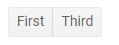

# ButtonGroup Overview

This article provides information about the <a href="https://www.telerik.com/blazor-ui/buttongroup" target="_blank">Blazor ButtonGroup component</a> and its core features.

The ButtonGroup component is a container for buttons that can be toggle buttons, and lets you [select one or more](), and respond to the [selection and click events](). The buttons inside fill up the container, match the styling according to the [chosen theme]() and provide the regular button features like images and icons and the other parameters and attributes.

In this article:

* [Basic and Toggle Buttons](#basic-and-toggle-buttons)
* [Disabled State](#disabled-state)
* [Hide Buttons](#hide-buttons)
* [Styling](#styling)

## Basic and Toggle Buttons

To add a Telerik ButtonGroup to your Blazor app:

1. Add the `TelerikButtonGroup` tag.
1. Inside it, add `ButtonGroupToggleButton` or `ButtonGroupButton` tags that denote each button.
    * The `ButtonGroupToggleButton` becomes primary when clicked and de-selects when another one is clicked. Read more in the [Selection]() article.
    * The `ButtonGroupButton` does not change its visual state when clicked.
1. Use the `OnClick` event of these buttons to handle the user actions.

>caption TelerikButtonGroup with regular buttons and toggle buttons, and their respective OnClick handlers

````CSHTML
@* Each individual button lets you control its selected state, have a click handler and template, icons, text *@

<TelerikButtonGroup>
    <ButtonGroupButton OnClick="@FirstClick">First button</ButtonGroupButton>
    <ButtonGroupToggleButton OnClick="@SecondClick">Second button</ButtonGroupToggleButton>
</TelerikButtonGroup>

@code{
    async Task FirstClick()
    {
        Console.WriteLine("the first button was clicked.");
    }

    async Task SecondClick()
    {
        Console.WriteLine("the second button was clicked. It becomes selected when clicked.");
    }
}
````

>caption The result from the code snippet above, after clicking the second button


## Disabled State

To disable a button, set its `Enabled` attribute to `false`.

>caption Disabled buttons in a button group

````CSHTML
<TelerikButtonGroup>
    <ButtonGroupButton>Enabled</ButtonGroupButton>
    <ButtonGroupButton Enabled="false">Disabled</ButtonGroupButton>
    <ButtonGroupToggleButton Selected="true">Enabled</ButtonGroupToggleButton>
    <ButtonGroupToggleButton Enabled="false">Disabled</ButtonGroupToggleButton>
</TelerikButtonGroup>
````

>caption Comparison between disabled and enabled button


## Hide Buttons

You can set the `Visible` parameter of individual buttons to `false` to hide them based on certain logic. This lets you maintain the same markup and toggle features on and off with simple flags without affecting indexes and event handlers.

>caption Hide buttons from a ButtonGroup

````CSHTML
<TelerikButtonGroup>
    <ButtonGroupButton>First</ButtonGroupButton>
    <ButtonGroupButton Visible="false">Hidden</ButtonGroupButton>
    <ButtonGroupButton>Third</ButtonGroupButton>
</TelerikButtonGroup>
````

>caption Only two visible buttons are rendered




## Styling

You can style the individual buttons through their `Class` attribute to define your own CSS rules that apply to the HTML rendering. You may want to make them conditional based on their `Selected` state.

>caption Set CSS class to the button and change its appearance

````CSHTML
<TelerikButtonGroup>
    <ButtonGroupToggleButton>Default</ButtonGroupToggleButton>
    <ButtonGroupToggleButton @bind-Selected="@IsSelected"
                             Class="@( IsSelected ? "my-on-class" : "the-off-class" )">Styled - Selected: @IsSelected</ButtonGroupToggleButton>
</TelerikButtonGroup>

@code {
    bool IsSelected { get; set; }
}

<style>
    .k-button-group button.k-button.my-on-class,
    .k-button-group button.k-button.my-on-class:hover {
        color: yellow;
        font-weight: 700;
    }

    .k-button-group button.k-button.the-off-class,
    .k-button-group button.k-button.the-off-class:hover {
        color: pink;
    }
</style>
````

>caption The result from the code snippet above


## See Also

  * [Live Demo: ButtonGroup](https://demos.telerik.com/blazor-ui/buttongroup/overview)
  * [Events]()
  * [Selection]()
  * [Icons]()
  * [API Reference](https://docs.telerik.com/blazor-ui/api/Telerik.Blazor.Components.TelerikButtonGroup)
   
