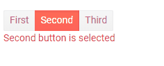
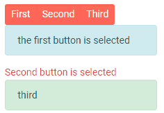

# ButtonGroup Selection

The ButtonGroup lets you select one or more of its `ButtonGroupToggleButton` instances depending on the `SelectionMode` setting:

* [Single](#single-selection) - the buttons act like radio buttons
* [Multiple](#multiple-selection) - the buttons act like checkboxes

You can control whether a button is selected (it is in its `Primary` state) through its `Selected` parameter. It offers two-way binding and an [SelectedChanged event]() so you can respond to the user actions.

## Single Selection

When you click a button, it becomes selected. When you click another button, the first one will become de-selected and the second one will be selected.

>caption Single Selection in the ButtonGroup



````CSHTML
@* You can use more complex logic to show different components. To load data asynchronously, use the OnClick event or the OnParametersSetAsync event of a component you render *@

<TelerikButtonGroup SelectionMode="@ButtonGroupSelectionMode.Single">
    <ButtonGroupToggleButton @bind-Selected="@FirstSelected">First</ButtonGroupToggleButton>
    <ButtonGroupToggleButton @bind-Selected="@SecondSelected">Second</ButtonGroupToggleButton>
    <ButtonGroupToggleButton @bind-Selected="@ThirdSelected">Third</ButtonGroupToggleButton>
</TelerikButtonGroup>

@if (FirstSelected)
{
    <div class="alert alert-info">the first button is selected</div>
}

@if (SecondSelected)
{
    <div class="text-danger">Second button is selected</div>
}

@if (ThirdSelected)
{
    <div class="alert alert-success">third</div>
}

@code{
    bool FirstSelected { get; set; }
    bool SecondSelected { get; set; } = true; // you can pre-select buttons
    bool ThirdSelected { get; set; }
}
````


## Multiple Selection

When you click a button, it becomes selected. When you click another button, the first one retains its selected state, and the second one will also be selected. Clicking on a selected button will deselect it.

>caption Multiple Selection in the ButtonGroup



````CSHTML
@* You can use more complex logic to show different components. To load data asynchronously, use the OnClick event or the OnParametersSetAsync event of a component you render *@

<TelerikButtonGroup SelectionMode="@ButtonGroupSelectionMode.Multiple">
    <ButtonGroupToggleButton @bind-Selected="@FirstSelected">First</ButtonGroupToggleButton>
    <ButtonGroupToggleButton @bind-Selected="@SecondSelected">Second</ButtonGroupToggleButton>
    <ButtonGroupToggleButton @bind-Selected="@ThirdSelected">Third</ButtonGroupToggleButton>
</TelerikButtonGroup>

@if (FirstSelected)
{
    <div class="alert alert-info">the first button is selected</div>
}

@if (SecondSelected)
{
    <div class="text-danger">Second button is selected</div>
}

@if (ThirdSelected)
{
    <div class="alert alert-success">third</div>
}

@code{
    bool FirstSelected { get; set; }
    bool SecondSelected { get; set; } = true; // you can pre-select buttons
    bool ThirdSelected { get; set; }
}
````


## See Also

  * [ButtonGroup Overview]()
  * [ButtonGroup Events]()
  * [Live Demo: ButtonGroup Selection](https://demos.telerik.com/blazor-ui/buttongroup/selection)
