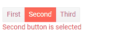
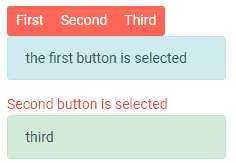

# ButtonGroup Selection

The ButtonGroup lets you select one or more of its `ButtonGroupToggleButton` instances depending on the `SelectionMode` setting:

* [Single](#single-selection) (default) - the buttons act like radio buttons
* [Multiple](#multiple-selection) - the buttons act like checkboxes

You can control whether a button is selected (it is in its `Primary` state) through its `Selected` parameter. It offers two-way binding and an [SelectedChanged event](slug:buttongroup-events) so you can respond to the user actions.

## Single Selection

When you click a button, it becomes selected. When you click another button, the first one will become deselected and the second one will be selected.

>caption Single Selection in the ButtonGroup

<demo metaUrl="client/buttongroup/selection/single/" height="300"></demo>

## Multiple Selection

When you click a button, it becomes selected. When you click another button, the first one retains its selected state, and the second one will also be selected. Clicking on a selected button will deselect it.

>caption Multiple Selection in the ButtonGroup

<demo metaUrl="client/buttongroup/selection/multiple/" height="300"></demo>

## See Also

* [ButtonGroup Overview](slug:buttongroup-overview)
* [ButtonGroup Events](slug:buttongroup-events)
* [Live Demo: ButtonGroup Selection](https://demos.telerik.com/blazor-ui/buttongroup/selection)
