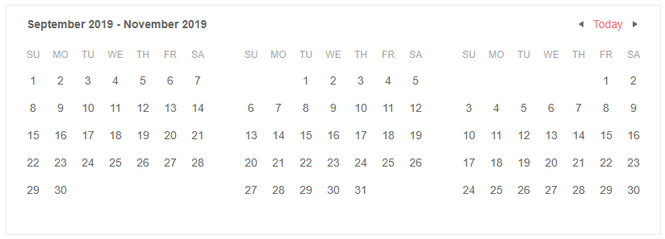

# Multiple Views

You can render several instances of the current calendar view next to each other so that the user needs to browse less. To do that, set the `Views` property to the desired count of views.

>caption Render 3 months (a quarter) at a time

````CSHTML
<TelerikCalendar Views="3" View="CalendarView.Month">
</TelerikCalendar>
````



>tip You can still use the other features of the calendar like setting a starting `Date` and [Selection](selection), or the `Min` and `Max` constraints.


## See Also

  * [Calendar Overview]()
  * [Live Demo: MultiView Calendar](https://demos.telerik.com/blazor-ui/calendar/multiview)
  
