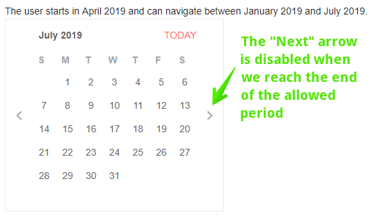
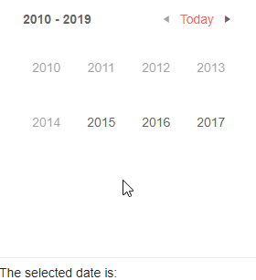

# Calendar Navigation

The user can navigate through several different views in a calendar - from a century, to a month. You can control in which view the user starts, the date which the calendar shows initially, how deep the user can go, and to also navigate to a desired date and view with code.

The calendar shows arrows that let the user flip between the adjacent periods. Clicking the `Today` button at the top navigates to a period in the current view that includes the current date.

For example, if the current date is April 2019, and the current view is the Month view, the user can press the back and forward arrows to go, respectively, to March 2019 and May 2019.

You can control how far the user can go by setting the `Min` and `Max` properties.

>caption Previous and Next navigation is enabled by default. You can control the min and max range of dates the user can navigate through

````CSHTML
@using Telerik.Blazor.Components.Calendar
@using Telerik.Blazor

The user starts in April 2019 and can navigate between January 2019 and July 2019.
<br />

<TelerikCalendar Date="@startDate" View="@CalendarView.Month" Min="@minDate" Max="@maxDate"></TelerikCalendar>
@code {
	DateTime startDate = new DateTime(2019, 4, 1);
	DateTime minDate = new DateTime(2019, 1, 1);
	DateTime maxDate = new DateTime(2019, 7, 31);
}
````

>caption The result from the code snippet above



## Toggle View Details Up and Down

The calendar offers several views that show the user different periods of time:

* `Century`
* `Decade`
* `Year`
* `Month`

The user can click on an item in the current view to go to the more detailed view. They can click the current range at the top to navigate to the larger view where navigating bigger portions of time is easier (for example, years, or even decades).

You can control the initial view by setting the `View` property to a member of the `Telerik.Blazor.CalendarView` enum as listed above.

You can control how much detail the user can go into by setting the `BottomView` property to the same enum. Once the user reaches this bottom view, clicking the items selects them and does not navigate to a more detailed view.

>caption Control current view and how deep the user can go

````CSHTML
@using Telerik.Blazor.Components.Calendar
@using Telerik.Blazor

The user starts in the Decade view and can only go down to years.
<br />

<TelerikCalendar BottomView="@CalendarView.Year" View="@CalendarView.Decade" 
                Min="@min" Max="@max" ValueChanged="@MyValueChangeHandler">
</TelerikCalendar>

The selected date is: @selectedDate

@code {
	private DateTime min = new DateTime(2015, 1, 1);
	private DateTime max = new DateTime(2025, 12, 31);
	private string selectedDate = "";

	private void MyValueChangeHandler(DateTime newValue)
	{
		selectedDate = newValue.ToString();
		StateHasChanged();
	}
}
````

>caption The behavior of the code snippet above



## Programmatic Navigation

You can make the Calendar component move to a certain date and view through its `Navigate` method from your own code. The method takes into account the min and max dates, and the allowed views. If the parameters passed to the method are not allowed by those constraints, navigation will not occur.

>caption Navigate the Calendar to a date and view programmatically

````CSHTML
@using Telerik.Blazor.Components.Calendar
@using Telerik.Blazor.Components.Button

<TelerikButton OnClick="@NavigateCalendarProgrammatically">Go to new date and view</TelerikButton>
<TelerikCalendar Date="@startDate" Max="@maxDate" Min="@minDate" View="@Telerik.Blazor.CalendarView.Decade" ref="@theCalendar"></TelerikCalendar>

@code{
	DateTime startDate = new DateTime(2345, 11, 22);
	DateTime maxDate = new DateTime(2400, 11, 22);
	DateTime minDate = new DateTime(1800, 11, 22);

	Telerik.Blazor.Components.Calendar.TelerikCalendar theCalendar;

	void NavigateCalendarProgrammatically()
	{
		theCalendar.Navigate(DateTime.Now, Telerik.Blazor.CalendarView.Month);
	}
}
````

## See Also

  * [Live Demo: Calendar](https://demos.telerik.com/blazor-ui/calendar/index)
  
