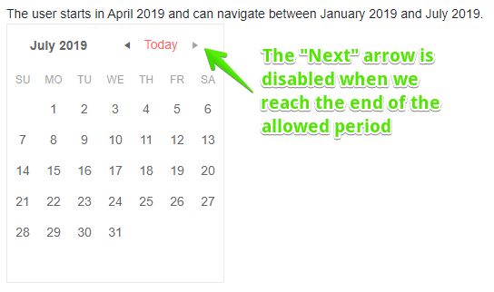

# Calendar Navigation

The user can navigate through several different views in a calendar - from a century, to a month. You can control in which view the user starts, the date which the calendar shows initially, how deep the user can go, and to also navigate to a desired date and view with code.

The calendar shows arrows that let the user flip between the adjacent periods. Clicking the `Today` button at the top navigates to a period in the current view that includes the current date.

For example, if the current date is April 2019, and the current view is the Month view, the user can press the back and forward arrows to go, respectively, to March 2019 and May 2019.

You can control how far the user can go by setting the `Min` and `Max` properties.

>caption Previous and Next navigation is enabled by default. You can control the min and max range of dates the user can navigate through

````RAZOR
The user starts in April 2019 and can navigate between January 2019 and July 2019.
<br />

<TelerikCalendar @bind-Date="@startDate" @bind-View="@selectedView" Min="@minDate" Max="@maxDate"></TelerikCalendar>
@code {
    DateTime startDate = new DateTime(2019, 4, 1);
    DateTime minDate = new DateTime(2019, 1, 1);
    DateTime maxDate = new DateTime(2019, 7, 31);
    CalendarView selectedView { get; set; } = CalendarView.Month;
}
````

>caption The result from the code snippet above



## Toggle View Details Up and Down

The calendar offers several views that show the user different periods of time:

* `Century`
* `Decade`
* `Year`
* `Month`

The user can click on an item in the current view to go to the more detailed view. They can click the current range at the top to navigate to the larger view where navigating bigger portions of time is easier (for example, years, or even decades).

To control the initial view, set the `View` property to a member of the `Telerik.Blazor.CalendarView` enum, as listed above.

To control how much detail the user can go into, set the [`BottomView` and `TopView`](#topview-and-bottomview) parameters to a member of the same enum. 

>caption Control current view and how deep the user can go

````RAZOR
The user can only go down to years on both - TopView and BottomView.
<br />

<TelerikCalendar TopView="@CalendarView.Year" BottomView="@CalendarView.Year" @bind-View="@SelectedView"
                 Min="@min" Max="@max" ValueChanged="@MyValueChangeHandler">
</TelerikCalendar>

<br />The selected date is: @selectedDate

@code {
    private DateTime min = new DateTime(2015, 1, 1);
    private DateTime max = new DateTime(2025, 12, 31);
    private CalendarView SelectedView { get; set; } = CalendarView.Decade;
    private string selectedDate = "";

    private void MyValueChangeHandler(DateTime newValue)
    {
        selectedDate = newValue.ToString();
        StateHasChanged();
    }
}
````

## TopView and BottomView

`BottomView` sets the greatest level of detail the user can navigate. Its default value is `CalendarView.Month`. If `View` is not set, the Calendar will initially display its `BottomView`.

`TopView` sets the least level of detail (i.e. greatest level of date aggregation). Its default value is `CalendarView.Century`.

## Programmatic Navigation

You can make the Calendar component move to a certain date and view through its `Date` and `View` parameters that support two-way binding. The constraints of the min/max and top/bottom view apply to programmatic navigation as well as to user navigation.

>caption Navigate the Calendar to a date and view programmatically

````RAZOR
@* Programmatic Calendar navigation *@

<TelerikCalendar @bind-Date="@startDate" @bind-View="@calendarView"
                 Min="@min" Max="@max">
</TelerikCalendar>
<TelerikButton OnClick="@UpdateView">Update View</TelerikButton>

@code {
    CalendarView calendarView { get; set; } = CalendarView.Month;
    DateTime startDate { get; set; } = new DateTime(2019, 5, 2);

    DateTime min = new DateTime(2015, 1, 1);
    DateTime max = new DateTime(2025, 12, 31);

    protected void UpdateView()
    {
        calendarView = CalendarView.Year;
        startDate = new DateTime(2018, 5, 2);
    }
}
````

## See Also

  * [Live Demo: Calendar](https://demos.telerik.com/blazor-ui/calendar/overview)
  
