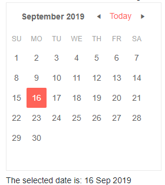

# Calendar Overview

The Calendar component allows the user to scroll through a calendar and select one or more dates. You can control to what level the user can zoom the calendar (for example, up to months or years), what are the minimum and maximum date the user can navigate to, and whether they can select one or more dates.

To use a Telerik Calendar for Blazor, add the `TelerikCalendar` tag.

>caption Basic calendar with its key features, and ValueChanged event handling

````CSHTML
@* Main Calendar features, ValueChanged event handling. *@
<br />

<TelerikCalendar Min="@min" Max="@max" ValueChanged="@MyValueChangeHandler" @bind-Date="@theDate">
</TelerikCalendar>

<br />
The selected date is: @selectedDate

@code {

    private DateTime min = new DateTime(2015, 1, 1);
    private DateTime max = new DateTime(2025, 12, 31);
    private DateTime theDate { get; set; } = DateTime.Now;
    private string selectedDate = "";

    private void MyValueChangeHandler(DateTime newValue)
    {
        selectedDate = newValue.ToString("dd MMM yyyy");
    }
}

````

>caption The result from the code snippet above



>tip The `Date` parameter indicates the view the user is in. You can use its `DateChanged` event to know when the user browses through the calendar.

>caption Component namespace and reference

````CSHTML
@using Telerik.Blazor.Components

<TelerikCalendar @ref="myCalendarReference">
</TelerikCalendar>

@code {
    Telerik.Blazor.Components.TelerikCalendar myCalendarReference;
}
````
The calendar provides a number of features that allow you to control the user experience:

* [Navigation]() - the calendar level (view) at which the user starts, to what detail (view) they can go, the min, max and current date.
* [Selection]() - whether the user can select only one ore more dates, and also a collection of dates they cannot select.
* [Multiple Views]() - you can show the user a wider range of dates.


## See Also

  * [Navigation]()
  * [Selection]()
  * [Multiple Views]()
  * [Live Demo: Calendar](https://demos.telerik.com/blazor-ui/calendar/index)
  * [API Reference](https://docs.telerik.com/blazor-ui/api/Telerik.Blazor.Components.TelerikCalendar)
