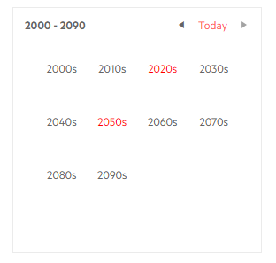

# Century Cell Template

The Century Cell Template controls what the calendar will render in the `<td>` element for each decade in the Century view that lists the decades.

The template receives the `DateTime` corresponding to its cell start year.

>caption Mark some decades on the calendar century view



````CSHTML
@* This example highlights certain decades *@

<TelerikCalendar Date="@startDate" @bind-View="@theView">
    <CenturyCellTemplate>
        <span style="color: @( ShouldHighlight(context.Year) ? "red" : "inherit" )">
            @(context.Year)s
        </span>
    </CenturyCellTemplate>
</TelerikCalendar>

@code{
    DateTime startDate { get; set; } = new DateTime(2021, 4, 1);
    CalendarView theView { get; set; } = CalendarView.Century;

    List<int> yearsWithEvents { get; set; } = new List<int>() { 2020, 2021, 2055 };
    bool ShouldHighlight(int decadeStart)
    {
        for (int i = 0; i < 10; i++)
        {
            if(yearsWithEvents.Contains(decadeStart + i))
            {
                return true;
            }
        }
        return false;
    }
}
````


## See Also

 * [Calendar Templates Overview]()
 * [Live Demo: Calendar Templates](https://demos.telerik.com/blazor-ui/calendar/templates)
 

