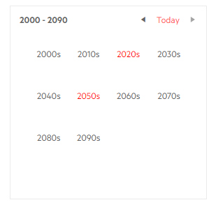

# Century Cell Template

The Century Cell Template controls what the calendar will render in the `<td>` element for each decade in the Century view that lists the decades.

The template receives the `DateTime` corresponding to its cell start year.

>caption Mark some decades on the calendar century view

<demo metaUrl="client/calendar/templates/century-cell/" height="500"></demo>

## See Also

* [Calendar Templates Overview](slug:calendar-templates-overview)
* [Live Demo: Calendar Templates](https://demos.telerik.com/blazor-ui/calendar/templates)
 

