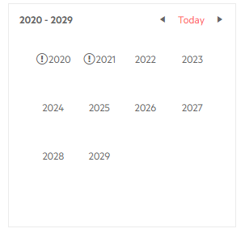

# Decade Cell Template

The Decade Cell Template controls what the calendar will render in the `<td>` element for each year in the Decade view that lists the years.

The template receives the `DateTime` corresponding to its cell.

>caption Mark some years on the calendar decade view



````CSHTML
@* This example adds an icon for certain years *@

<TelerikCalendar Date="@startDate" @bind-View="@theView">
    <DecadeCellTemplate>
        @if (yearsWithEvents.Contains(context.Year))
        {
            <TelerikIcon Icon="warning"></TelerikIcon>
        }
        @context.Year
    </DecadeCellTemplate>
</TelerikCalendar>

@code{
    DateTime startDate { get; set; } = new DateTime(2021, 4, 1);

    CalendarView theView { get; set; } = CalendarView.Decade;
    List<int> yearsWithEvents { get; set; } = new List<int>() { 2020, 2021 };
}
````


## See Also

 * [Calendar Templates Overview]()
 * [Live Demo: Calendar Templates](https://demos.telerik.com/blazor-ui/calendar/templates)
 

