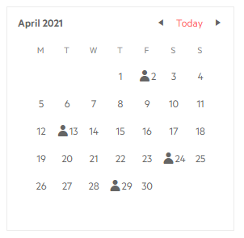

# Month Cell Template

The Month Cell Template controls what the calendar will render in the `<td>` element for each day in the month view.

The template receives the `DateTime` corresponding to its cell.

>caption Mark special days on the calendar month view



````CSHTML
@* This example adds an icon for certain days *@

<TelerikCalendar Date="@startDate">
    <MonthCellTemplate>
        @if (IsSpecialDay(context))
        {
            <TelerikIcon Icon="user"></TelerikIcon>
        }
        @context.Day
    </MonthCellTemplate>
</TelerikCalendar>

@code{
    DateTime startDate { get; set; } = new DateTime(2021, 4, 1);
    List<DateTime> birthdays { get; set; } = new List<DateTime>()
    {
        new DateTime(2021, 4, 2),
        new DateTime(2021, 4, 13),
        new DateTime(2021, 4, 24),
        new DateTime(2021, 4, 29)
    };

    bool IsSpecialDay(DateTime currDate)
    {
        return birthdays.Any(d => d.Year == currDate.Year && d.Month == currDate.Month && d.Day == currDate.Day);
    }
}
````


## See Also

 * [Live Demo: Calendar Templates](https://demos.telerik.com/blazor-ui/calendar/templates)
 

