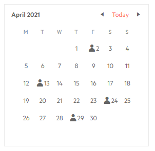

# Month Cell Template

The Month Cell Template controls what the calendar will render in the `<td>` element for each day in the Month view that lists the days.

The template receives the `DateTime` corresponding to its cell.

>caption Mark special days on the calendar month view

<demo metaUrl="client/calendar/templates/month-cell/" height="500"></demo>

## See Also

* [Calendar Templates Overview](slug:calendar-templates-overview)
* [Live Demo: Calendar Templates](https://demos.telerik.com/blazor-ui/calendar/templates)
 

