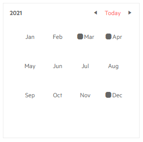

# Year Cell Template

The Year Cell Template controls what the calendar will render in the `<td>` element for each month in the Year view that lists the months.

The template receives the `DateTime` corresponding to its cell.

>caption Mark some months on the calendar year view



````CSHTML
@* This example adds an icon for certain months *@

<TelerikCalendar Date="@startDate" @bind-View="@theView">
    <YearCellTemplate>
        @if (monthsWithEvents.Contains(context.Month))
        {
            <TelerikIcon Icon="round-corners"></TelerikIcon>
        }
        @context.ToString("MMM")
    </YearCellTemplate>
</TelerikCalendar>

@code{
    DateTime startDate { get; set; } = new DateTime(2021, 4, 1);
    CalendarView theView { get; set; } = CalendarView.Year;
    
    List<int> monthsWithEvents { get; set; } = new List<int>() { 3, 4, 12 };
}
````


## See Also

 * [Calendar Templates Overview]()
 * [Live Demo: Calendar Templates](https://demos.telerik.com/blazor-ui/calendar/templates)
 

