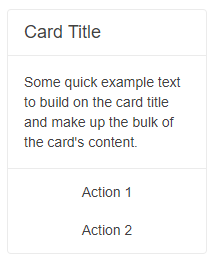

# Card Actions

Every Blazor Card has a dedicated area for action buttons related to the content. The content of these action items, as well as their overall layout and orientation, is completely customizable through the available configuration options.

## Features

>caption The Card provides the following features:

* `Class` - `string` - the CSS class that will be rendered on the main wrapping container of the action buttons.

* `Orientation` - `CardOrientation` - defines the orientation of the Action buttons.

* `Layout` - `CardActionsLayout` - defines the layout of the Action buttons.

* `ChildContent` - `RenderFragment` - defines the child content of the component.

## Orientation

You can define the orientation of the buttons through the `Orientation` parameter of the `CardActions`. It takes a member of the `Telerik.Blazor.CardOrientation` enum:
   * `Horizontal`
   * `Vertical`

>caption Change the orientation of the action buttons. The result from the snippet below.



````CSHTML
@* Change the orientation of the action buttons *@

<TelerikCard Width="200px">
    <CardHeader>
        <CardTitle>Card Title</CardTitle>
    </CardHeader>
    <CardBody>
        <p>Some quick example text to build on the card title and make up the bulk of the card's content.</p>
    </CardBody>
    <CardSeparator></CardSeparator>
    <CardActions Orientation="@CardOrientation.Vertical">
        <TelerikButton Class="k-flat">Action 1</TelerikButton>
        <TelerikButton Class="k-flat">Action 2</TelerikButton>
    </CardActions>
</TelerikCard>
````

## Layout

You can set the layout of the action buttons through the `Layout` parameter of the `CardActions`. We support 4 types of layout - to the start, center, end part of the actions container, or stretched buttons that will fill the whole container with equal size.

The `Layout` parameter takes a member of the `Telerik.Blazor.CardActionsLayout` enum:
* `Center`
* `End`
* `Start`
* `Stretched`

>caption Set stretched layout for the action buttons. The result from the snippet below.


````CSHTML
@* Change the layout of the action buttons *@

<TelerikCard Width="600px" >
    <CardHeader>
        <CardTitle>Card Title</CardTitle>
    </CardHeader>
    <CardBody>
        <p>Some quick example text to build on the card title and make up the bulk of the card's content.</p>
    </CardBody>
    <CardSeparator></CardSeparator>
    <CardActions Layout="@CardActionsLayout.Stretched">
        <TelerikButton Class="k-flat">Action 1</TelerikButton>
        <TelerikButton Class="k-flat">Action 2</TelerikButton>
        <TelerikButton Class="k-flat">Action 3</TelerikButton>
    </CardActions>    
</TelerikCard>
````

## See Also
  
  * [Live Demo: Card](https://demos.telerik.com/blazor-ui/card/actions)
  