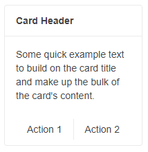

# Card Separator

The `CardSeparator` element of the Card for Blazor distinguishes separate sections or content in the Card. You can use it as a standalone building block, or inside any of the other Card elements. When used as nested component, the `CardSeparator` will be rendered in accordance to any margin applied to the content.

The `CardHeader` comes with a built-in separator at the bottom of the section and the `CardFooter` comes with a built-in separator at the top of the section. Therefore, you don't need to explicitly insert a `CardSeparator` after the `CardHeader` and before the `CardFooter` elements.


#### In this article:
   * [Standalone Card Separator](#standalone-card-separator) 
   * [Nested Card Separator](#nested-card-separator)
   * [Card Separator Orientation](#card-separator-orientation)
   * [Features](#features)

## Standalone Card Separator

Use the `CardSeparator` to distinguish `CardBody` and `CardActions` sections.

In the example below no separator is used after the `CardHeader`, the horizontal line is still present due to the built-in `CardHeader` feature.

>caption  Use the `Card Separator` as a standalone building block. The result from the snippet below.


````CSHTML
@*CardSeparator as a standalone building block*@

<TelerikCard Width="200px">
    <CardHeader>
        <strong>Card Header</strong>
    </CardHeader>
    <CardBody>
        <p> Some quick example text to build on the card title and make up the bulk of the card content.</p>
    </CardBody>
    
   <CardSeparator></CardSeparator>
   
    <CardActions Layout="CardActionsLayout.Center">
        <TelerikButton Class="k-flat">Action 1</TelerikButton>
        <TelerikButton Class="k-flat">Action 2</TelerikButton>
    </CardActions>
</TelerikCard>

````

## Nested Card Separator

Use the `CardSeparator` to distinguish two separate sections in the `CardBody`. The result from the snippet below.


````CSHTML
@*CardSeparator as a nested building block*@

<TelerikCard Width="200px">
    <CardHeader>
        <strong>Card Header</strong>
    </CardHeader>
    <CardBody>
        <p> Some quick example text to build on the card title and make up the bulk of the card content.</p>
        
        <CardSeparator></CardSeparator>
        
        <p>Some other text in the Card Body after the separator.</p>
    </CardBody>
</TelerikCard>
````

## Card Separator Orientation

You can change the `CardSeparator` orientation through its `Orientation` parameter.

>caption Use `CardSeparator` with vertical orientation to separate the two action buttons. The result from the snippet below.



````CSHTML
@*CardSeparator with vertical orientation*@

<TelerikCard Width="200px">
    <CardHeader>
        <strong>Card Header</strong>
    </CardHeader>
    <CardBody>
        <p> Some quick example text to build on the card title and make up the bulk of the card content.</p>
    </CardBody>
    <CardActions Layout="CardActionsLayout.Center">
        <TelerikButton Class="k-flat">Action 1</TelerikButton>
        
        <CardSeparator Orientation="CardOrientation.Vertical"></CardSeparator>
        
        <TelerikButton Class="k-flat">Action 2</TelerikButton>
    </CardActions>
</TelerikCard>
````

## Features

The `CardSeparator` provides the following features:

* `Class` - `string` - the CSS class that will be rendered on the main wrapping element of the `CardSeparator`.

* `Orientation` - `CardOrientation` - defines the orientation of the `CardSeparator`. Takes a member of the `Telerik.Blazor.CardOrientation` enum (`Horizontal` or `Vertical`).


## See Also

  * [Live Demo: Card Building Blocks](https://demos.telerik.com/blazor-ui/card/building-blocks)