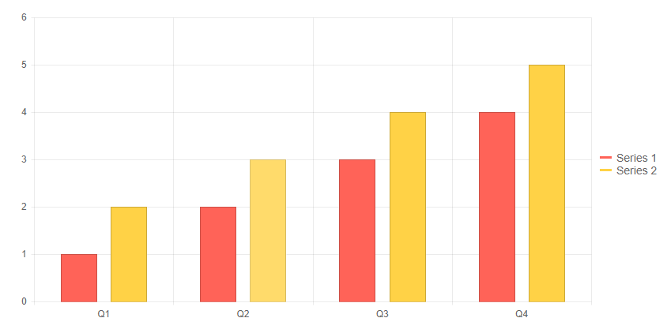
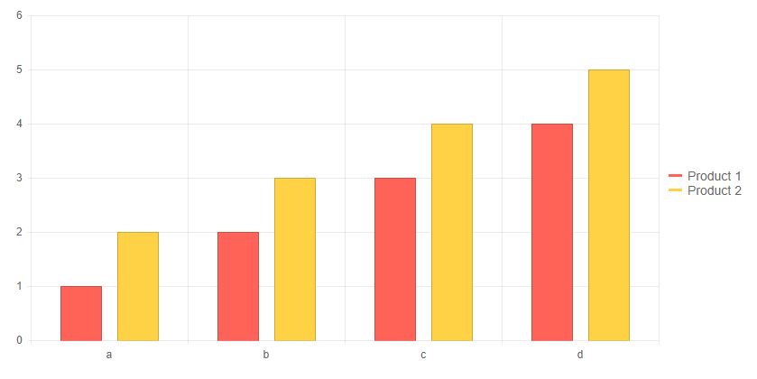
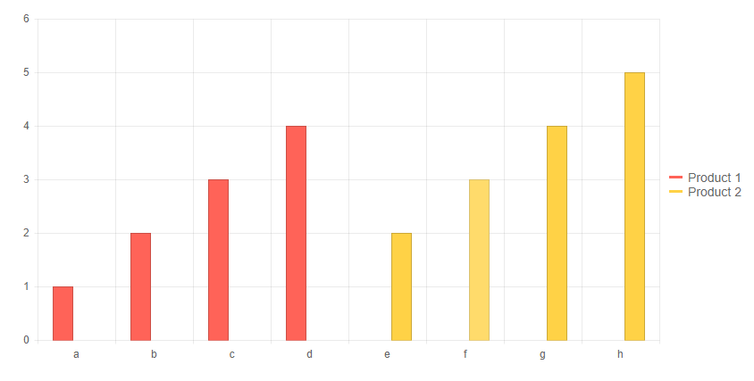
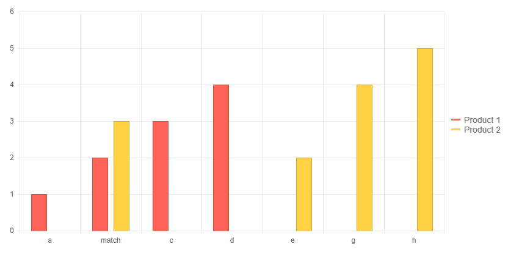
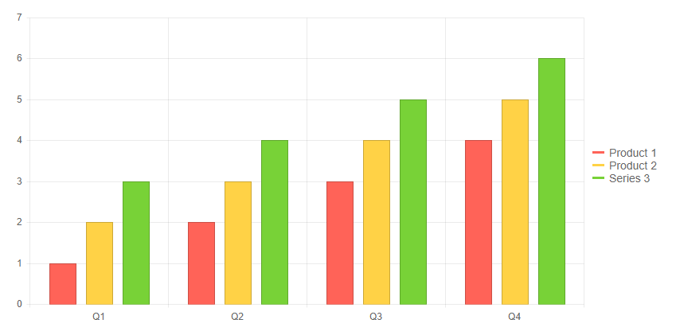
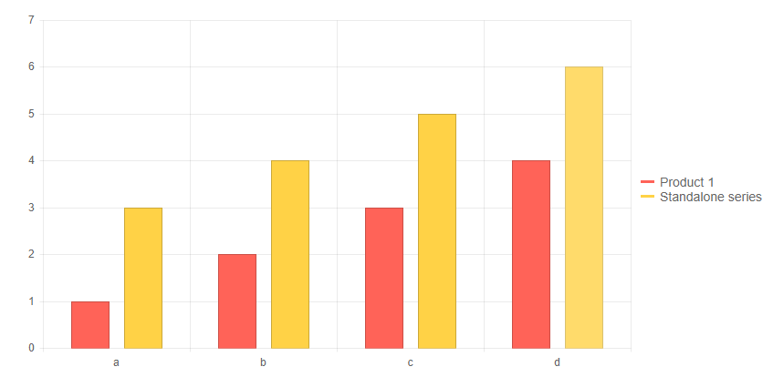

# Chart Data Binding

This article explains the different ways to provide data to a Chart component, the properties related to data binding and their results.

There are two key ways to bind data to the chart series and axes:

* [Independent Series Binding](#independent-series-binding)
* [Attach Series Items to Their Categories](#attach-series-items-to-their-categories)

You can, of course, [mix these approaches](#mixed-data-source).

## Series Types

There are three main types of chart in terms of the data they require for their x-axis:

* **Categorical** - series like Area, Line, Column require a set of categories to match the data points values against. Those categories can be shared among different series, or unique. The categories are usually strings, but can also be [dates](). While there are X and Y axes, the x-axis is not a progression of numerical values - spacing between all x-axis items is equal and they show the text of the category.
* **Numerical** - series like Bubble, Scatter and Scatter Line represent two numerical values for the X and Y axes. They do not use categories on the x-axis and thus each data point is independent. This makes it easier to bind each series to a separate collection of data that can have different number of items in it, because plotting the data points is not dependent on string categories, but on numeric values that will be plotted and spaced according to their values.
* **Axis-free** - series like Pie and Donut do not have a x-axis at all. They use categories to build a list of items for each series and show those categories in the legend, as opposed to the series name that is usually shown by the other chart types.

With this in mind, the information below is applicable for all chart types, but the finer points are mostly relevant to categorical charts.

## Mixing Series

You can use only series with the same general layout in a single chart. You cannot mix numerical with categorical x-axes in the same chart. For example:

* Line, Area and Column series can be used together.
* Line, Area and Bar series can be used together. To rotate the layout of the chart according to the way Bar charts render, the bar series must be declared first. Otherwise, a column layout will be used.
* Bar and Column charts have a different layout and the rendering will depend on the first declared series.
* Scatter and ScatterLine series can be used together.
* Bubble charts cannot be used with other chart types because they have a very distinct layout due to the Size dimension.
* Pie charts will render only one series per chart and so only one can be used at a time.
* Donut charts can only have donut series in them (but can have multiple series).


## Independent Series Binding

In the simplest case, you provide two collections to the chart:

* an `object[]` for the `Categories` (items) on the x-axis
* a `List<object>` with decimal values for the series `Data`

With this approach, the items in each series are independent from the other series, and from the items on the x-axis where the corresponding categories are displayed. The series items are matched with the items on the x-axis by their index.

>caption Bind series independently of each other and of the category axis

````CSHTML
Independent data

<TelerikChart>
	<ChartSeriesItems>
		<ChartSeries Type="ChartSeriesType.Column" Name="Series 1" Data="@data1">
		</ChartSeries>
		<ChartSeries Type="ChartSeriesType.Column" Name="Series 2" Data="@data2">
		</ChartSeries>
	</ChartSeriesItems>

	<ChartCategoryAxes>
		<ChartCategoryAxis Categories="@xAxisItems"></ChartCategoryAxis>
	</ChartCategoryAxes>
</TelerikChart>

@code {
	public List<object> data1 = new List<object>() { 1, 2, 3, 4 };
	public List<object> data2 = new List<object>() { 2, 3, 4, 5 };
	public string[] xAxisItems = new string[] { "Q1", "Q2", "Q3", "Q4" };
}
````

>caption The result from the code snippet above



## Attach Series Items to Their Categories

You can provide a `List<object>` to the `Data` property of a series that contains both its data points, and its x-axis categories. Then, set the series:

* `Field` property to the name of the field with its values
* `CategoryField` property to the name of the field for its x-axis items

With this, the items from the series will be matched to the items (categories) on the x-axis. Each series will add its own categories to the x-axis in order of appearance, and the series items will appear above them only.

>tip This approach lets you define the `CategoryField` for only one series and the rest of the series will match the categories by their index. In such a case, you can provide a single data collection to the chart that holds all data points and x-axis categories.

>caption Bind the entire chart to a single collection. 

````CSHTML
One model for all the chart data

<TelerikChart>
    <ChartSeriesItems>
        <ChartSeries Type="ChartSeriesType.Column" Name="Product 1" Data="@chartData"
                     Field="@nameof(MyDataModel.Product1)" CategoryField="@nameof(MyDataModel.MySharedCategories)">
        </ChartSeries>
        <ChartSeries Type="ChartSeriesType.Column" Name="Product 2" Data="@chartData"
                     Field="@nameof(MyDataModel.Product2)">
        </ChartSeries>
    </ChartSeriesItems>
</TelerikChart>

@code {
    public class MyDataModel
    {
        public string MySharedCategories { get; set; }
        public int Product1 { get; set; }
        public int Product2 { get; set; }
    }

    public List<MyDataModel> chartData = new List<MyDataModel>()
    {
        new MyDataModel() { MySharedCategories = "a", Product1 = 1, Product2 = 2 },
        new MyDataModel() { MySharedCategories = "b", Product1 = 2, Product2 = 3 },
        new MyDataModel() { MySharedCategories = "c", Product1 = 3, Product2 = 4 },
        new MyDataModel() { MySharedCategories = "d", Product1 = 4, Product2 = 5 },
    };
}
````

>caption The result from the code snippet above



>caption Unique categories are added independently.

````CSHTML
Separate fields for series categories

<TelerikChart>
    <ChartSeriesItems>
        <ChartSeries Type="ChartSeriesType.Column" Name="Product 1" Data="@chartData"
                     Field="@nameof(MyDataModel.Product1)" CategoryField="@nameof(MyDataModel.FirstSeriesCategories)">
        </ChartSeries>
        <ChartSeries Type="ChartSeriesType.Column" Name="Product 2" Data="@chartData"
                     Field="@nameof(MyDataModel.Product2)" CategoryField="@nameof(MyDataModel.SecondSeriesCategories)">
        </ChartSeries>
    </ChartSeriesItems>
</TelerikChart>

@code {
    public class MyDataModel
    {
        public string FirstSeriesCategories { get; set; }
        public string SecondSeriesCategories { get; set; }
        public int Product1 { get; set; }
        public int Product2 { get; set; }
    }

    public List<MyDataModel> chartData = new List<MyDataModel>()
    {
        new MyDataModel() { FirstSeriesCategories = "a",  SecondSeriesCategories = "e", Product1 = 1, Product2 = 2 },
        new MyDataModel() { FirstSeriesCategories = "b",  SecondSeriesCategories = "f", Product1 = 2, Product2 = 3 },
        new MyDataModel() { FirstSeriesCategories = "c",  SecondSeriesCategories = "g", Product1 = 3, Product2 = 4 },
        new MyDataModel() { FirstSeriesCategories = "d",  SecondSeriesCategories = "h", Product1 = 4, Product2 = 5 },
    };
}
````

>caption The result from the code snippet above



>tip You can define [multiple x-axes](multiple-axes) to avoid this behavior and have each series populate its own x-axis.

>caption If category values match, they will be combined

````CSHTML
Combining matching standalone categories

<TelerikChart>
    <ChartSeriesItems>
        <ChartSeries Type="ChartSeriesType.Column" Name="Product 1" Data="@chartData"
                     Field="@nameof(MyDataModel.Product1)" CategoryField="@nameof(MyDataModel.FirstSeriesCategories)">
        </ChartSeries>
        <ChartSeries Type="ChartSeriesType.Column" Name="Product 2" Data="@chartData"
                     Field="@nameof(MyDataModel.Product2)" CategoryField="@nameof(MyDataModel.SecondSeriesCategories)">
        </ChartSeries>
    </ChartSeriesItems>
</TelerikChart>

@code {
    public class MyDataModel
    {
        public string FirstSeriesCategories { get; set; }
        public string SecondSeriesCategories { get; set; }
        public int Product1 { get; set; }
        public int Product2 { get; set; }
    }

    public List<MyDataModel> chartData = new List<MyDataModel>()
    {
        new MyDataModel() { FirstSeriesCategories = "a",  SecondSeriesCategories = "e", Product1 = 1, Product2 = 2 },

        //the categories for both series match and both data points will be rendered on the same category
        new MyDataModel() { FirstSeriesCategories = "match",  SecondSeriesCategories = "match", Product1 = 2, Product2 = 3 },

        new MyDataModel() { FirstSeriesCategories = "c",  SecondSeriesCategories = "g", Product1 = 3, Product2 = 4 },
        new MyDataModel() { FirstSeriesCategories = "d",  SecondSeriesCategories = "h", Product1 = 4, Product2 = 5 },
    };
}
````

>caption The result from the code snippet above



## Mixed Data Source

You can choose where to take the categories and series data from, and combine both approaches to a solution that fits the existing data models and data retrieval logic that you have.

For example, you can take the data for some series from a complex model, and the categories from a different place. Or, you can take the categories from a complex model, but let some standalone data populate some series.

>caption Populate categories and one series from standalone data, other series from model

````CSHTML
Mixed data binding

<TelerikChart>
    <ChartSeriesItems>
        <ChartSeries Type="ChartSeriesType.Column" Name="Product 1" Data="@chartData" Field="@nameof(MyDataModel.Product1)">
        </ChartSeries>
        <ChartSeries Type="ChartSeriesType.Column" Name="Product 2" Data="@chartData" Field="@nameof(MyDataModel.Product2)">
        </ChartSeries>
        <ChartSeries Type="ChartSeriesType.Column" Name="Series 3" Data="@standaloneData">
        </ChartSeries>
    </ChartSeriesItems>

    <ChartCategoryAxes>
        <ChartCategoryAxis Categories="@xAxisItems"></ChartCategoryAxis>
    </ChartCategoryAxes>
</TelerikChart>

@code {
    public List<object> standaloneData = new List<object>() { 3, 4, 5, 6 };
    public string[] xAxisItems = new string[] { "Q1", "Q2", "Q3", "Q4" };

    public class MyDataModel
    {
        public string MySharedCategories { get; set; }
        public int Product1 { get; set; }
        public int Product2 { get; set; }
    }

    public List<MyDataModel> chartData = new List<MyDataModel>()
    {
        //you do not have to use all the fields, and you do not have to take the categories from this model
        new MyDataModel() { MySharedCategories = "a", Product1 = 1, Product2 = 2 },
        new MyDataModel() { MySharedCategories = "b", Product1 = 2, Product2 = 3 },
        new MyDataModel() { MySharedCategories = "c", Product1 = 3, Product2 = 4 },
        new MyDataModel() { MySharedCategories = "d", Product1 = 4, Product2 = 5 },
    };
}
````

>caption The result from the code snippet above



>caption Populate categories from model, and some series from standalone data. Standalone categories are ignored.

````CSHTML
Standalone categories are ignored when there is category data binding to a model

<TelerikChart>
    <ChartSeriesItems>
        <ChartSeries Type="ChartSeriesType.Column" Name="Product 1" Data="@chartData"
                     Field="@nameof(MyDataModel.Product1)" CategoryField="@nameof(MyDataModel.MySharedCategories)">
        </ChartSeries>
        <ChartSeries Type="ChartSeriesType.Column" Name="Standalone series" Data="@standaloneData">
        </ChartSeries>
    </ChartSeriesItems>

    <ChartCategoryAxes>
        <ChartCategoryAxis Categories="@xAxisItems"></ChartCategoryAxis>
    </ChartCategoryAxes>
</TelerikChart>

@code {
    public List<object> standaloneData = new List<object>() { 3, 4, 5, 6 };

    //the standalone categories will be ignored if they are data bound from a series configuration
    public string[] xAxisItems = new string[] { "Q1", "Q2", "Q3", "Q4" };

    public class MyDataModel
    {
        public string MySharedCategories { get; set; }
        public int Product1 { get; set; }
        public int Product2 { get; set; }
    }

    public List<MyDataModel> chartData = new List<MyDataModel>()
    {
        new MyDataModel() { MySharedCategories = "a", Product1 = 1, Product2 = 2 },
        new MyDataModel() { MySharedCategories = "b", Product1 = 2, Product2 = 3 },
        new MyDataModel() { MySharedCategories = "c", Product1 = 3, Product2 = 4 },
        new MyDataModel() { MySharedCategories = "d", Product1 = 4, Product2 = 5 },
    };
}
````

>caption The result from the code snippet above




## Numerical Charts

Numerical charts do not use categories and you do not need to consider how the x-axis is shared between the series and whether several data points will be in the same zone. You can provide a model for each series that contains the necessary information (x-value, y-value, and any other value that may be needed, such as size for bubble charts) and they will be plotted independently.

If one series has more data points than another, you will not get empty items on the x-axis, all data points are plotted according to general mathematical rules on the axes.

This means that it is often suitable to provide each series with its own collection of data, and these collections can often use the same model. You can still data bind the entire chart to a single collection, or use any of the approaches above.

>caption Series with a different number of items can be easily used in numerical charts

````CSHTML

@* Standalone collections of the same model type are used for the different series without consideration for matching categories *@

<TelerikChart>
    <ChartTitle Text="Unrecoverable Errors Per Minute vs. Signal Level"></ChartTitle>

    <ChartSeriesItems>
        <ChartSeries Type="ChartSeriesType.Scatter"
                     Data="@Series1Data"
                     Name="APSK modulation"
                     XField="@nameof(ModelData.Strength)"
                     YField="@nameof(ModelData.Errors)">
        </ChartSeries>

        <ChartSeries Type="ChartSeriesType.Scatter"
                     Data="@Series2Data"
                     Name="QAM modulation"
                     XField="@nameof(ModelData.Strength)"
                     YField="@nameof(ModelData.Errors)">
        </ChartSeries>
    </ChartSeriesItems>

    <ChartXAxes>
        <ChartXAxis Max="-30" AxisCrossingValue="@(new object[] { -100 })">
            <ChartXAxisTitle Text="Signal Strength, dBm"></ChartXAxisTitle>
        </ChartXAxis>
    </ChartXAxes>

    <ChartYAxes>
        <ChartYAxis>
            <ChartYAxisTitle Text="Error count"></ChartYAxisTitle>
        </ChartYAxis>
    </ChartYAxes>
</TelerikChart>

@code {
    public class ModelData
    {
        public double Strength { get; set; }
        public double Errors { get; set; }
    }

    public List<ModelData> Series1Data = new List<ModelData>()
    {
       new ModelData { Strength = -82, Errors = 15  },
       new ModelData { Strength = -79, Errors = 13  },
       new ModelData { Strength = -77, Errors = 10  },
       new ModelData { Strength = -74, Errors = 7  },
       new ModelData { Strength = -70, Errors = 3  },
       new ModelData { Strength = -65, Errors = 1  }
    };

    public List<ModelData> Series2Data = new List<ModelData>()
    {
       new ModelData { Strength = -80, Errors = 25  },
       new ModelData { Strength = -76, Errors = 22  },
       new ModelData { Strength = -73, Errors = 17  },
       new ModelData { Strength = -70, Errors = 15  },
       new ModelData { Strength = -65, Errors = 12  },
       new ModelData { Strength = -61, Errors = 10  },
       new ModelData { Strength = -55, Errors = 7  },
       new ModelData { Strength = -50, Errors = 3  }
    };
}
````

>caption The same chart bound to a single model with fields for each series

````CSHTML
@* You can also have a different number of series item if you bind the entire chart to the same model *@

<TelerikChart>
    <ChartTitle Text="Unrecoverable Errors Per Minute vs. Signal Level"></ChartTitle>

    <ChartSeriesItems>
        <ChartSeries Type="ChartSeriesType.Scatter"
                     Data="@AllChartData"
                     Name="APSK modulation"
                     XField="@nameof(ModelData.ApskStrength)"
                     YField="@nameof(ModelData.ApskErrors)">
        </ChartSeries>

        <ChartSeries Type="ChartSeriesType.Scatter"
                     Data="@AllChartData"
                     Name="QAM modulation"
                     XField="@nameof(ModelData.QamStrength)"
                     YField="@nameof(ModelData.QamErrors)">
        </ChartSeries>
    </ChartSeriesItems>

    <ChartXAxes>
        <ChartXAxis Max="-30" AxisCrossingValue="@(new object[] { -100 })">
            <ChartXAxisTitle Text="Signal Strength, dBm"></ChartXAxisTitle>
        </ChartXAxis>
    </ChartXAxes>

    <ChartYAxes>
        <ChartYAxis>
            <ChartYAxisTitle Text="Error count"></ChartYAxisTitle>
        </ChartYAxis>
    </ChartYAxes>
</TelerikChart>

@code {
    public class ModelData
    {
        public double ApskStrength { get; set; }
        public double ApskErrors { get; set; }
        public double QamStrength { get; set; }
        public double QamErrors { get; set; }
    }

    public List<ModelData> AllChartData = new List<ModelData>()
    {
       new ModelData { QamStrength = -80, QamErrors = 25, ApskStrength = -82, ApskErrors = 15  },
       new ModelData { QamStrength = -76, QamErrors = 22, ApskStrength = -79, ApskErrors = 13  },
       new ModelData { QamStrength = -73, QamErrors = 17, ApskStrength = -77, ApskErrors = 10  },
       new ModelData { QamStrength = -70, QamErrors = 15, ApskStrength = -74, ApskErrors = 7  },
       new ModelData { QamStrength = -65, QamErrors = 12, ApskStrength = -70, ApskErrors = 3  },
       new ModelData { QamStrength = -61, QamErrors = 10, ApskStrength = -65, ApskErrors = 1  },
       new ModelData { QamStrength = -55, QamErrors = 7  },
       new ModelData { QamStrength = -50, QamErrors = 3  }
    };
}

````

## See Also

  * [Live Demos: Chart](https://demos.telerik.com/blazor-ui/chart/index)
