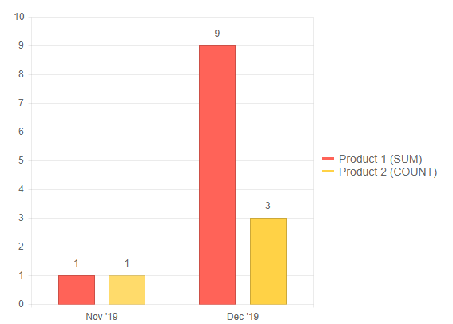

# Date Axis

This article demonstrates how to use `DateTime` values for the x-axis of the chart.

You can find the following sections:
* [Categorical charts](#categorical-charts)
* [Numerical charts](#numerical-charts)

## Categorical charts

Categorical charts (such as [Column](), [Line](), [Area]()) support displaying dates on the x-axis. A date axis aggregates the data points that fall within its scope to a single data point that gets rendered.

To enable a date axis:

1. Set the `Type` property of the `ChartCategoryAxis` to `ChartCategoryAxisType.Date`.
1. Provide categories of type `DateTime` to it (see [data binding a chart]()).

You can control the aggregation level through the `BaseUnit` property of the axis. It takes a member of the `Telerik.Blazor.ChartCategoryAxisBaseUnit` class.

You can set the aggregation function through the `Aggregate` property of the series. It takes a member of the `Telerik.Blazor.ChartSeriesAggregate` class.

>caption Date Axis with month grouping and different aggregates on the series

````CSHTML
Grouping by month, aggregates

<TelerikChart>

	<ChartCategoryAxes>
		<ChartCategoryAxis BaseUnit="ChartCategoryAxisBaseUnit.Months" Type="ChartCategoryAxisType.Date"></ChartCategoryAxis>
	</ChartCategoryAxes>
	
	<ChartSeriesItems>
		<ChartSeries Type="ChartSeriesType.Column" Name="Product 1 (SUM)" Data="@chartData"
							Field="@nameof(MyDataModel.Product1)" CategoryField="@nameof(MyDataModel.MySharedCategories)" Aggregate="ChartSeriesAggregate.Sum">
			<ChartSeriesLabels Visible="true"></ChartSeriesLabels>
		</ChartSeries>
		<ChartSeries Type="ChartSeriesType.Column" Name="Product 2 (COUNT)" Data="@chartData"
							Field="@nameof(MyDataModel.Product2)" Aggregate="ChartSeriesAggregate.Count">
			<ChartSeriesLabels Visible="true"></ChartSeriesLabels>
		</ChartSeries>
	</ChartSeriesItems>
	
</TelerikChart>

@code {
	public class MyDataModel
	{
		public DateTime MySharedCategories { get; set; }
		public int Product1 { get; set; }
		public int Product2 { get; set; }
	}

	public List<MyDataModel> chartData = new List<MyDataModel>()
    {
		new MyDataModel() { MySharedCategories = new DateTime(2019, 11, 11), Product1 = 1, Product2 = 2 },
		new MyDataModel() { MySharedCategories = new DateTime(2019, 12, 15), Product1 = 2, Product2 = 3 },
		new MyDataModel() { MySharedCategories = new DateTime(2019, 12, 19), Product1 = 3, Product2 = 4 },
		new MyDataModel() { MySharedCategories = new DateTime(2019, 12, 28), Product1 = 4, Product2 = 5 },
	};
}
````

>caption The result from the code snippet above



### Advanced Features

#### Automatic Fitting

If you set `BaseUnit="ChartCategoryAxisBaseUnit.Fit"`, the chart will choose such a base unit, so that the number of categories on the axis will be less than or equal to the value of the `MaxDateGroups` property (if it is set).

Using this feature will ignore the `BaseUnitStep`.

If you do not set the `BaseUnit`, its value is determined by the smallest interval between categories. In the example above, it is four days, which is less than a week, but more than a day, so the base unit will be `Days`.

>tip Avoid large intervals with short base units. This would result in a huge amount of categories and this can result in performance degradation, or even errors/crashes.

#### Base Unit Step

If there are many categories, you can choose to render every n-th of them by setting the `BaseUnitStep` property.

#### Week Start Day

When the `BaseUnit` is set to weeks, you can control the start day of the week through the `WeekStartDay` property. The `0` value is `Sunday`, `1` is `Monday` and so on.

#### Labels Format

Each base unit has a default format for the date it displays. If you want to change it, use the `Format` property under the `ChartCategoryAxisLabels` tag of the category axis.

>caption Steps set to weeks, changed weeks start day to Monday and non-default label format

````CSHTML
Steps, custom label format, non-default start of week

<TelerikChart>

	<ChartCategoryAxes>
		<ChartCategoryAxis BaseUnit="ChartCategoryAxisBaseUnit.Weeks" WeekStartDay="1" Type="ChartCategoryAxisType.Date">
			<ChartCategoryAxisLabels Format="{0:dd MMM}" />
		</ChartCategoryAxis>
	</ChartCategoryAxes>
	
	<ChartSeriesItems>
		<ChartSeries Type="ChartSeriesType.Column" Name="Product 1 (SUM)" Data="@chartData"
							Field="@nameof(MyDataModel.Product1)" CategoryField="@nameof(MyDataModel.MySharedCategories)" 
							Aggregate="ChartSeriesAggregate.Sum">
			<ChartSeriesLabels Visible="true"></ChartSeriesLabels>
		</ChartSeries>
		<ChartSeries Type="ChartSeriesType.Column" Name="Product 2 (COUNT)" Data="@chartData"
							Field="@nameof(MyDataModel.Product2)" Aggregate="ChartSeriesAggregate.Count">
			<ChartSeriesLabels Visible="true"></ChartSeriesLabels>
		</ChartSeries>
	</ChartSeriesItems>

</TelerikChart>

@code {
	public class MyDataModel
	{
		public DateTime MySharedCategories { get; set; }
		public int Product1 { get; set; }
		public int Product2 { get; set; }
	}

	public List<MyDataModel> chartData = new List<MyDataModel>()
	{
		new MyDataModel() { MySharedCategories = new DateTime(2019, 11, 11), Product1 = 1, Product2 = 2 },
		new MyDataModel() { MySharedCategories = new DateTime(2019, 12, 15), Product1 = 2, Product2 = 3 },
		new MyDataModel() { MySharedCategories = new DateTime(2019, 12, 19), Product1 = 3, Product2 = 4 },
		new MyDataModel() { MySharedCategories = new DateTime(2019, 12, 28), Product1 = 4, Product2 = 5 },
	};
}
````

## Numerical charts

The numerical [Scatter]() and [ScatterLine]() charts also support `DateTime` values for the x-axis. To enable such scenario:

1. Set the `Type` property of the `ChartXAxis` to "date".
1. Provide a field of type `DateTime` to the `XField` parameter of the `ChartSeries` (see [data binding a chart]()).

You can control the aggregation level through the `BaseUnit` property of the axis. It takes a string and the available options are "milliseconds", "seconds", "minutes", "hours", "days", "weeks", "months" or "years".

>note The `BaseUnit` and `Type` properties on the x-axis for numeric charts will eventually become an `enum` at some point. As it can lead to changes in the chart settings markup, in order to keep in track with this potential API update, you can follow the enhancement request in the Telerik UI for Blazor public feedback portal - [scatter chart with date axis](https://feedback.telerik.com/blazor/1441432-scatter-chart-with-date-axis).

### Advanced Features

#### Labels Format

Each base unit has a default format for the date it displays. If you want to change it, use the `Format` property of the `ChartXAxisLabels` tag under the `ChartXAxis` tag.


### Considerations

If the data provided to the chart uses the complete `DateTime` format, this will affect the rendering of the labels and markers as the chart will take into account the complete `DateTime` value. This should be considered when specifying the chart settings in order to achieve the desired result.

For example, if the chosen `BaseUnit` is `days`, the X labels mark the beginning of the day and the data records also specify time values, their markers will be rendered at the corresponding to their time value point and not exactly on the label for this day. This specific behavior when working with `DateTime` values could be observed in the following examples:

>caption ScatterLine chart with day and time values. Markers are rendered after the day labels to also respect the time values. The result from the snippet below


````CSHTML
@* ScatterLine chart with day and time values for the X-axis *@

<div style="width:800px">
    <TelerikChart>

        <ChartSeriesItems>
            <ChartSeries Type="ChartSeriesType.ScatterLine"
                         Data="@ChartData"
                         Name="0.8C"
                         XField="@nameof(ModelData.X)"
                         YField="@nameof(ModelData.Y)">
            </ChartSeries>
        </ChartSeriesItems>

        <ChartXAxes>
            <ChartXAxis Type="date"
                        BaseUnit="days"
                        MajorUnit="1"
                        Min="@( new DateTime(2021, 5, 23) )"
                        Max="@( new DateTime(2021, 5, 31) )">
                <ChartXAxisTitle Text="Time"></ChartXAxisTitle>
                <ChartXAxisLabels Format="{0:dd MMM yy}"></ChartXAxisLabels>
            </ChartXAxis>
        </ChartXAxes>

    </TelerikChart>
</div>

@code {

    public class ModelData
    {
        public DateTime X { get; set; }
        public int Y { get; set; }
    }

    public List<ModelData> ChartData = new List<ModelData>
{
        new ModelData() { X = new DateTime(2021, 5, 23, 10, 30, 0), Y = 20  },
        new ModelData() { X = new DateTime(2021, 5, 24, 12, 0, 0), Y = 25  },
        new ModelData() { X = new DateTime(2021, 5, 25, 0, 0, 0), Y = 40  },
        new ModelData() { X = new DateTime(2021, 5, 26, 9, 0, 0), Y = 50  },
        new ModelData() { X = new DateTime(2021, 5, 27, 14, 30, 0, 0), Y = 60  },
        new ModelData() { X = new DateTime(2021, 5, 28, 18, 15, 0), Y = 65  },
        new ModelData() { X = new DateTime(2021, 5, 29, 16, 20, 0), Y = 80  },
        new ModelData() { X = new DateTime(2021, 5, 30, 15, 30, 0), Y = 90  },
        new ModelData() { X = new DateTime(2021, 5, 31, 0, 0, 0), Y = 100 }
    };
}
````
<br/>

>caption ScatterLine chart with only days values. Markers are rendered exactly on the day labels. The result from the snippet below


````CSHTML
@* ScatterLine chart with only day values for the X-axis *@

<div style="width:800px">
    <TelerikChart>

        <ChartSeriesItems>
            <ChartSeries Type="ChartSeriesType.ScatterLine"
                         Data="@ChartData"
                         Name="0.8C"
                         XField="@nameof(ModelData.X)"
                         YField="@nameof(ModelData.Y)">
            </ChartSeries>
        </ChartSeriesItems>

        <ChartXAxes>
            <ChartXAxis Type="date"
                        BaseUnit="days"
                        MajorUnit="1"
                        Min="@( new DateTime(2021, 5, 23) )"
                        Max="@( new DateTime(2021, 5, 31) )">
                <ChartXAxisTitle Text="Time"></ChartXAxisTitle>
                <ChartXAxisLabels Format="{0:dd MMM yy}"></ChartXAxisLabels>
            </ChartXAxis>
        </ChartXAxes>

    </TelerikChart>
</div>
@code {

    public class ModelData
    {
        public DateTime X { get; set; }
        public int Y { get; set; }
    }

    public List<ModelData> ChartData = new List<ModelData>
{
        new ModelData() { X = new DateTime(2021, 5, 23), Y = 20  },
        new ModelData() { X = new DateTime(2021, 5, 24), Y = 25  },
        new ModelData() { X = new DateTime(2021, 5, 25), Y = 40  },
        new ModelData() { X = new DateTime(2021, 5, 26), Y = 50  },
        new ModelData() { X = new DateTime(2021, 5, 27), Y = 60  },
        new ModelData() { X = new DateTime(2021, 5, 28), Y = 65  },
        new ModelData() { X = new DateTime(2021, 5, 29), Y = 80  },
        new ModelData() { X = new DateTime(2021, 5, 30), Y = 90  },
        new ModelData() { X = new DateTime(2021, 5, 31), Y = 100 }
    };
}
````

## See Also

  * [Data Binding a Chart]()
  * [Live Demos: Chart](https://demos.telerik.com/blazor-ui/chart/index)
