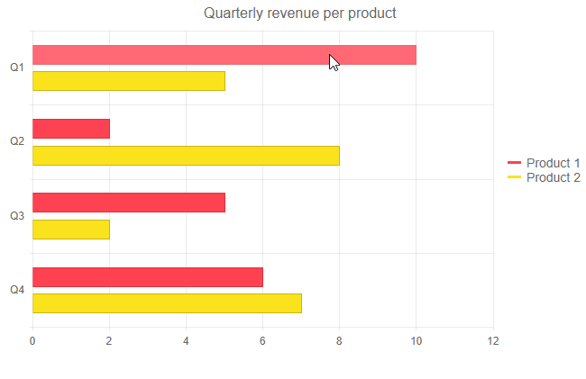
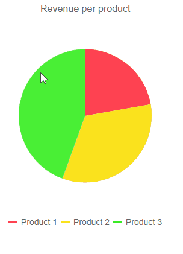

# Chart Events

This article explains the available events for the Telerik Chart for Blazor:

* [OnSeriesClick](#onseriesclick)


## OnSeriesClick

The `OnSeriesClick` event fires as a response to the user click on a `<ChartSeries>`.

Below you can find:

* [Event Arguments](#event-arguments)
* Examples:
	* [Basic Click Handler](#basic-click-handler)
	* [Get The Data Model For The Clicked Series](#get-the-data-model-for-the-clicked-series)
	* [Load Data On Demand Based On Series Click](#load-data-on-demand-based-on-series-click)


### Event Arguments

The event handler receives a `ChartSeriesClickEventArgs` object which provides the following data:

* `DataItem` - provides the data model of the current series item. You need to cast it to the type from your datasource, which needs to be serializable.

  * If you are using a [Date Axis](), the `DataItem` will contain the only the aggregated value in the corresponding y-value field, because it is a collection of more than one items. See the `Category` below for details.


* `Category` - provides information on the category the data point is located in. You need to cast it to the type in your data source, for example `DateTime`, `string`, `int` or another type. The Category parameter is applicable to [Categorical Charts](#series-types).

  * When using a [Date Axis](), you can use it, together with the `BaseUnit` value of the axis, to filter the data source and obtain the actual data items from the data source in case you want to provide extra information about them.


* `Percentage` - applicable to [Donut](), [Pie]() and [Stacked 100%](#stack-100) Charts - the percentage value of the current data point from the whole.

* `SeriesIndex` - provides the index of the `<ChartSeries>` the data point belongs to.

* `SeriesName` - bound to the Name parameter of the `<ChartSeries>` the data point belongs to.

* `SeriesColor` - shows the RGB color of the Series the data point belongs to.

* `CategoryIndex` - shows the index of the data point's x-axis category.

### Examples

These examples showcase the different applications of the `OnSeriesClick` event.

* [Basic Click Handler](#basic-click-handler)
* [Get The Data Model For The Clicked Series](#get-the-data-model-for-the-clicked-series)
* [Load Data On Demand Based On Series Click](#load-data-on-demand-based-on-series-click)

### Basic Click Handler

````CSHTML
@* Get the Category from which the user clicked. *@

<TelerikChart OnSeriesClick="@OnSeriesClickHandler">

    <ChartTooltip Visible="true">
    </ChartTooltip>

    <ChartSeriesItems>
        <ChartSeries Type="ChartSeriesType.Bar" Name="Product 1" Data="@series1Data">
        </ChartSeries>
        <ChartSeries Type="ChartSeriesType.Bar" Name="Product 2" Data="@series2Data">
        </ChartSeries>
    </ChartSeriesItems>

    <ChartCategoryAxes>
        <ChartCategoryAxis Categories="@xAxisItems"></ChartCategoryAxis>
    </ChartCategoryAxes>

    <ChartTitle Text="Quarterly revenue per product"></ChartTitle>

    <ChartLegend Position="ChartLegendPosition.Right">
    </ChartLegend>
</TelerikChart>


<div>
   Clicked from: @logger
</div>

@code {
    public List<object> series1Data = new List<object>() { 10, 2, 5, 6 };
    public List<object> series2Data = new List<object>() { 5, 8, 2, 7 };
    public string[] xAxisItems = new string[] { "Q1", "Q2", "Q3", "Q4" };

    string logger = String.Empty;

    void OnSeriesClickHandler(ChartSeriesClickEventArgs args)
    {
        var category = args.Category.ToString();
        logger = category;
    }
}
````

>caption The result from the code snippet above




### Get The Data Model For The Clicked Series

````CSHTML
@* Receive the data model based on the series the user clicked on *@

<TelerikChart OnSeriesClick="@OnSeriesClickHandler">
    <ChartSeriesItems>
        <ChartSeries Type="ChartSeriesType.Pie" Data="@pieData"
                     Field="@nameof(MyPieChartModel.SegmentValue)" CategoryField="@nameof(MyPieChartModel.SegmentName)">
        </ChartSeries>
    </ChartSeriesItems>

    <ChartTitle Text="Revenue per product"></ChartTitle>

    <ChartLegend Position="ChartLegendPosition.Bottom">
    </ChartLegend>
</TelerikChart>

@if (!String.IsNullOrEmpty(logger))
{
    <div class="text-center">
        @logger
    </div>
}

@code {

    string logger = String.Empty;

    void OnSeriesClickHandler(ChartSeriesClickEventArgs args)
    {
        //Get the data model for the clicked series
        string item = (args.DataItem as MyPieChartModel).SegmentName;
        MyPieChartModel dataModel = pieData.Where(x => x.SegmentName == item).FirstOrDefault();

        logger = $"Clicked from {dataModel.SegmentName} with value {dataModel.SegmentValue}";
    }

    public class MyPieChartModel
    {
        public string SegmentName { get; set; }
        public double SegmentValue { get; set; }
    }

    public List<MyPieChartModel> pieData = new List<MyPieChartModel>
    {
        new MyPieChartModel
        {
            SegmentName = "Product 1",
            SegmentValue = 2
        },
        new MyPieChartModel
        {
            SegmentName = "Product 2",
            SegmentValue = 3
        },
        new MyPieChartModel
        {
            SegmentName = "Product 3",
            SegmentValue = 4
        }
    };
}
````

>caption The result from the code snippet above




### Load Data On Demand Based On Series Click

````CSHTML
@* Load data on demand based on series click *@

<TelerikChart OnSeriesClick="@OnSeriesClickHandler">
    <ChartSeriesItems>
        <ChartSeries Type="ChartSeriesType.Pie" Data="@pieData"
                     Field="@nameof(MyPieChartModel.SegmentValue)" CategoryField="@nameof(MyPieChartModel.SegmentName)">
        </ChartSeries>
    </ChartSeriesItems>

    <ChartTitle Text="Revenue per product"></ChartTitle>

    <ChartLegend Position="ChartLegendPosition.Bottom">
    </ChartLegend>
</TelerikChart>

@if (GridData.Any())
{
    <div class="text-center">
        <TelerikGrid Data="@GridData" AutoGenerateColumns="true"
                     Pageable="true" PageSize="4" Width="650px">
        </TelerikGrid>
    </div>
}

@code {
    public List<MyGridModel> GridData { get; set; } = new List<MyGridModel>();

    async Task OnSeriesClickHandler(ChartSeriesClickEventArgs args)
    {
        int clickedId = (args.DataItem as MyPieChartModel).SegmentId;

        GridData = await GenerateGridData(clickedId);
    }

    async Task<List<MyGridModel>> GenerateGridData(int id)
    {
        GridData = new List<MyGridModel>()
        {
            new MyGridModel()
            {
                Id = id,
                ProductManager = $"Product manager {id}",
                ProductLaunchDate = DateTime.Today.AddDays(-id),
                isActive = id % 2 == 0 ? true : false
            }
        };
        return await Task.FromResult(GridData);
    }

    public List<MyPieChartModel> pieData = new List<MyPieChartModel>
    {
        new MyPieChartModel
        {
            SegmentId = 1,
            SegmentName = "Product 1",
            SegmentValue = 2
        },
        new MyPieChartModel
        {
            SegmentId = 2,
            SegmentName = "Product 2",
            SegmentValue = 3
        },
        new MyPieChartModel
        {
            SegmentId = 3,
            SegmentName = "Product 3",
            SegmentValue = 4
        }
    };

    public class MyPieChartModel
    {
        public int SegmentId { get; set; }
        public string SegmentName { get; set; }
        public double SegmentValue { get; set; }
    }

    public class MyGridModel
    {
        public int Id { get; set; }
        public string ProductManager { get; set; }
        public DateTime ProductLaunchDate { get; set; }
        public bool isActive { get; set; }
    }
}
````


## See Also

* [Live Demo: Chart Events](https://demos.telerik.com/blazor-ui/chart/events)
