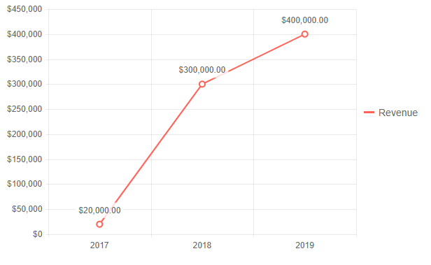
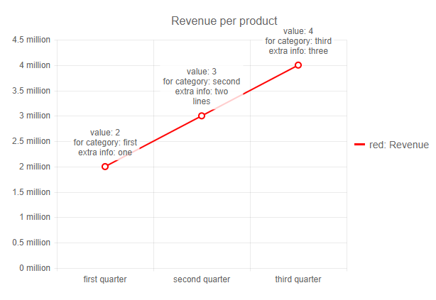
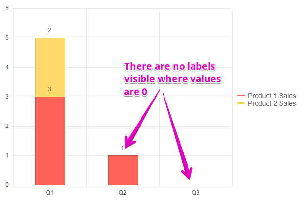

# Label Template and Format

The Chart for Blazor can render labels on the axes, series data points and legend. You can control those texts not only through the values you data bind, but also through [format strings](#format-strings) or [templates](#templates).

To turn on series labels, you must set their `Visible` property to `true` under the corresponding `ChartSeriesLabels` tag. The series labels are turned off by default to avoid clutter and to make the charts easier to read.

## Format Strings

Where the labels are numerical (series values, the value axis), you can format those strings through the `Format` property of the corresponding labels inner tag. This lets you set [standard numeric format strings](https://docs.microsoft.com/en-us/dotnet/standard/base-types/standard-numeric-format-strings) to the values to showcase, for example, percentage, currency, and so on.

>caption Format numerical values through format strings

````CSHTML
Standard number format strings

<TelerikChart>
	<ChartSeriesItems>
		<ChartSeries Type="ChartSeriesType.Line" Data="@chartData" Name="Revenue"
							Field="@nameof(MyChartDataModel.TheValue)" CategoryField="@nameof(MyChartDataModel.TheCategory)">
			<ChartSeriesLabels Visible="true" Format="{0:C2}"></ChartSeriesLabels>
		</ChartSeries>
	</ChartSeriesItems>

	<ChartValueAxes>
		<ChartValueAxis>
			<ChartValueAxisLabels Format="{0:C0}"></ChartValueAxisLabels>
		</ChartValueAxis>
	</ChartValueAxes>

	<ChartLegend Position="ChartLegendPosition.Right">
	</ChartLegend>
</TelerikChart>

@code {
	public class MyChartDataModel
	{
		public double TheValue { get; set; }
		public string TheCategory { get; set; }
	}

	public List<MyChartDataModel> chartData = new List<MyChartDataModel>
    {
		new MyChartDataModel
		{
			TheValue = 20000,
			TheCategory = "2017"
		},
		new MyChartDataModel
		{

			TheValue = 300000,
			TheCategory = "2018"
		},
		new MyChartDataModel
		{
			TheValue = 400000,
			TheCategory = "2019"
		}
	};
}
````

>caption The result from the code snippet above



## Templates

To set a template for the corresponding label, use the `Template` property in the corresponding Label inner tag of the element you want to customize, for example, under `ChartSeriesLabels` or under `ChartValueAxisLabels`.

After the example, you can find lists with the available fields you can use in templates.

To add a new line, use the `\n` symbol.

>caption Custom templates in labels

````CSHTML
Label templates

<TelerikChart>
    <ChartSeriesItems>
        <ChartSeries Type="ChartSeriesType.Line" Data="@chartData" Name="Revenue" Color="red"
                     Field="@nameof(MyChartDataModel.TheValue)" CategoryField="@nameof(MyChartDataModel.TheCategory)">
            <ChartSeriesLabels Visible="true" Template="@MySeriesTemplate"></ChartSeriesLabels>
        </ChartSeries>
    </ChartSeriesItems>

    <ChartCategoryAxes>
        <ChartCategoryAxis>
            <ChartCategoryAxisLabels Template="@MyCategoryAxisTemplate"></ChartCategoryAxisLabels>
        </ChartCategoryAxis>
    </ChartCategoryAxes>

    <ChartValueAxes>
        <ChartValueAxis>
            <ChartValueAxisLabels Template="@MyValueAxisTemplate"></ChartValueAxisLabels>
        </ChartValueAxis>
    </ChartValueAxes>

    <ChartTitle Text="Revenue per product"></ChartTitle>

    <ChartLegend Position="ChartLegendPosition.Right">
        <ChartLegendLabels Template="@MyLegendItemTemplate"></ChartLegendLabels>
    </ChartLegend>
</TelerikChart>

@code {
    public string MySeriesTemplate = "value: #=value#\nfor category: #=category#\nextra info: #=dataItem.ExtraData#";
    public string MyCategoryAxisTemplate = "#=value# quarter";
    public string MyValueAxisTemplate = "#=value# million";
    public string MyLegendItemTemplate = "#=series.color#: #=text#";

    public class MyChartDataModel
    {
        public double TheValue { get; set; }
        public string ExtraData { get; set; }
        public string TheCategory { get; set; }
    }

    public List<MyChartDataModel> chartData = new List<MyChartDataModel>
    {
        new MyChartDataModel
        {
            ExtraData = "one",
            TheValue = 2,
            TheCategory = "first"
        },
        new MyChartDataModel
        {
            ExtraData = "two\nlines",
            TheValue = 3,
            TheCategory = "second"
        },
        new MyChartDataModel
        {
            ExtraData = "three",
            TheValue = 4,
            TheCategory = "third"
        }
    };
}
````

>caption The result from the code snippet above




In a **series label template**, you can use the following fields:

* `category` - the category name. Available for area, bar, column, donut, line, pie series.
* `dataItem` - the original data item used to construct the point. Will be `null` if binding to array.
* `percentage` - the point value represented as a percentage value. Available only for donut, pie and 100% stacked charts.
* `stackValue` - the cumulative point value on the stack. Available only for stackable series.
* `value` - the point value. Can be a number or object containing each bound field.

<!--* `series` - the data series-->
<!--* runningTotal - the sum of point values since the last "runningTotal" summary point. Available for waterfall series.
* total - the sum of all previous series values. Available for waterfall series.-->

In a **category axis label template**, you can use the following fields:

* `value` - the category value
* `format` - the default format of the label

<!--* `dataItem` - the data item, in case a field has been specified. If the category does not have a corresponding item in the data then an empty object will be passed.-->
<!--* culture - the default culture (if set) on the label-->

In a **value axis label template**, you can use the following fields:

* `value` - the label value

In a **legend item label template**, you can use the following fields:

* `text` - the text the legend item
* `series` - the data series
* `value` - the point value (only for donut and pie charts)
* `percentage` - the point value represented as a percentage value. Available only for donut, pie and 100% stacked charts
 

### Hide Label Conditionally

In some cases, you want the series to have labels, but certain data points must not have a label. For example, in [stacked series]() where a certain value is `0`.

To do that, you need to:

* add conditional logic in the template that renders the desired content when your condition is met, and returns nothing when it is not.
* ensure the labels background is transparent so there are no leftover spots on the chart.

>caption Hide labels with zero values

````CSHTML
Conditional label display

<TelerikChart>
	<ChartSeriesItems>
		<ChartSeries Type="ChartSeriesType.Column" Data="@chartData" Name="Product 1 Sales"
							Field="@nameof(MyChartDataModel.Value1)" CategoryField="@nameof(MyChartDataModel.TheCategory)">
			<ChartSeriesLabels Visible="true" Template="@MySeriesTemplate" Background="transparent"></ChartSeriesLabels>
			<ChartSeriesStack Enabled="true"></ChartSeriesStack>
		</ChartSeries>
		<ChartSeries Type="ChartSeriesType.Column" Data="@chartData" Name="Product 2 Sales"
							Field="@nameof(MyChartDataModel.Value2)" CategoryField="@nameof(MyChartDataModel.TheCategory)">
			<ChartSeriesLabels Visible="true" Template="@MySeriesTemplate" Background="transparent"></ChartSeriesLabels>
		</ChartSeries>
	</ChartSeriesItems>
</TelerikChart>

@code {
	public string MySeriesTemplate = "# if (value != 0) { # #=value# #}#";

	public class MyChartDataModel
	{
		public double Value1 { get; set; }
		public double Value2 { get; set; }
		public string TheCategory { get; set; }
	}

	public List<MyChartDataModel> chartData = new List<MyChartDataModel>
	{
		new MyChartDataModel
		{
			Value1 = 3,
			Value2 = 2,
			TheCategory = "Q1"
		},
		new MyChartDataModel
		{
			Value1 = 1,
			Value2 = 0,
			TheCategory = "Q2"
		},
		new MyChartDataModel
		{
			Value1 = 0,
			Value2 = 0,
			TheCategory = "Q3"
		}
	};
}
````

>caption The result from the code above:




## See Also

  * [Live Demos: Chart](https://demos.telerik.com/blazor-ui/chart/index)
