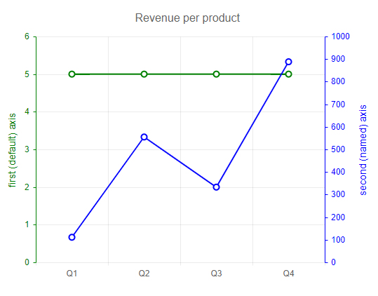
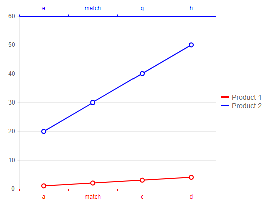
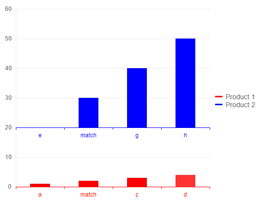
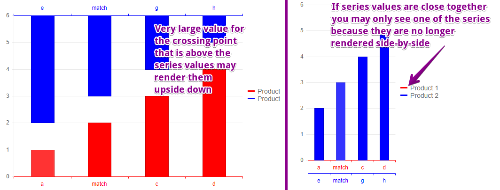
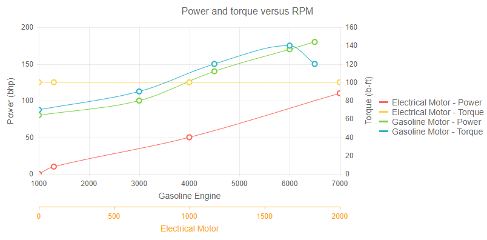
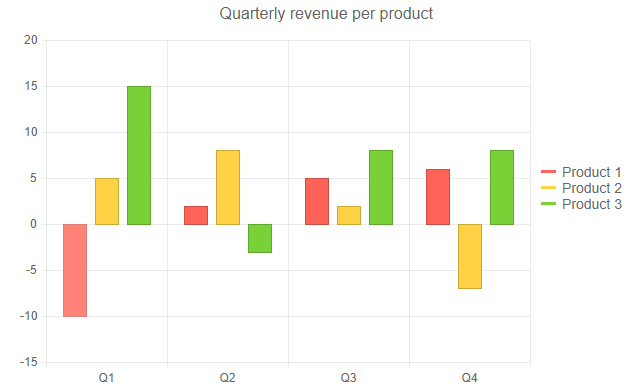
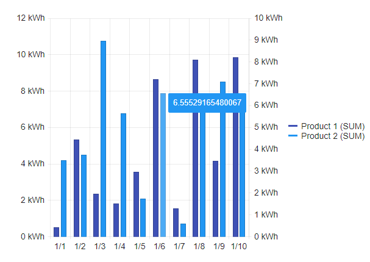

# Multiple Axes

You can have the chart render more than one axis for a given dimension. This lets you associate series with different axes, and position different axes to the left, right, top or bottom of the chart. This is often useful when you have data for some series that varies greatly in magnitude from other data, or is measured in a different unit. You can also associate series with different categories on the x-axis without having them side-by-side.

>caption Multiple Y-axes in a chart



>tip The [Examples](#examples) section offer several common use-cases.

This article contains the following sections:

* [Define Multiple Axes](#define-multiple-axes)
	* [Categorical Charts](#categorical-charts)
	* [Numerical Charts](#numerical-charts)
* [Choose Axis Position](#choose-axis-position)
* [Examples](#examples)
	* [Categorical Chart - Value Axes Examples](#categorical-chart---value-axes-examples)
	* [Category Axes](#category-axes)
		* [Behavior with Bar and Column Charts](#behavior-with-bar-and-column-charts)
	* [Numerical Chart Examples](#numerical-chart-examples)
	* [Move X-Axis Labels to the Bottom](#move-x-axis-labels-to-the-bottom)
	* [Move Value Axis to the Right](#move-value-axis-to-the-right)

>tip When using multiple axes, you would often set the color of the axis to match the `Color` of the series that uses it.

## Define Multiple Axes

The way multiple axes are declared depends on the [chart series type](#series-types):

### Categorical Charts

1. Define the extra axis in the corresponding `ChartCategoryAxes` and/or `ChartValueAxes` tags.
2. Set its `Name` property as desired. By default, a series uses the first axis.
3. Provide the `Name` value to the series you want to use it through its `Axis` and `CategoryAxis` for the `Y` and `X` axis respectively.


### Numerical Charts

1. Define the extra axis in the corresponding `ChartXAxes` and/or `ChartYAxes` tags.
2. Set its `Name` property as desired. By default, a series uses the first axis.
3. Provide the `Name` value to the series you want to use it through its `yAxis` and `xAxis` properties.

## Choose Axis Position

To define the position of the extra axes, you need to:

1. Use the `AxisCrossingValue` property of the first axis from the **other** dimension.
2. Set it to an array that indicates at which points it will be crossed by the multiple axes:

     * for categorical axes, the numbers indicate the index of the category at which the axes will cross
     * for numerical axes, the numbers indicate the value at which the axes will cross
     
    The items in the array correspond to the order of the axes declaration.

You can set a very large or a very small value to make a certain axis appear at the end of the chart. You can find an example in the [Move X-Axis Labels to the Bottom](#move-x-axis-labels-to-the-bottom) section.

## Examples

In this section you can find code examples, explanations on the behavior and screenshots of the expected behavior so you can understand the behavior of the chart and use it to your advantage.


* [Categorical Chart - Value Axes Examples](#categorical-chart---value-axes-examples)
* [Category Axes](#category-axes)
	* [Behavior with Bar and Column Charts](#behavior-with-bar-and-column-charts)
* [Numerical Chart Examples](#numerical-chart-examples)
* [Move X-Axis Labels to the Bottom](#move-x-axis-labels-to-the-bottom)
* [Move Value Axis to the Right](#move-value-axis-to-the-right)


### Categorical Chart - Value Axes Examples

In the following example, you can see how to define multiple y-axes, associate a series with an axis, and change the position of an axis.

>caption Multiple Y-axes and defining their position according a category axis

````CSHTML
Multiple y-axes and their position

<TelerikChart>
	<ChartSeriesItems>
		<ChartSeries Type="ChartSeriesType.Line" Data="@seriesOneData" Color="green">
		</ChartSeries>
		<ChartSeries Type="ChartSeriesType.Line" Data="@seriesTwoData" Color="blue" Axis="secondAxis">
		</ChartSeries>
	</ChartSeriesItems>

	<ChartValueAxes>
		<ChartValueAxis Color="green">
			<ChartValueAxisTitle Text="first (default) axis"></ChartValueAxisTitle>
		</ChartValueAxis>
		<ChartValueAxis Color="blue" Name="secondAxis">
			<ChartValueAxisTitle Text="second (named) axis"></ChartValueAxisTitle>
		</ChartValueAxis>
	</ChartValueAxes>

	<ChartCategoryAxes>
		<ChartCategoryAxis Categories="@categories" AxisCrossingValue="@crossingValues"></ChartCategoryAxis>
	</ChartCategoryAxes>

	<ChartTitle Text="Revenue per product"></ChartTitle>

	<ChartLegend Position="ChartLegendPosition.Right">
	</ChartLegend>
</TelerikChart>

@code {
	List<object> seriesOneData = new List<object>() { 5, 5, 5, 5 };
	List<object> seriesTwoData = new List<object>() { 111, 555, 333, 888 };
	public string[] categories = new string[] { "Q1", "Q2", "Q3", "Q4" };
	public object[] crossingValues = new object[] { 0, 5 };
}
````

>caption The result from the code snippet above


### Category Axes

You can use multiple category axes to associate each series with its own points on the axis instead of having them add up on the same axis.

>caption Multiple category axes on a line chart

````CSHTML
Multiple category axes and their position

<TelerikChart>
	<ChartSeriesItems>
		<ChartSeries Type="ChartSeriesType.Line" Name="Product 1" Data="@chartData" CategoryAxis="firstAxis" Color="red"
							Field="@nameof(MyDataModel.Product1)" CategoryField="@nameof(MyDataModel.FirstSeriesCategories)">
		</ChartSeries>
		<ChartSeries Type="ChartSeriesType.Line" Name="Product 2" Data="@chartData" CategoryAxis="secondAxis" Color="blue"
							Field="@nameof(MyDataModel.Product2)" CategoryField="@nameof(MyDataModel.SecondSeriesCategories)">
		</ChartSeries>
	</ChartSeriesItems>

	<ChartCategoryAxes>
		<ChartCategoryAxis Name="firstAxis" Color="red"></ChartCategoryAxis>
		<ChartCategoryAxis Name="secondAxis" Color="blue"></ChartCategoryAxis>
	</ChartCategoryAxes>

	<ChartValueAxes>
		<ChartValueAxis AxisCrossingValue="@crossingPoints"></ChartValueAxis>
	</ChartValueAxes>
</TelerikChart>

@code {
	public class MyDataModel
	{
		public string FirstSeriesCategories { get; set; }
		public string SecondSeriesCategories { get; set; }
		public int Product1 { get; set; }
		public int Product2 { get; set; }
	}

	public List<MyDataModel> chartData = new List<MyDataModel>()
    {
		new MyDataModel() { FirstSeriesCategories = "a",  SecondSeriesCategories = "e", Product1 = 1, Product2 = 20 },
		new MyDataModel() { FirstSeriesCategories = "match",  SecondSeriesCategories = "match", Product1 = 2, Product2 = 30 },
		new MyDataModel() { FirstSeriesCategories = "c",  SecondSeriesCategories = "g", Product1 = 3, Product2 = 40 },
		new MyDataModel() { FirstSeriesCategories = "d",  SecondSeriesCategories = "h", Product1 = 4, Product2 = 50 },
	};

	public object[] crossingPoints = new object[] { -9999999, 9999999 };
}
````

>caption The result from the code snippet above




### Behavior with Bar and Column Charts

It is important to keep in mind the behavior of the series with multiple category axes:

* the series items will **not** be rendered side by side, and may overlap (mostly applicable to bar and column types of series).
* series items touch the category axis for some chart types, like a column or bar chart, and having too large or too small crossing values may lead to unexpected appearance.
 
>caption Multiple category axes on a column chart with proper crossing values and series values

````CSHTML
Viable values for the axes positions

<TelerikChart>
	<ChartSeriesItems>
		<ChartSeries Type="ChartSeriesType.Column" Name="Product 1" Data="@chartData" CategoryAxis="firstAxis" Color="red"
							Field="@nameof(MyDataModel.Product1)" CategoryField="@nameof(MyDataModel.FirstSeriesCategories)">
		</ChartSeries>
		<ChartSeries Type="ChartSeriesType.Column" Name="Product 2" Data="@chartData" CategoryAxis="secondAxis" Color="blue"
							Field="@nameof(MyDataModel.Product2)" CategoryField="@nameof(MyDataModel.SecondSeriesCategories)">
		</ChartSeries>
	</ChartSeriesItems>

	<ChartCategoryAxes>
		<ChartCategoryAxis Name="firstAxis" Color="red"></ChartCategoryAxis>
		<ChartCategoryAxis Name="secondAxis" Color="blue"></ChartCategoryAxis>
	</ChartCategoryAxes>

	<ChartValueAxes>
		<ChartValueAxis AxisCrossingValue="@crossingPoints"></ChartValueAxis>
	</ChartValueAxes>
</TelerikChart>

@code {
	public class MyDataModel
	{
		public string FirstSeriesCategories { get; set; }
		public string SecondSeriesCategories { get; set; }
		public int Product1 { get; set; }
		public int Product2 { get; set; }
	}

	public List<MyDataModel> chartData = new List<MyDataModel>()
    {
		new MyDataModel() { FirstSeriesCategories = "a",  SecondSeriesCategories = "e", Product1 = 1, Product2 = 20 },
		new MyDataModel() { FirstSeriesCategories = "match",  SecondSeriesCategories = "match", Product1 = 2, Product2 = 30 },
		new MyDataModel() { FirstSeriesCategories = "c",  SecondSeriesCategories = "g", Product1 = 3, Product2 = 40 },
		new MyDataModel() { FirstSeriesCategories = "d",  SecondSeriesCategories = "h", Product1 = 4, Product2 = 50 },
	};

	public object[] crossingPoints = new object[] { -9999999, 20 };
}
````

>caption The result from the code snippet above



>caption Examples of potentially unwanted behaviors of column and bar types of charts with multiple axes, and the code that produces those issues.

````LargeCrossingPoint
Potentially unwanted behavior 1

<TelerikChart>
	<ChartSeriesItems>
		<ChartSeries Type="ChartSeriesType.Column" Name="Product 1" Data="@chartData" CategoryAxis="firstAxis" Color="red"
							Field="@nameof(MyDataModel.Product1)" CategoryField="@nameof(MyDataModel.FirstSeriesCategories)">
		</ChartSeries>
		<ChartSeries Type="ChartSeriesType.Column" Name="Product 2" Data="@chartData" CategoryAxis="secondAxis" Color="blue"
							Field="@nameof(MyDataModel.Product2)" CategoryField="@nameof(MyDataModel.SecondSeriesCategories)">
		</ChartSeries>
	</ChartSeriesItems>

	<ChartCategoryAxes>
		<ChartCategoryAxis Name="firstAxis" Color="red"></ChartCategoryAxis>
		<ChartCategoryAxis Name="secondAxis" Color="blue"></ChartCategoryAxis>
	</ChartCategoryAxes>

	<ChartValueAxes>
		<ChartValueAxis AxisCrossingValue="@crossingPoints"></ChartValueAxis>
	</ChartValueAxes>
</TelerikChart>

@code {
	public class MyDataModel
	{
		public string FirstSeriesCategories { get; set; }
		public string SecondSeriesCategories { get; set; }
		public int Product1 { get; set; }
		public int Product2 { get; set; }
	}

	public List<MyDataModel> chartData = new List<MyDataModel>()
    {
		new MyDataModel() { FirstSeriesCategories = "a",  SecondSeriesCategories = "e", Product1 = 1, Product2 = 2 },
		new MyDataModel() { FirstSeriesCategories = "match",  SecondSeriesCategories = "match", Product1 = 2, Product2 = 3 },
		new MyDataModel() { FirstSeriesCategories = "c",  SecondSeriesCategories = "g", Product1 = 3, Product2 = 4 },
		new MyDataModel() { FirstSeriesCategories = "d",  SecondSeriesCategories = "h", Product1 = 4, Product2 = 5 },
	};

	public object[] crossingPoints = new object[] { -9999999, 9999999 };
}
````
````OverlappingValues
Potentially unwanted behavior 2

<TelerikChart>
	<ChartSeriesItems>
		<ChartSeries Type="ChartSeriesType.Column" Name="Product 1" Data="@chartData" CategoryAxis="firstAxis" Color="red"
							Field="@nameof(MyDataModel.Product1)" CategoryField="@nameof(MyDataModel.FirstSeriesCategories)">
		</ChartSeries>
		<ChartSeries Type="ChartSeriesType.Column" Name="Product 2" Data="@chartData" CategoryAxis="secondAxis" Color="blue"
							Field="@nameof(MyDataModel.Product2)" CategoryField="@nameof(MyDataModel.SecondSeriesCategories)">
		</ChartSeries>
	</ChartSeriesItems>

	<ChartCategoryAxes>
		<ChartCategoryAxis Name="firstAxis" Color="red"></ChartCategoryAxis>
		<ChartCategoryAxis Name="secondAxis" Color="blue"></ChartCategoryAxis>
	</ChartCategoryAxes>
</TelerikChart>

@code {
	public class MyDataModel
	{
		public string FirstSeriesCategories { get; set; }
		public string SecondSeriesCategories { get; set; }
		public int Product1 { get; set; }
		public int Product2 { get; set; }
	}

	public List<MyDataModel> chartData = new List<MyDataModel>()
    {
		new MyDataModel() { FirstSeriesCategories = "a",  SecondSeriesCategories = "e", Product1 = 1, Product2 = 2 },
		new MyDataModel() { FirstSeriesCategories = "match",  SecondSeriesCategories = "match", Product1 = 2, Product2 = 3 },
		new MyDataModel() { FirstSeriesCategories = "c",  SecondSeriesCategories = "g", Product1 = 3, Product2 = 4 },
		new MyDataModel() { FirstSeriesCategories = "d",  SecondSeriesCategories = "h", Product1 = 4, Product2 = 5 },
	};
}
````

>caption The result from the code snippets above




### Numerical Chart Examples

When using numerical charts, you define the extra axes in the `ChartXAxes` and `ChartYAxes` tags.

>caption Multiple axes in a numerical chart

````CSHTML
@* Both torque series use the torque y-axis. Both electrical motor series use the electrical motor x-axis. The default warm colors the come in for the electrical series are associated with their x-axis by making the electrical motor x-axis orange (you can choose colors that better match your scenario) *@

<TelerikChart>
    <ChartTitle Text="Power and torque versus RPM"></ChartTitle>
    <ChartLegend Visible="true"></ChartLegend>

    <ChartSeriesItems>
        <ChartSeries Type="ChartSeriesType.ScatterLine"
                     Data="@ElectricalPower"
                     Name="Electrical Motor - Power"
                     XAxis="ElectricalMotorAxis"
                     XField="@nameof(ModelData.X)"
                     YField="@nameof(ModelData.Y)"
                     Style="ChartSeriesStyle.Smooth">
        </ChartSeries>

        <ChartSeries Type="ChartSeriesType.ScatterLine"
                     Data="@ElectricalTorque"
                     Name="Electrical Motor - Torque"
                     XAxis="ElectricalMotorAxis"
                     YAxis="TorqueAxis"
                     XField="@nameof(ModelData.X)"
                     YField="@nameof(ModelData.Y)"
                     Style="ChartSeriesStyle.Smooth">
        </ChartSeries>

        <ChartSeries Type="ChartSeriesType.ScatterLine"
                     Data="@GasPower"
                     Name="Gasoline Motor - Power"
                     XField="@nameof(ModelData.X)"
                     YField="@nameof(ModelData.Y)"
                     Style="ChartSeriesStyle.Smooth">
        </ChartSeries>

        <ChartSeries Type="ChartSeriesType.ScatterLine"
                     Data="@GasTorque"
                     Name="Gasoline Motor - Torque"
                     YAxis="TorqueAxis"
                     XField="@nameof(ModelData.X)"
                     YField="@nameof(ModelData.Y)"
                     Style="ChartSeriesStyle.Smooth">
        </ChartSeries>
    </ChartSeriesItems>

    <ChartXAxes>
        <ChartXAxis AxisCrossingValue="@crossingValues" Min="1000" Max="7000">
            <ChartXAxisTitle Text="Gasoline Engine"></ChartXAxisTitle>
        </ChartXAxis>
        <ChartXAxis Name="ElectricalMotorAxis" AxisCrossingValue="@crossingValues" Min="0" Max="2000" Color="orange">
            <ChartXAxisTitle Text="Electrical Motor"></ChartXAxisTitle>
        </ChartXAxis>
    </ChartXAxes>

    <ChartYAxes>
        <ChartYAxis Min="0">
            <ChartYAxisTitle Text="Power (bhp)"></ChartYAxisTitle>
        </ChartYAxis>
        <ChartYAxis Name="TorqueAxis" Min="0">
            <ChartYAxisTitle Text="Torque (lb-ft)"></ChartYAxisTitle>
        </ChartYAxis>
    </ChartYAxes>

</TelerikChart>

@code {
    public object[] crossingValues = new object[] { 0, 99999 };

    public class ModelData
    {
        public int X { get; set; }
        public int Y { get; set; }
    }

    public List<ModelData> GasPower = new List<ModelData>()
    {
        new ModelData() { X = 1000, Y = 80 },
        new ModelData() { X = 3000, Y = 100 },
        new ModelData() { X = 4500, Y = 140 },
        new ModelData() { X = 6000, Y = 170 },
        new ModelData() { X = 6500, Y = 180 },
    };

    public List<ModelData> GasTorque = new List<ModelData>()
    {
        new ModelData() { X = 1000, Y = 70 },
        new ModelData() { X = 3000, Y = 90 },
        new ModelData() { X = 4500, Y = 120 },
        new ModelData() { X = 6000, Y = 140 },
        new ModelData() { X = 6500, Y = 120 },
    };

    public List<ModelData> ElectricalPower = new List<ModelData>()
    {
        new ModelData() { X = 0, Y = 0 },
        new ModelData() { X = 100, Y = 10 },
        new ModelData() { X = 1000, Y = 50 },
        new ModelData() { X = 2000, Y = 110 },
    };

    public List<ModelData> ElectricalTorque = new List<ModelData>()
    {
        new ModelData() { X = 0, Y = 100 },
        new ModelData() { X = 100, Y = 100 },
        new ModelData() { X = 1000, Y = 100 },
        new ModelData() { X = 2000, Y = 100 },
    };
}
````

>caption The result from the code snippet above




### Move X-Axis Labels to the Bottom

This example shows how to move the x-axis labels to the bottom of the chart. This can be useful when you have negative values and you don't want the x-axis labels to overlap the series themselves.

The general approach is to set an axis crossing point that has a very large value - in this example - `int.MinValue`.

>caption X-axis Labels at the bottom of the chart with negative values

````CSHTML
@* This sample showcases how to move the x-axis labels to the bottom of the chart even when
    there are negative values - through a very low axis crossing point for the y-axis.
    Enabling the Stack settings changes the behavior of the 0 value for bar and column series
    Test with and without it to see the difference and choose the behavior your prefer.
    This sample shows how to have series that are not stacked and touch the 0 value and not the x-axis.
    You do not need stack settings for line series, for example.
    *@

<TelerikChart>
    <ChartValueAxes>
        <ChartValueAxis AxisCrossingValue="@crossingValues"></ChartValueAxis>
    </ChartValueAxes>

    <ChartSeriesItems>
        <ChartSeries Type="ChartSeriesType.Column" Name="Product 1" Data="@series1Data">
            <ChartSeriesStack Enabled="true" Group="separateGroup1"></ChartSeriesStack>
        </ChartSeries>
        <ChartSeries Type="ChartSeriesType.Column" Name="Product 2" Data="@series2Data">
            <ChartSeriesStack Enabled="true" Group="separateGroup2"></ChartSeriesStack>
        </ChartSeries>
        <ChartSeries Type="ChartSeriesType.Column" Name="Product 3" Data="@series3Data">
            <ChartSeriesStack Enabled="true" Group="separateGroup3"></ChartSeriesStack>
        </ChartSeries>
    </ChartSeriesItems>

    <ChartCategoryAxes>
        <ChartCategoryAxis Categories="@categories"></ChartCategoryAxis>
    </ChartCategoryAxes>

    <ChartTitle Text="Quarterly revenue per product"></ChartTitle>
    <ChartLegend Position="ChartLegendPosition.Right">
    </ChartLegend>
</TelerikChart>

@code {
    // very low value for the crossing value moves the axis to the corresponding end of the chart
    public object[] crossingValues = new object[] { int.MinValue };

    public List<object> series1Data = new List<object>() { -10, 2, 5, 6 };
    public List<object> series2Data = new List<object>() { 5, 8, 2, -7 };
    public List<object> series3Data = new List<object>() { 15, -3, 8, 8 };
    public string[] categories = new string[] { "Q1", "Q2", "Q3", "Q4" };
}
````

>caption The result from the code snippet above




### Move Value Axis to the Right

To ensure that an axis is always to the desired side of the chart, you could set its corresponding `AxisCrossingValue` to a very large value such as `int.MaxValue` or `int.MinValue`.

This approach can work for both numerical and categorical axes. The example below uses a categorical axis.

>caption Example of setting a crossing point that is very large so the value axis appears on the right hand side of the chart

````CSHTML
@* See the AxisCrossingValue parameter on the x-axis and its value - it uses int.MaxValue to push the second value axis all the way to the right *@

<TelerikChart>

    <ChartCategoryAxes>
        <ChartCategoryAxis AxisCrossingValue="@crossingValues" BaseUnit="ChartCategoryAxisBaseUnit.Days" Type="ChartCategoryAxisType.Date">
        </ChartCategoryAxis>
    </ChartCategoryAxes>
    
    <ChartValueAxes>
        <ChartValueAxis Type="@ChartValueAxisType.Numeric" Name="FirstYAxis" Visible="true">
            <ChartValueAxisLabels Template="#=value# kWh" Visible="true"></ChartValueAxisLabels>
        </ChartValueAxis>

        <ChartValueAxis Type="@ChartValueAxisType.Numeric" Name="SecondYAxis" Visible="true">
            <ChartValueAxisLabels Template="#=value# kWh" Visible="true"></ChartValueAxisLabels>
        </ChartValueAxis>
    </ChartValueAxes>

    <ChartSeriesItems>
        <ChartSeries Type="ChartSeriesType.Column" Name="Product 1 (SUM)" Data="@chartData" Field="@nameof(MyDataModel.Product1)" CategoryField="@nameof(MyDataModel.MySharedCategories)" Aggregate="ChartSeriesAggregate.Sum" Axis="FirstYAxis">
            <ChartSeriesLabels Visible="false"></ChartSeriesLabels>
            <ChartSeriesTooltip Visible="true"></ChartSeriesTooltip>
        </ChartSeries>
        <ChartSeries Type="ChartSeriesType.Column" Name="Product 2 (SUM)" Data="@chartData" Field="@nameof(MyDataModel.Product2)" CategoryField="@nameof(MyDataModel.MySharedCategories)" Aggregate="ChartSeriesAggregate.Sum" Axis="SecondYAxis">
            <ChartSeriesLabels Visible="false"></ChartSeriesLabels>
            <ChartSeriesTooltip Visible="true"></ChartSeriesTooltip>
        </ChartSeries>
    </ChartSeriesItems>

</TelerikChart>

@code {
    public object[] crossingValues = new object[] { 0, int.MaxValue };

    public class MyDataModel
    {
        public DateTime MySharedCategories { get; set; }
        public decimal Product1 { get; set; }
        public decimal Product2 { get; set; }
    }

    public List<MyDataModel> chartData = new List<MyDataModel>();

    protected override void OnInitialized()
    {
        var random = new Random();

        for (var i = 0; i < 10; i++)
        {
            var dateTime = new DateTime(2019, 1, 1);
            var value1 = Convert.ToDecimal(random.NextDouble() * 10);
            var value2 = Convert.ToDecimal(random.NextDouble() * 10);
            this.chartData.Add(new MyDataModel { MySharedCategories = dateTime.AddDays(i), Product1 = value1, Product2 = value2 });
        }
    }
}
````

>caption The result from the code snippet above




## See Also

  * [Data Binding a Chart]()
  * [Live Demos: Chart](https://demos.telerik.com/blazor-ui/chart/index)
