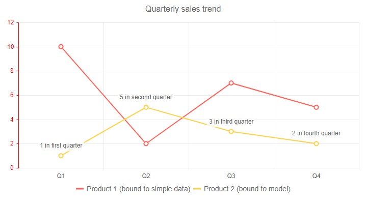

# Chart Overview

The Blazor chart allows you to visualize data to your users in a meaningful way so they can draw conclusions. You can use a variety of chart types and control all aspects of the chart's appearance - from colors and fonts, to paddings, margins and templates.

To use a Telerik chart for Blazor, add the `TelerikChart` tag.

>caption Basic chart with series and category axis [data binding](data-bind), and a few commonly used appearance settings

````CSHTML
Basic chart and common settings/elements

<TelerikChart>
	<ChartSeriesItems>
		<ChartSeries Type="ChartSeriesType.Line" Name="Product 1 (bound to simple data)" Data="@simpleData">
		</ChartSeries>
		<ChartSeries Type="ChartSeriesType.Line" Name="Product 2 (bound to model)" Data="@modelData" Field="@nameof(MyDataModel.SecondSeriesValue)">
			<ChartSeriesLabels Template="#=value# in #=dataItem.ExtraData# quarter" Visible="true"></ChartSeriesLabels>
		</ChartSeries>
	</ChartSeriesItems>

	<ChartValueAxes>
		<ChartValueAxis Color="red"></ChartValueAxis>
	</ChartValueAxes>

	<ChartCategoryAxes>
		<ChartCategoryAxis Categories="@xAxisItems"></ChartCategoryAxis>
	</ChartCategoryAxes>

	<ChartTitle Text="Quarterly sales trend"></ChartTitle>

	<ChartLegend Position="Telerik.Blazor.ChartLegendPosition.Bottom">
	</ChartLegend>
</TelerikChart>

@code {
	public class MyDataModel
	{
		public int SecondSeriesValue { get; set; }
		public string ExtraData { get; set; }

	}

	public List<MyDataModel> modelData = new List<MyDataModel>()
    {
		new MyDataModel() { SecondSeriesValue = 1, ExtraData = "first" },
		new MyDataModel() { SecondSeriesValue = 5, ExtraData = "second" },
		new MyDataModel() { SecondSeriesValue = 3, ExtraData = "third" },
		new MyDataModel() { SecondSeriesValue = 2, ExtraData = "fourth" },
	};

	public List<object> simpleData = new List<object>() { 10, 2, 7, 5 };

	public string[] xAxisItems = new string[] { "Q1", "Q2", "Q3", "Q4" };
}
````

>caption The result from the code snippet above




@[template](/_contentTemplates/chart/link-to-basics.md#configurable-nested-chart-settings)

>caption Component namespace and reference

````CSHTML
@using Telerik.Blazor.Components

<TelerikChart @ref="myChartRef">
</TelerikChart>

@code {
	Telerik.Blazor.Components.TelerikChart myChartRef;
}
````

## Chart Size

To control the chart size, use its `Width` and `Height` properties. You can read more on how they work in the [Dimensions]() article.

You can also set the chart size in percentage values so it occupies its container when it renderes. If the parent container size changes, you must call the chart's `Refresh()` C# method after the DOM has been redrawn and the new container dimensions are rendered. You can do this when you explicitly change container sizes (like in the example below), or from code that gets called by events like `window.resize`. You can find an example of making charts redraw on `window.resize` in the [Responsive Chart](https://github.com/telerik/blazor-ui/tree/master/chart/responsive-chart) sample.


>caption Change the 100% chart size dynamically to have a responsive chart

````CSHTML
You can make a responsive chart

<TelerikButton OnClick="@ResizeChart">Resize the container and redraw the chart</TelerikButton>

<div style="border: 1px solid red;width:@ContainerWidth; height: @ContainerHeight">

    <TelerikChart Width ="100%" Height="100%" @ref="theChart">

        <ChartSeriesItems>
            <ChartSeries Type="ChartSeriesType.Column" Name="Product 1" Data="@someData">
            </ChartSeries>
        </ChartSeriesItems>
        <ChartCategoryAxes>
            <ChartCategoryAxis Categories="@xAxisItems"></ChartCategoryAxis>
        </ChartCategoryAxes>
        <ChartTitle Text="Quarterly sales trend"></ChartTitle>

    </TelerikChart>

</div>

@code {
    string ContainerWidth { get; set; } = "400px";
    string ContainerHeight { get; set; } = "300px";
    Telerik.Blazor.Components.TelerikChart theChart { get; set; }

    async Task ResizeChart()
    {
        //resize the container
        ContainerHeight = "500px";
        ContainerWidth = "800px";

        //give time to the framework and browser to resize the actual DOM so the chart can use the expected size
        await Task.Delay(20);

        //redraw the chart
        theChart.Refresh();
    }

    public List<object> someData = new List<object>() { 10, 2, 7, 5 };

    public string[] xAxisItems = new string[] { "Q1", "Q2", "Q3", "Q4" };
}
````

## See Also

  * [Data Binding]()
  * [Live Demos: Chart](https://demos.telerik.com/blazor-ui/chart/index)
  * [API Reference](https://docs.telerik.com/blazor-ui/api/Telerik.Blazor.Components.TelerikChartBase)
