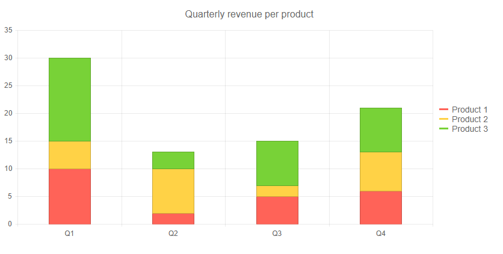
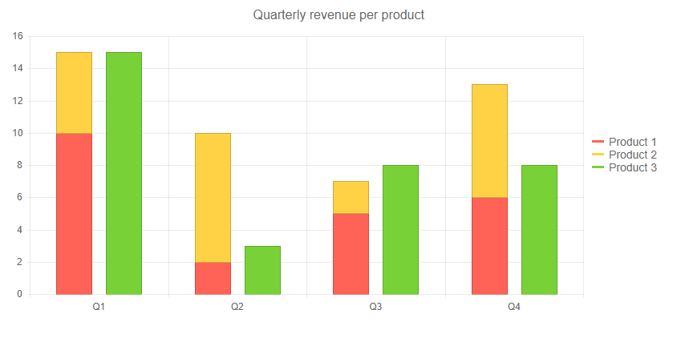
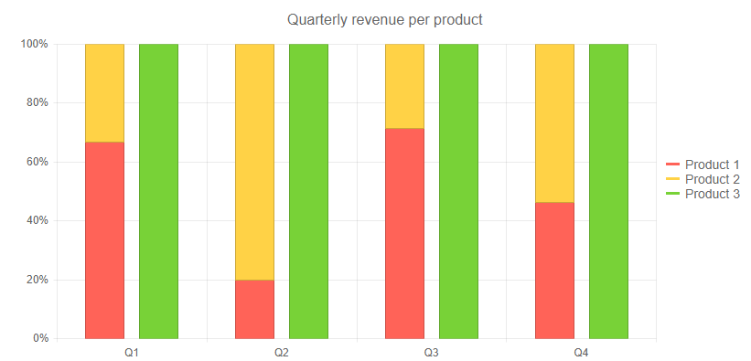

# Stacked Chart Series

You can stack different series in one data category on top of each other to showcase cumulative effects.

This article explains how to configure the available stack options:

* [Simple Stack](#simple-stack)
* [Named Stack](#named-stack)
* [Stack 100%](#stack-100)

Series stacking is available for  "bar", "column", "line", "area" types of series, and all series in the same stack must be of the same type.

Stack settings of the first series are inherited as a default value by the rest of the series, in case they are not overridden.

## Simple Stack

To stack all series together, set the `Enabled` property to `true` in the `TelerikChartSeriesStack` tag of the first series in your chart.

>caption All series stacked together

````CSHTML
@using Telerik.Blazor
@using Telerik.Blazor.Components.Chart

<TelerikChart>
	<TelerikChartSeriesItems>
		<TelerikChartSeries Type="ChartSeriesType.Column" Name="Product 1" Data="@series1Data">
			<TelerikChartSeriesStack Enabled="true"></TelerikChartSeriesStack>
		</TelerikChartSeries>
		<TelerikChartSeries Type="ChartSeriesType.Column" Name="Product 2" Data="@series2Data">
		</TelerikChartSeries>
		<TelerikChartSeries Type="ChartSeriesType.Column" Name="Product 3" Data="@series3Data">
		</TelerikChartSeries>
	</TelerikChartSeriesItems>

	<TelerikChartCategoryAxes>
		<TelerikChartCategoryAxis Categories="@xAxisItems"></TelerikChartCategoryAxis>
	</TelerikChartCategoryAxes>

	<TelerikChartTitle Text="Quarterly revenue per product"></TelerikChartTitle>

	<TelerikChartLegend Position="ChartLegendPosition.Right">
	</TelerikChartLegend>
</TelerikChart>

@functions {
	public List<object> series1Data = new List<object>() { 10, 2, 5, 6 };
	public List<object> series2Data = new List<object>() { 5, 8, 2, 7 };
	public List<object> series3Data = new List<object>() { 15, 3, 8, 8 };
	public string[] xAxisItems = new string[] { "Q1", "Q2", "Q3", "Q4" };
}
````

>caption The result from the code snippet above



## Named Stack

You can choose which series to cluster together through the `Group` property of the `TelerikChartSeriesStack` tag. If you set it to one series, it automatically enables stacking, so if you want to put one or more series in a separate group, you must provide a group name for each series.

>caption Stack certain series together in a separate group

````CSHTML
@using Telerik.Blazor
@using Telerik.Blazor.Components.Chart

<TelerikChart>
	<TelerikChartSeriesItems>
		<TelerikChartSeries Type="ChartSeriesType.Column" Name="Product 1" Data="@series1Data">
			<TelerikChartSeriesStack Group="myStack"></TelerikChartSeriesStack>
		</TelerikChartSeries>
		<TelerikChartSeries Type="ChartSeriesType.Column" Name="Product 2" Data="@series2Data">
			<TelerikChartSeriesStack Group="myStack"></TelerikChartSeriesStack>
		</TelerikChartSeries>
		<TelerikChartSeries Type="ChartSeriesType.Column" Name="Product 3" Data="@series3Data">
			<TelerikChartSeriesStack Group="mySecondStack"></TelerikChartSeriesStack>
		</TelerikChartSeries>
	</TelerikChartSeriesItems>

	<TelerikChartCategoryAxes>
		<TelerikChartCategoryAxis Categories="@xAxisItems"></TelerikChartCategoryAxis>
	</TelerikChartCategoryAxes>

	<TelerikChartTitle Text="Quarterly revenue per product"></TelerikChartTitle>

	<TelerikChartLegend Position="ChartLegendPosition.Right">
	</TelerikChartLegend>
</TelerikChart>

@functions {
	public List<object> series1Data = new List<object>() { 10, 2, 5, 6 };
	public List<object> series2Data = new List<object>() { 5, 8, 2, 7 };
	public List<object> series3Data = new List<object>() { 15, 3, 8, 8 };
	public string[] xAxisItems = new string[] { "Q1", "Q2", "Q3", "Q4" };
}
````

>caption The result from the code snippet above



## Stack 100%

You can also have each stack fill up the entire chart - its total value will be 100%. This is often useful when contribution of values within stacks is more meaningful than the amounts themselves.

To use a 100% stacks, set the `Type` property of the first stacked series to `Telerik.Blazor.ChartSeriesStack.Stack100`.

You can use separate groups, or you can stack all series together with just the `Enabled` property.

>caption Stack 100% with groups

````CSHTML
@using Telerik.Blazor
@using Telerik.Blazor.Components.Chart

<TelerikChart>
	<TelerikChartSeriesItems>
		<TelerikChartSeries Type="ChartSeriesType.Column" Name="Product 1" Data="@series1Data">
			<TelerikChartSeriesStack Group="myStack" Type="ChartSeriesStack.Stack100"></TelerikChartSeriesStack>
		</TelerikChartSeries>
		<TelerikChartSeries Type="ChartSeriesType.Column" Name="Product 2" Data="@series2Data">
			<TelerikChartSeriesStack Group="myStack"></TelerikChartSeriesStack>
		</TelerikChartSeries>
		<TelerikChartSeries Type="ChartSeriesType.Column" Name="Product 3" Data="@series3Data">
			<TelerikChartSeriesStack Group="mySecondStack"></TelerikChartSeriesStack>
		</TelerikChartSeries>
	</TelerikChartSeriesItems>

	<TelerikChartCategoryAxes>
		<TelerikChartCategoryAxis Categories="@xAxisItems"></TelerikChartCategoryAxis>
	</TelerikChartCategoryAxes>

	<TelerikChartTitle Text="Quarterly revenue per product"></TelerikChartTitle>

	<TelerikChartLegend Position="ChartLegendPosition.Right">
	</TelerikChartLegend>
</TelerikChart>

@functions {
	public List<object> series1Data = new List<object>() { 10, 2, 5, 6 };
	public List<object> series2Data = new List<object>() { 5, 8, 2, 7 };
	public List<object> series3Data = new List<object>() { 15, 3, 8, 8 };
	public string[] xAxisItems = new string[] { "Q1", "Q2", "Q3", "Q4" };
}
````

>caption The result from the code snippet above



## See Also

  * [Live Demos: Chart](https://demos.telerik.com/blazor-ui/chart/index)
