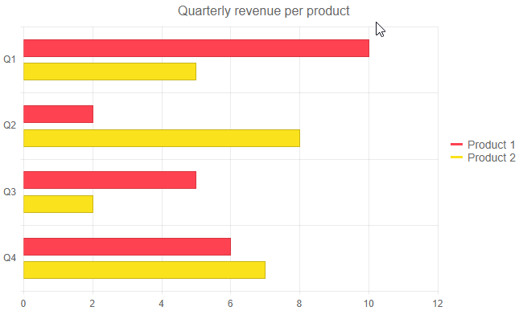

# Tooltip for Telerik Blazor Chart

The Telerik Chart provides a tooltip for its data points. You can have settings specific to each `<ChartSeries>`, common tooltip settings for all series, or a [shared]() tooltip for all categories.

In this article:

* [Basics](#basics)
* [Common Tooltip](#common-tooltip)
* [Customization](#customization)
	* [Parameter Settings](#parameter-settings)
	* [Template](#template)


## Basics

By default the value of the point will be presented when hovered over.

To enable tooltips for the data points of each individual series:

1. Inside the `<ChartSeries>`, include the `<ChartSeriesTooltip>` tag.
1. Set its `Visible` parameter to `true`.


>caption Enable the tooltip for a specific Chart Series

````CSHTML
@* Enable tooltip for a single Chart Series *@

<TelerikChart>
    <ChartSeriesItems>
        <ChartSeries Type="ChartSeriesType.Column" Name="Series 1" Data="@data1">
        </ChartSeries>

        <ChartSeries Type="ChartSeriesType.Column" Name="Series 2" Data="@data2">
            <ChartSeriesTooltip Visible="true"></ChartSeriesTooltip>
        </ChartSeries>

    </ChartSeriesItems>

    <ChartCategoryAxes>
        <ChartCategoryAxis Categories="@xAxisItems"></ChartCategoryAxis>
    </ChartCategoryAxes>
</TelerikChart>

@code {
    public List<object> data1 = new List<object>() { 1, 2, 3, 4 };
    public List<object> data2 = new List<object>() { 2, 3, 4, 5 };
    public string[] xAxisItems = new string[] { "Q1", "Q2", "Q3", "Q4" };
}
````

>caption The result from the code snippet above


## Common Tooltip

The Chart allows you to enable and define common tooltip settings for all series at once. It looks like the individual tooltips (the value of the point will be presented when hovered over), but you declare it only once.

A tooltip set to a specific `<ChartSeries>` will take precedence over the common tooltip settings.

To enable the same tooltip for all series:

1. Inside the `<TelerikChart>`, add the `<ChartTooltip>`.
1. Set its `Visible` parameter to `true`.

>caption Set a Common Tooltip for all series at once

````CSHTML
@* This example shows you how to create a common tooltip for all data points *@

<TelerikChart>

    <ChartTooltip Visible="true">
    </ChartTooltip>

    <ChartSeriesItems>
        <ChartSeries Type="ChartSeriesType.Bar" Name="Product 1" Data="@series1Data">
        </ChartSeries>
        <ChartSeries Type="ChartSeriesType.Bar" Name="Product 2" Data="@series2Data">
        </ChartSeries>
    </ChartSeriesItems>

    <ChartCategoryAxes>
        <ChartCategoryAxis Categories="@xAxisItems"></ChartCategoryAxis>
    </ChartCategoryAxes>

    <ChartTitle Text="Quarterly revenue per product"></ChartTitle>

    <ChartLegend Position="ChartLegendPosition.Right">
    </ChartLegend>
</TelerikChart>

@code {
    public List<object> series1Data = new List<object>() { 10, 2, 5, 6 };
    public List<object> series2Data = new List<object>() { 5, 8, 2, 7 };
    public string[] xAxisItems = new string[] { "Q1", "Q2", "Q3", "Q4" };
}
````

>caption The result from the code snippet above




## Customization

There are two types of customizations you can do for the tooltips:

* [Parameter Settings](#parameter-settings) - lets you alter cosmetic settings such as borders, colors and padding through simple parameters
* [Template](#template) - lets you control the entire content

### Parameter Settings

You can customize the appearance of the individual series tooltip by using:

* `Background` - control the background color by applying a CSS color string, including HEX and RGB. By default the it will match the color for the category.

* `Color` - control the text color by applying a CSS color string, including HEX and RGB.

* Use the [Template](#template) to take control over what is rendered in the tooltip.

>caption Configuration of the tooltips with applied customization settings

````CSHTML
@* This example shows how to customize the tooltip *@

<TelerikChart>
    <ChartSeriesItems>
        <ChartSeries Type="ChartSeriesType.Line" Name="Product 1 (bound to simple data)" Data="@simpleData">
        </ChartSeries>
        <ChartSeries Type="ChartSeriesType.Line" Name="Product 2 (bound to model)"
                     Data="@modelData" Field="@nameof(MyDataModel.SecondSeriesValue)">
            <ChartSeriesTooltip Visible="true"
                                Background="#0000FF"
                                Color="#D3D3D3">
            </ChartSeriesTooltip>
        </ChartSeries>
    </ChartSeriesItems>

    <ChartValueAxes>
        <ChartValueAxis Color="red"></ChartValueAxis>
    </ChartValueAxes>

    <ChartCategoryAxes>
        <ChartCategoryAxis Categories="@xAxisItems"></ChartCategoryAxis>
    </ChartCategoryAxes>

    <ChartTitle Text="Quarterly sales trend"></ChartTitle>

    <ChartLegend Position="Telerik.Blazor.ChartLegendPosition.Bottom">
    </ChartLegend>
</TelerikChart>

@code {
    public class MyDataModel
    {
        public int SecondSeriesValue { get; set; }
        public string ExtraData { get; set; }

    }

    public List<MyDataModel> modelData = new List<MyDataModel>()
    {
        new MyDataModel() { SecondSeriesValue = 1, ExtraData = "first" },
        new MyDataModel() { SecondSeriesValue = 5, ExtraData = "second" },
        new MyDataModel() { SecondSeriesValue = 3, ExtraData = "third" },
        new MyDataModel() { SecondSeriesValue = 2, ExtraData = "fourth" },
    };

    public List<object> simpleData = new List<object>() { 10, 2, 7, 5 };

    public string[] xAxisItems = new string[] { "Q1", "Q2", "Q3", "Q4" };
}

````

>caption The result from the code snippet above


#### Common Tooltip Settings

In a similar fashion, you can declare these settings in the common tooltip section. Their tag names are slightly different, however:

@[template](/_contentTemplates/chart/chart-tooltip-context-templates.md#shared-tooltip-parameter-settings)

* Use the [Template](#template) to take control over what is rendered in the tooltip - the tag name and data it provides is the same as for the specific tooltip, but it affects all series at once.


### Template

The `Template` allows you to take control over the rendering of the tooltip and include additional information to the user.

In the template you can:

* Use business logic and render HTML

* Use the `context` parameter that provides information about the current data point.

The available series data point information in the `context` is:

@[template](/_contentTemplates/chart/chart-tooltip-context-templates.md#context-parameter-information)


>caption Use the Tooltip Template and use the DataItem to get the value of the point and add additional information

````CSHTML
@* This example shows how to use the Template to provide an Icon and additional information from the model *@

<TelerikChart>
    <ChartSeriesItems>
        <ChartSeries Type="ChartSeriesType.Line" Name="Product 1 (bound to simple data)" Data="@simpleData">
        </ChartSeries>
        <ChartSeries Type="ChartSeriesType.Line" Name="Product 2 (bound to model)"
                     Data="@modelData" Field="@nameof(MyDataModel.SecondSeriesValue)">
            <ChartSeriesTooltip Visible="true">
                <Template>
                    <TelerikIcon Icon="@IconName.Information" />
                    @((context.DataItem as MyDataModel).SecondSeriesValue) for @((context.DataItem as MyDataModel).ExtraData)
                </Template>
            </ChartSeriesTooltip>
        </ChartSeries>
    </ChartSeriesItems>

    <ChartValueAxes>
        <ChartValueAxis Color="red"></ChartValueAxis>
    </ChartValueAxes>

    <ChartCategoryAxes>
        <ChartCategoryAxis Categories="@xAxisItems"></ChartCategoryAxis>
    </ChartCategoryAxes>

    <ChartTitle Text="Quarterly sales trend"></ChartTitle>

    <ChartLegend Position="Telerik.Blazor.ChartLegendPosition.Bottom">
    </ChartLegend>
</TelerikChart>

@code {
    public class MyDataModel
    {
        public int SecondSeriesValue { get; set; }
        public string ExtraData { get; set; }

    }

    public List<MyDataModel> modelData = new List<MyDataModel>()
{
        new MyDataModel() { SecondSeriesValue = 1, ExtraData = "first" },
        new MyDataModel() { SecondSeriesValue = 5, ExtraData = "second" },
        new MyDataModel() { SecondSeriesValue = 3, ExtraData = "third" },
        new MyDataModel() { SecondSeriesValue = 2, ExtraData = "fourth" },
    };

    public List<object> simpleData = new List<object>() { 10, 2, 7, 5 };

    public string[] xAxisItems = new string[] { "Q1", "Q2", "Q3", "Q4" };
}
````

>caption The result from the code snippet above


## See Also

  * [Chart Overview]()
  * [Chart Shared Tooltip]()
