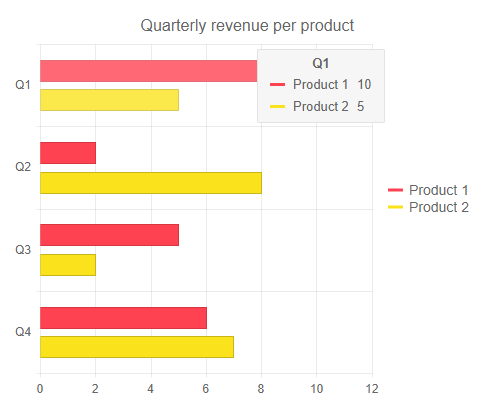
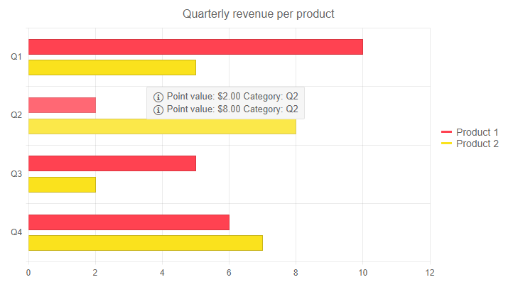

# Shared Tooltip for Telerik Blazor Chart

The Telerik Chart allows you to show a unified tooltip for all categories in [Categorical](#series-types) Charts.

In this article:
* [Basics](#basics)
 * [Customization Features](#customization-features)
* [Shared Template](#shared-template)


## Basics

The shared tooltip provides summarized information of all data points from the hovered category. This tooltip will take precedence over tooltip settings defined for a specific series.

To enable the shared tooltip include the `<ChartTooltip>` tag nested inside the `<TelerikChart>`, and set it's `Visible` and `Shared` parameters to `true`. 

>caption Basic configuration of a Chart with Shared Tooltip

````CSHTML
@* This example shows how to enable a Shared Tooltip *@

<TelerikChart>
    <ChartTooltip Visible="true" Shared="true"></ChartTooltip>
    <ChartSeriesItems>
        <ChartSeries Type="ChartSeriesType.Bar" Name="Product 1" Data="@series1Data">
        </ChartSeries>
        <ChartSeries Type="ChartSeriesType.Bar" Name="Product 2" Data="@series2Data">
        </ChartSeries>
    </ChartSeriesItems>

    <ChartCategoryAxes>
        <ChartCategoryAxis Categories="@xAxisItems"></ChartCategoryAxis>
    </ChartCategoryAxes>

    <ChartTitle Text="Quarterly revenue per product"></ChartTitle>

    <ChartLegend Position="ChartLegendPosition.Right">
    </ChartLegend>
</TelerikChart>

@code {
    public List<object> series1Data = new List<object>() { 10, 2, 5, 6 };
    public List<object> series2Data = new List<object>() { 5, 8, 2, 7 };
    public string[] xAxisItems = new string[] { "Q1", "Q2", "Q3", "Q4" };
}
````
>caption The result from the code snippet above



### Customization Features

You can customize the rendering of the `Shared` tooltip by using:

* `Background` - control the background color by applying a CSS color string, including HEX and RGB. By default the it will match the color for the category.
* `Color` - control the text color by applying a CSS color string, including HEX and RGB.
* `Opacity` - control the opacity of the tooltip.
* `Border` - control the `Color` and the `Width` of the tooltip by using the `<ChartTooltipBorder />` nested inside the `<ChartTooltip>` tag.
* `Padding` - control the `Left`, `Right`, `Top` and `Bottom` padding of the tooltip by using the `<ChartTooltipPadding />` nested inside the `<ChartTooltip>` tag.


## Shared Template

The `SharedTemplate` allows you to control the rendering of the shared tooltip.

It provides `context` which contains the following information:
* `Category` - renders the name of the Category.
* `Point` - provides information on the points like their `Value`, `DataItem`, `CategoryIndex`, etc.

>caption Handle the SharedTemplate

````CSHTML
@* This example shows how to handle the SharedTemplate and extract information on the data points value and category from the context *@

<TelerikChart>
    <ChartTooltip Visible="true" Shared="true">
        <SharedTemplate>
           @{
               var points = context.Points;

               foreach (var point in points)
               {
                   <div>
                       <TelerikIcon Icon="@IconName.Information" />
                       Point value: @point.Value
                       Category: @context.Category
                   </div>
               }
           }
        </SharedTemplate>
    </ChartTooltip>
    <ChartSeriesItems>
        <ChartSeries Type="ChartSeriesType.Bar" Name="Product 1" Data="@series1Data">
        </ChartSeries>
        <ChartSeries Type="ChartSeriesType.Bar" Name="Product 2" Data="@series2Data">
        </ChartSeries>
    </ChartSeriesItems>

    <ChartCategoryAxes>
        <ChartCategoryAxis Categories="@xAxisItems"></ChartCategoryAxis>
    </ChartCategoryAxes>

    <ChartTitle Text="Quarterly revenue per product"></ChartTitle>

    <ChartLegend Position="ChartLegendPosition.Right">
    </ChartLegend>
</TelerikChart>

@code {
    public List<object> series1Data = new List<object>() { 10, 2, 5, 6 };
    public List<object> series2Data = new List<object>() { 5, 8, 2, 7 };
    public string[] xAxisItems = new string[] { "Q1", "Q2", "Q3", "Q4" };
}
````
>caption The result from the code snippet above


