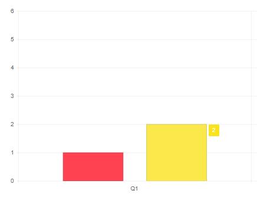
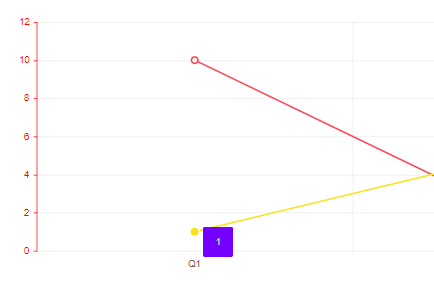
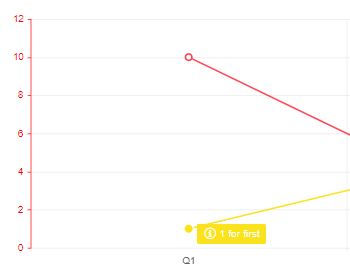

# Tooltip for Telerik Blazor Chart

The Chart provides a tooltip for its data points. They can be set either to a specific `<ChartSeries>` or as a [shared]() tooltip for all series.

In this article:
* [Basics](#basics)
 * [Customization Features](#customization-features)
* [Template](#template)

## Basics

You can enable tooltips for the data points by setting the `Visible` parameter of the `<ChartSeriesTooltip>`, nested inside the `<ChartSeries>` tag, to `true`. By default the value of the point will be presented whey hovered over.

>caption Basic configuration to enable the tooltip for the Chart Series

````CSHTML
@* Enable tooltip for a Chart Series *@

<TelerikChart>
    <ChartSeriesItems>
        <ChartSeries Type="ChartSeriesType.Column" Name="Series 1" Data="@data1">
        </ChartSeries>
        <ChartSeries Type="ChartSeriesType.Column" Name="Series 2" Data="@data2">
            <ChartSeriesTooltip Visible="true"></ChartSeriesTooltip>
        </ChartSeries>
    </ChartSeriesItems>

    <ChartCategoryAxes>
        <ChartCategoryAxis Categories="@xAxisItems"></ChartCategoryAxis>
    </ChartCategoryAxes>
</TelerikChart>

@code {
    public List<object> data1 = new List<object>() { 1, 2, 3, 4 };
    public List<object> data2 = new List<object>() { 2, 3, 4, 5 };
    public string[] xAxisItems = new string[] { "Q1", "Q2", "Q3", "Q4" };
}
````
>caption The result from the code snippet above




### Customization Features

You can customize the appearance of the tooltip by using:
* `Background` - control the background color by applying a CSS color string, including HEX and RGB. By default the it will match the color for the category.
* `Color` - control the text color by applying a CSS color string, including HEX and RGB.
* `Border` - control the `Color` and the `Width` of the tooltip by using the `<ChartSeriesTooltipBorder />` nested inside the `<ChartSeriesTooltip>` tag.
* `Padding` - control the `Left`, `Right`, `Top` and `Bottom` padding of the tooltip by using the `<ChartSeriesTooltipPadding />` nested inside the `<ChartSeriesTooltip>` tag.
* Use the [Template](#template) to take control over what is rendered in the tooltip.

>caption Configuration of the tooltips with applied customization settings

````CSHTML
@* This example shows how to customize the tooltip *@

<TelerikChart>
    <ChartSeriesItems>
        <ChartSeries Type="ChartSeriesType.Line" Name="Product 1 (bound to simple data)" Data="@simpleData">
        </ChartSeries>
        <ChartSeries Type="ChartSeriesType.Line" Name="Product 2 (bound to model)"
                     Data="@modelData" Field="@nameof(MyDataModel.SecondSeriesValue)">
            <ChartSeriesTooltip Visible="true"
                                Background="#0000FF"
                                Color="#D3D3D3">
                <ChartSeriesTooltipBorder Color="#ADD8E6" Width="10" />
                <ChartSeriesTooltipPadding Top="10" Bottom="10" Left="15" Right="15" />
            </ChartSeriesTooltip>
        </ChartSeries>
    </ChartSeriesItems>

    <ChartValueAxes>
        <ChartValueAxis Color="red"></ChartValueAxis>
    </ChartValueAxes>

    <ChartCategoryAxes>
        <ChartCategoryAxis Categories="@xAxisItems"></ChartCategoryAxis>
    </ChartCategoryAxes>

    <ChartTitle Text="Quarterly sales trend"></ChartTitle>

    <ChartLegend Position="Telerik.Blazor.ChartLegendPosition.Bottom">
    </ChartLegend>
</TelerikChart>

@code {
    public class MyDataModel
    {
        public int SecondSeriesValue { get; set; }
        public string ExtraData { get; set; }

    }

    public List<MyDataModel> modelData = new List<MyDataModel>()
{
        new MyDataModel() { SecondSeriesValue = 1, ExtraData = "first" },
        new MyDataModel() { SecondSeriesValue = 5, ExtraData = "second" },
        new MyDataModel() { SecondSeriesValue = 3, ExtraData = "third" },
        new MyDataModel() { SecondSeriesValue = 2, ExtraData = "fourth" },
    };

    public List<object> simpleData = new List<object>() { 10, 2, 7, 5 };

    public string[] xAxisItems = new string[] { "Q1", "Q2", "Q3", "Q4" };
}

````

>caption The result from the code snippet above



## Template

The `Template` allows you to take control over the rendering of the tooltip and include additional information to the user.

It also provides a `context` with the following information:
* `Value` - maps to the value of the data point that is being hovered.
* `DataItem` - provides the data model of the component.
* `Percentage` - applicable to [Donut](), [Pie]() and [Stacked 100%](#stack-100) Charts
* `SeriesIndex` - provides the index of the `<ChartSeries>`
* `SeriesName` - bound to the `Name` parameter of the `<ChartSeries>`
* `SeriesColor` - shows the color of the Series in RGB.
* `CategoryIndex` - shows the index of the data points.

>caption Handle the Template to add an Icon and additional information to the tooltip

````CSHTML
@* This example shows how to use the Template to provide an Icon and additional information from the model *@

<TelerikChart>
    <ChartSeriesItems>
        <ChartSeries Type="ChartSeriesType.Line" Name="Product 1 (bound to simple data)" Data="@simpleData">
        </ChartSeries>
        <ChartSeries Type="ChartSeriesType.Line" Name="Product 2 (bound to model)"
                     Data="@modelData" Field="@nameof(MyDataModel.SecondSeriesValue)">
            <ChartSeriesTooltip Visible="true">
                <Template>
                    <TelerikIcon Icon="@IconName.Information" />
                    @context.Value for @((context.DataItem as MyDataModel).ExtraData)
                </Template>
            </ChartSeriesTooltip>
        </ChartSeries>
    </ChartSeriesItems>

    <ChartValueAxes>
        <ChartValueAxis Color="red"></ChartValueAxis>
    </ChartValueAxes>

    <ChartCategoryAxes>
        <ChartCategoryAxis Categories="@xAxisItems"></ChartCategoryAxis>
    </ChartCategoryAxes>

    <ChartTitle Text="Quarterly sales trend"></ChartTitle>

    <ChartLegend Position="Telerik.Blazor.ChartLegendPosition.Bottom">
    </ChartLegend>
</TelerikChart>

@code {
    public class MyDataModel
    {
        public int SecondSeriesValue { get; set; }
        public string ExtraData { get; set; }

    }

    public List<MyDataModel> modelData = new List<MyDataModel>()
{
        new MyDataModel() { SecondSeriesValue = 1, ExtraData = "first" },
        new MyDataModel() { SecondSeriesValue = 5, ExtraData = "second" },
        new MyDataModel() { SecondSeriesValue = 3, ExtraData = "third" },
        new MyDataModel() { SecondSeriesValue = 2, ExtraData = "fourth" },
    };

    public List<object> simpleData = new List<object>() { 10, 2, 7, 5 };

    public string[] xAxisItems = new string[] { "Q1", "Q2", "Q3", "Q4" };
}
````

>caption The result from the code snippet above



## See Also

  * [Chart Overview]()
  * [Chart Shared Tooltip]()
